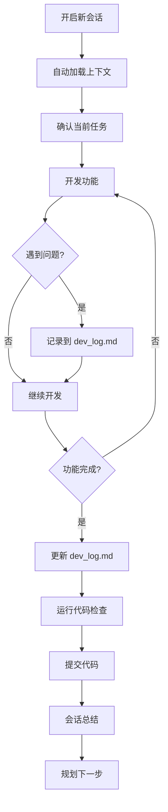

# Claude Code 工作流系统

> **自动化开发流程，提高效率和代码质量**

---

## 🚀 快速开始

### 1️⃣ 开启新会话

当你启动新的 Claude Code 会话时：

```
你: /session-init
```

或者直接开始工作，Claude 会自动：
- 📖 读取开发日志 (dev_log.md)
- 📐 加载编码规范 (coding_standards.md)
- 🎯 了解项目上下文 (project_context.md)

### 2️⃣ 进行开发工作

Claude 会：
- ✅ 遵循编码规范
- 📝 记录重要问题和决策
- 🔍 自动检查代码质量
- 📊 使用 TodoWrite 追踪任务

### 3️⃣ 结束会话

```
你: /session-end
```

Claude 会：
- 📝 总结本次会话
- 📊 更新开发日志
- 🎯 规划下一步任务
- 💾 建议 Git 提交

---

## 📂 目录结构

```
.claude/
├── README.md                    # 本文档
├── settings.local.json          # Claude Code 配置
├── skills/                      # Skills 工作流
│   ├── session-init/           # 会话初始化技能
│   │   └── session-init.md
│   └── session-end/            # 会话结束技能
│       └── session-end.md
├── context/                     # 项目上下文文档
│   ├── dev_log.md              # 📋 开发日志（重要！）
│   ├── coding_standards.md     # 📐 编码规范
│   └── project_context.md      # 🎮 项目架构
└── hooks/                       # 事件钩子（可选）
    └── session-start.sh         # 会话启动脚本
```

---

## 🎯 核心文件说明

### 📋 `dev_log.md` - 开发日志

**最重要的文件！** 记录项目的所有开发进度。

**包含内容**:
- ✅ 已完成功能
- 🎯 当前任务
- 🐛 已知问题和解决方案
- 💡 重要决策记录
- 📝 开发笔记

**何时更新**:
- 完成重要功能
- 发现或解决问题
- 做出架构决策
- 每次会话结束

### 📐 `coding_standards.md` - 编码规范

定义代码风格和最佳实践。

**包含内容**:
- GDScript 命名约定
- 类型提示规范
- 架构模式（组件化、Resource、AutoLoad）
- 性能优化规范
- 代码审查检查清单

### 🎮 `project_context.md` - 项目上下文

项目架构和技术选型的快速参考。

**包含内容**:
- 系统架构图
- 模块详解
- 物理层设置
- 常用代码模式
- MCP 集成说明

---

## 🔄 工作流程

### 典型开发流程



### 问题追踪流程

```
发现问题 → 评估优先级 → 记录到日志 → 尝试解决 → 验证结果 → 更新日志
```

**优先级**:
- **P0 (紧急)**: 阻塞开发的严重问题
- **P1 (重要)**: 影响功能的问题
- **P2 (改进)**: 优化和改进

---

## 🛠️ Skills 使用方法

### 会话初始化 - `/session-init`

**自动执行内容**:
1. 读取 `dev_log.md` 了解当前状态
2. 加载 `coding_standards.md` 编码规范
3. 查看 `project_context.md` 项目架构
4. 检查 Git 分支状态
5. 准备任务清单

**何时使用**:
- 开启新会话时
- 切换到新任务时
- 需要回顾项目时

### 会话结束 - `/session-end`

**自动执行内容**:
1. 总结本次会话工作
2. 更新 `dev_log.md`
3. 更新任务状态
4. 记录技术决策
5. 建议 Git 提交
6. 规划下一步

**何时使用**:
- 会话结束时
- 完成重要功能后
- 需要切换任务时

---

## ✅ 代码质量检查清单

### 提交前必查

在提交代码前，确保：

- [ ] 所有函数都有类型提示
- [ ] 遵循命名约定 (snake_case/PascalCase)
- [ ] 没有在 `_process()` 中创建临时对象
- [ ] 关键逻辑有注释
- [ ] 移除了 debug print 语句
- [ ] 更新了 `dev_log.md`

### GDScript 规范快查

```gdscript
# ✅ 正确示例
class_name PlayerController

const MAX_HEALTH: int = 100
var player_speed: float = 200.0

func calculate_damage(base: float) -> float:
    return base * 1.5
```

---

## 📝 使用示例

### 示例 1: 开始新功能开发

```
你: 我要添加一个技能冷却系统

Claude:
1. 读取开发日志，了解当前状态
2. 检查现有的技能系统代码
3. 创建任务清单：
   - [ ] 设计技能冷却数据结构
   - [ ] 实现冷却计时逻辑
   - [ ] 添加 UI 显示
   - [ ] 测试冷却系统
4. 开始实现第一个任务...
```

### 示例 2: 遇到问题

```
你: 敌人AI在墙角会卡住

Claude:
1. 记录问题到 dev_log.md:
   [P1] 敌人AI在墙角卡住
   - 现象：敌人追击时碰到墙角无法移动
   - 影响：游戏体验
2. 分析 enemy_chase.gd 代码
3. 提出解决方案：
   - 添加墙体检测
   - 实现路径重规划
4. 实施修复...
5. 验证并更新日志
```

### 示例 3: 会话结束

```
你: /session-end

Claude:
📝 会话总结

✅ 完成的工作:
- 实现了技能冷却系统
- 修复了敌人AI卡墙问题
- 添加了冷却UI显示

🐛 发现的问题:
- [P2] 冷却UI在分辨率变化时位置错误

💡 技术决策:
- 使用 Resource 存储技能数据，便于编辑和复用

⏭️ 下一步:
1. 修复冷却UI响应式布局
2. 添加更多技能类型
3. 实现技能升级系统

📊 建议提交:
git commit -m "feat: 添加技能冷却系统

- 实现冷却计时逻辑
- 添加冷却UI显示
- 修复敌人AI卡墙问题"
```

---

## 🎓 最佳实践

### 会话管理

**持续会话 vs 新会话**:

| 场景 | 推荐 | 原因 |
|------|------|------|
| 单一功能开发 | 持续会话 | 上下文连贯 |
| 长期项目 | 定期开新会话 | 避免上下文过长 |
| Bug修复 | 新会话 | 聚焦问题 |
| 大重构 | 新会话 + Skills | 清晰起点 |

### 日志维护

**频繁更新开发日志**:
- ✅ 每完成一个功能
- ✅ 每发现一个问题
- ✅ 每做一个决策
- ✅ 每次会话结束

**保持日志清晰**:
- 使用清单格式
- 标注优先级
- 记录日期
- 链接相关代码文件

### 技能使用

**主动使用 Skills**:
- 新会话开始时使用 `/session-init`
- 会话结束时使用 `/session-end`
- 遇到复杂问题时查阅 `coding_standards.md`
- 需要了解架构时查阅 `project_context.md`

---

## 🔧 自定义配置

### 添加自定义 Skill

1. 在 `.claude/skills/` 创建新目录
2. 添加技能描述文件 (Markdown)
3. 在会话中调用 `/your-skill-name`

### 修改编码规范

编辑 `.claude/context/coding_standards.md`，添加项目特定的规范。

### 扩展项目上下文

编辑 `.claude/context/project_context.md`，补充新的系统说明。

---

## 🆘 故障排查

### Skills 不生效

**检查**:
1. 文件路径是否正确
2. Markdown 格式是否规范
3. 重启 VSCode

### 日志未更新

**检查**:
1. 是否手动调用了 `/session-end`
2. Claude 是否有写入权限
3. 文件是否存在于正确路径

---

## 📚 相关资源

- [Claude Code 文档](https://docs.claude.com/)
- [Godot 官方文档](https://docs.godotengine.org/)
- [项目 README](../README.md)
- [MCP 使用指南](../MCP使用指南.md)

---

## 🎯 快速命令参考

```bash
# Skills
/session-init     # 初始化会话
/session-end      # 结束会话总结

# 查看文档
cat .claude/context/dev_log.md           # 开发日志
cat .claude/context/coding_standards.md  # 编码规范
cat .claude/context/project_context.md   # 项目上下文

# Git 操作
git status        # 查看状态
git diff          # 查看改动
git add .         # 暂存所有
git commit        # 提交
git push          # 推送
```

---

**工作流系统已就绪！开始高效开发吧。**

**记住**: 频繁更新 `dev_log.md`，它是项目的记忆。
