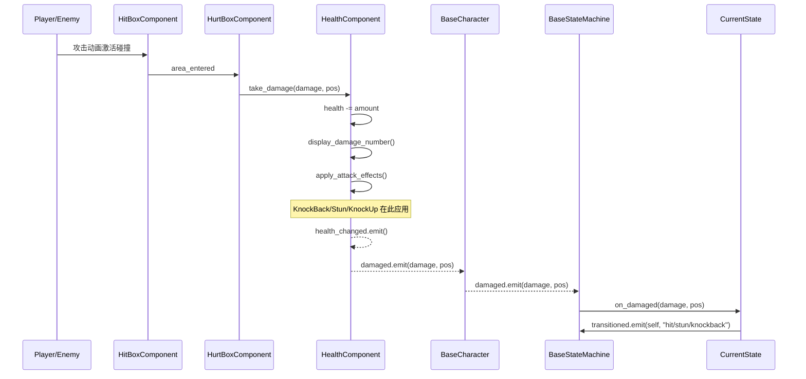

# 数据流与信号链路

## 伤害系统时序图



## 状态机优先级系统

```
CONTROL(2)  → stun, frozen
              最高优先级，只能被同级中断（如果 can_be_interrupted=true）
              用途：眩晕、冰冻等强控制效果

REACTION(1) → hit, knockback
              中等优先级，被 CONTROL 打断
              用途：受击硬直、击退/击飞

BEHAVIOR(0) → idle, wander, chase, attack
              最低优先级，被任何高级打断
              用途：正常 AI 行为循环
```

### 优先级判定规则（BaseState.can_transition_to）
```
高优先级 → 低优先级 = 始终允许（外部打断）
同优先级 = 检查 can_be_interrupted 属性
低优先级 → 高优先级 = 不可能（由优先级保证）
当前状态主动 → 任意低优先级 = 允许（自愿结束，如 Stun 恢复后转 Idle）
```

## 状态机切换完整链路

```
1. 触发源发出请求:
   current_state.transitioned.emit(self, "new_state_name")

2. BaseStateMachine._on_state_transition(from_state, new_state_name):
   ├─ 验证 from_state == current_state
   │   └─ 不等: 忽略（过期请求，防止竞态）
   ├─ states.get(new_state_name.to_lower())
   │   └─ 找不到: 打印警告，忽略
   └─ current_state.can_transition_to(new_state)
       └─ 不允许: 打印拒绝日志，忽略

3. _execute_transition(from_state, new_state):
   ├─ current_state.exit()  ← 清理：停 timer、断信号、重置动画
   ├─ new_state.enter()     ← 初始化：启 timer、连信号、设动画
   ├─ current_state = new_state
   └─ DebugConfig.debug("[owner] from → to", "state_machine")
```

## Autoload 信号清单

### GameManager
| 信号 | 参数 | 用途 |
|------|------|------|
| `game_state_changed` | state: int | 游戏状态切换通知 |
| `character_selection_completed` | character_data: CharacterData | 角色选择完成 |

### LevelManager
| 信号 | 参数 | 用途 |
|------|------|------|
| `level_started` | level_index: int | 关卡开始 |
| `level_completed` | level_index: int | 关卡完成 |
| `item_collected` | item_type: String, count: int | 物品收集 |
| `objective_updated` | type: String, current: int, required: int | 目标进度更新 |
| `boss_defeated` | — | Boss 击败 |
| `game_completed` | — | 游戏通关 |

### HealthComponent
| 信号 | 参数 | 用途 |
|------|------|------|
| `health_changed` | current: float, maximum: float | 血条 UI 更新、阶段检测 |
| `damaged` | damage: Damage, attacker_position: Vector2 | 状态机响应 |
| `died` | — | 死亡处理 |

### BaseCharacter
| 信号 | 参数 | 用途 |
|------|------|------|
| `damaged` | damage: Damage, attacker_position: Vector2 | 转发给状态机 |

### BossBase
| 信号 | 参数 | 用途 |
|------|------|------|
| `phase_changed` | new_phase: int | 阶段转换通知 |
| `boss_defeated` | — | Boss 击败通知 |

### BaseState
| 信号 | 参数 | 用途 |
|------|------|------|
| `transitioned` | from_state: BaseState, new_state_name: String | 状态切换请求 |

## 特殊技能触发链路

```
ChaseState/AttackState.physics_process_state(delta):
  → 检查是否有 special skill 状态节点
  → special_skill_state.can_trigger(distance):
      ├─ _cooldown_remaining > 0 → false（冷却中）
      ├─ _recheck_remaining > 0 → false（短暂等待）
      ├─ _check_condition(distance) → false（子类条件不满足）
      └─ randf() >= skill_probability → false（概率未命中，设 recheck_delay）
  → true: transitioned.emit(self, special_skill_name)
  → SpecialSkillState.enter():
      └─ _executing = true → execute_skill()（子类实现，可 await）
  → 完成: finish_skill()
      ├─ _cooldown_remaining = skill_cooldown
      ├─ _executing = false
      └─ transition_to("chase")
```

## Boss 阶段转换链路

```
HealthComponent.take_damage()
  → health_changed.emit(current, maximum)
  → BossBase._on_health_changed(current, maximum):
      └─ check_phase_transition():
          ├─ health_percent = health / max_health
          ├─ <= phase_3_health_percent (0.33) → change_phase(PHASE_3)
          └─ <= phase_2_health_percent (0.66) → change_phase(PHASE_2)

BossBase.change_phase(new_phase):
  ├─ current_phase = new_phase
  ├─ activate_phase_transition_effect():
  │   ├─ HealthComponent.set_invincible(true, 1.0)  ← 1秒无敌
  │   ├─ knockback_nearby_units()                    ← 200px 范围击退
  │   └─ play "phase_transition" animation（如有）
  ├─ phase_changed.emit(new_phase)
  └─ _on_phase_transition()  ← 子类钩子（调速度、解锁攻击等）
```

## 关卡流程链路

```
Main.tscn → GameManager.change_state(MENU)
  → 玩家选择角色 → character_selection_completed.emit(data)
  → GameManager.change_state(PLAYING)
  → LevelManager.start_level(0):
      ├─ load LEVEL_SCENES[0]
      ├─ level_started.emit(0)
      └─ 设置 current_objectives

Level 脚本._ready():
  ├─ 注册目标到 LevelManager
  ├─ 连接完成条件信号
  └─ 生成敌人/放置物品

目标完成:
  → LevelManager.check_objectives()
  → 全部完成: LevelManager.complete_level()
      ├─ level_completed.emit(index)
      └─ start_level(index + 1) 或 game_completed.emit()
```
