# 场景模板、类继承与 AnimationTree 分层动画

三类角色（Player / Enemy / Boss）的场景节点树、类继承关系、状态机配置、AnimationTree BlendTree 结构的完整参考。含 Mermaid 架构图、类图、数据流图。

---

## 1. 整体架构图

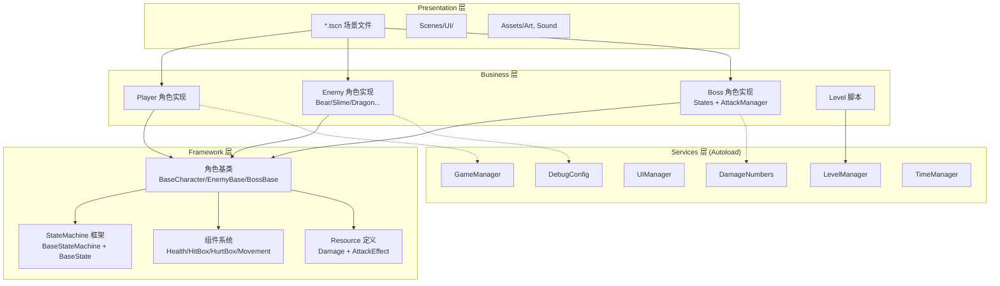

---

## 2. 角色类继承图

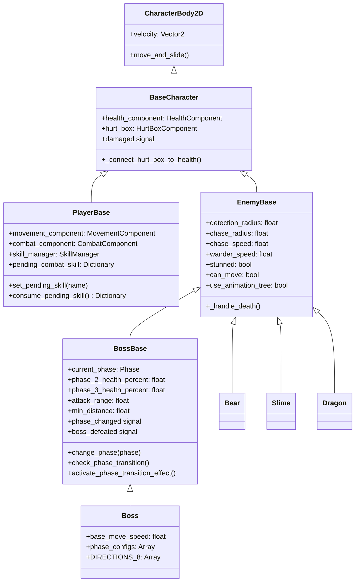

---

## 3. 状态机类继承图

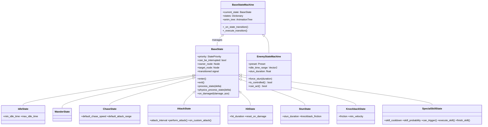

---

## 4. 组件与伤害系统类图

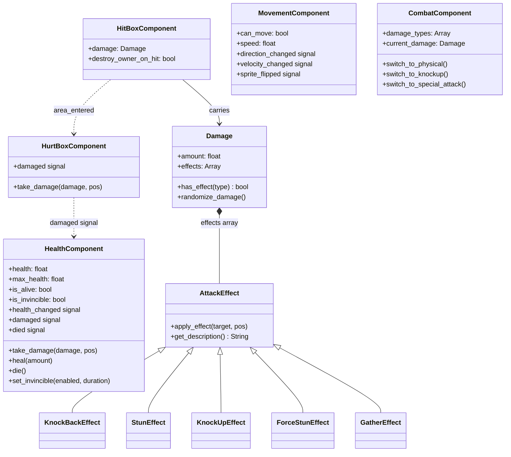

---

## 5. 统一 AnimationTree BlendTree 结构

所有角色共用同一套 BlendTree 布局，区别仅在 locomotion 和 control_sm 内的具体动画：

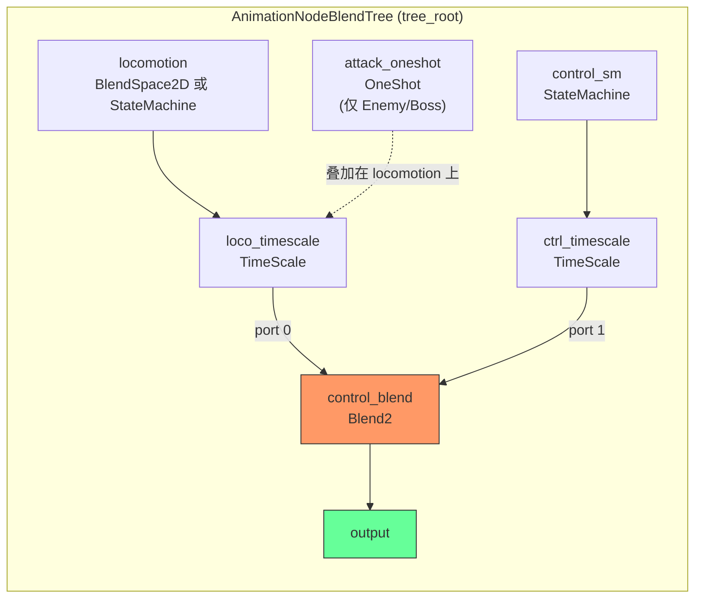

### 关键参数表

| 参数路径 | 类型 | 说明 |
|---------|------|------|
| `parameters/control_blend/blend_amount` | float | **核心开关**：0.0=locomotion 层，1.0=control 层 |
| `parameters/locomotion/playback` | Playback | Player 用：travel("idle"/"run") |
| `parameters/locomotion/blend_position` | Vector2 | Enemy/Boss 用：(方向x, 速度比y) |
| `parameters/control_sm/playback` | Playback | start("hit"/"stunned"/"death"/攻击名) |
| `parameters/loco_timescale/scale` | float | locomotion 动画速度倍率 |
| `parameters/ctrl_timescale/scale` | float | control 动画速度倍率 |
| `parameters/attack_oneshot/request` | int | Enemy/Boss：FIRE=触发攻击，ABORT=中断 |

### 状态切换 API（BaseState 方法）

```gdscript
# 切到 locomotion 层
exit_control_state()           # blend_amount = 0.0

# 切到 control 层
enter_control_state("hit")     # blend_amount = 1.0, control_sm.start("hit")

# locomotion 内切换
set_locomotion_state("idle")   # Player: playback.travel("idle")
set_locomotion(Vector2(1, 0.8))# Enemy: blend_position = (1, 0.8)

# 攻击 OneShot（Enemy/Boss）
fire_attack()                  # attack_oneshot.request = FIRE
abort_attack()                 # attack_oneshot.request = ABORT

# 时间缩放
set_control_time_scale(2.0)    # 加速 control 动画
set_locomotion_time_scale(0.5) # 减慢 locomotion 动画
reset_time_scale()             # 全部重置为 1.0
```

### 两层动画的切换时机

```
正常行为循环:  blend_amount = 0.0 (locomotion 层活跃)
  Idle/Wander: set_locomotion(0, 0) 或 set_locomotion_state("idle")
  Chase/Run:   set_locomotion(dir.x, speed_ratio) 或 set_locomotion_state("run")
  Attack:      fire_attack() (OneShot 叠加，不改 blend_amount)

受击/控制:      blend_amount = 1.0 (control 层活跃)
  Hit:     enter_control_state("hit")
  Stun:    enter_control_state("stunned")
  Death:   enter_control_state("death")
  恢复:    exit_control_state() (blend_amount 回到 0.0)

Player 攻击:    blend_amount = 1.0 (control 层)
  atk_1/2/3: enter_control_state("atk_1") + set_control_time_scale(2.0)
  完成:      animation_finished 回调 exit_control_state()
```

---

## 6. Player 场景模板

### 场景树

```
PlayerBase (CharacterBody2D) [Layer=2, Mask=128]
+-- FloorCollision (CollisionShape2D)
+-- AnimatedSprite2D
+-- AnimationPlayer
+-- AnimationTree [active]
+-- HurtBoxComponent (Area2D) [Layer=2, Mask=0]
|   +-- CollisionShape2D
+-- HitBoxComponent (Area2D) [Layer=4, Mask=8]
|   +-- CollisionShape2D (默认 disabled)
+-- HealthComponent (Node)
+-- HealthBar (ProgressBar)
+-- DamageNumbersAnchor (Node2D)
+-- MovementComponent (Node)
+-- CombatComponent (Node)
+-- SkillManager (Node)
+-- AudioStreamPlayer
+-- PlayerStateMachine (Node) [init_state="Ground"]
    +-- Ground        (BEHAVIOR, can_interrupt=true)
    +-- Air           (BEHAVIOR, can_interrupt=true)
    +-- Combat        (REACTION, can_interrupt=false)
    +-- Roll          (REACTION, can_interrupt=false)
    +-- Hit           (CONTROL,  can_interrupt=false)
    +-- SpecialAttack (REACTION, can_interrupt=false)
    +-- FallDeath     (CONTROL,  can_interrupt=false)
```

### Player 状态流转图

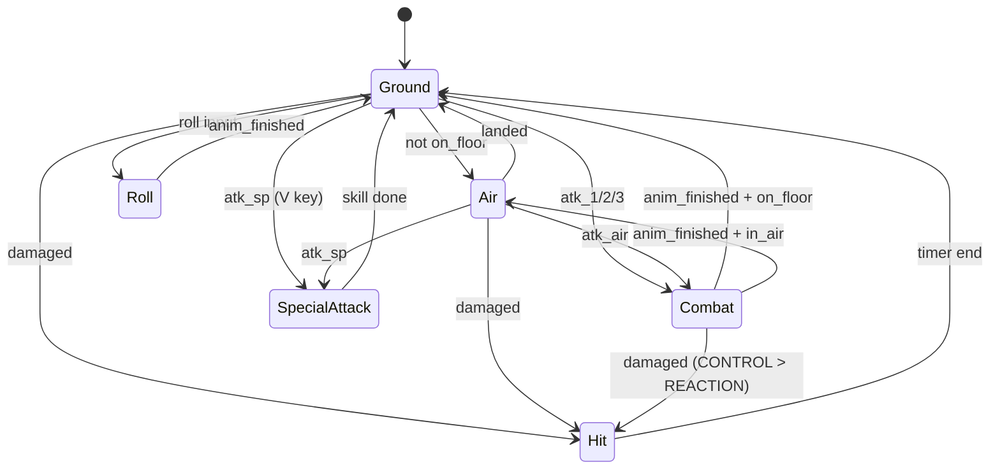

### Player locomotion / control_sm 层

```
locomotion (StateMachine): idle, run
control_sm (StateMachine): atk_1, atk_2, atk_3, atk_air, atk_sp, j_up, j_down, roll, take_hit
```

### Pending Skill 模式

```gdscript
# Ground/Air 检测输入，写入 pending，切状态
owner_node.set_pending_skill("atk_1")
transitioned.emit(self, "combat")

# Combat.enter() 消费 pending，播动画
var skill = owner_node.consume_pending_skill()
enter_control_state(skill.skill_name)

# 动画完成，回到 Ground/Air
func _on_animation_finished(anim_name):
    return_to_locomotion()
```

### 五组件协作图

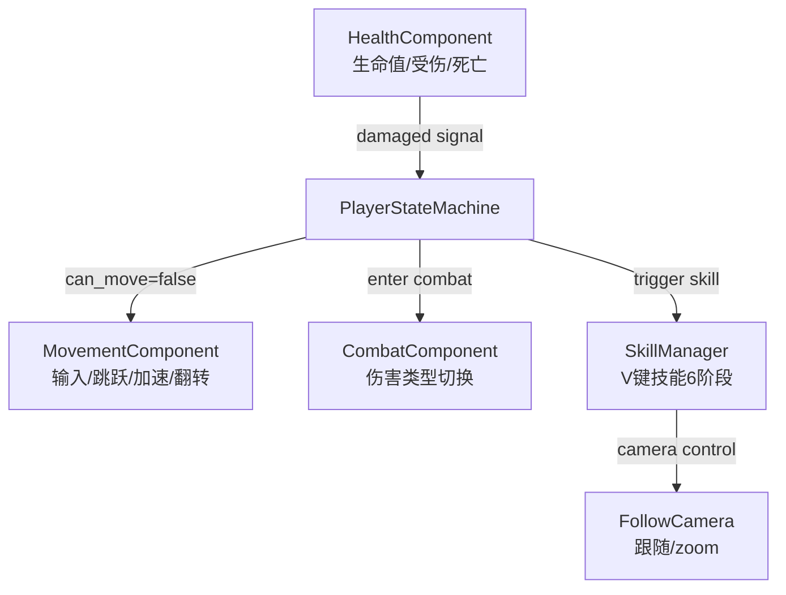

---

## 7. Enemy 场景模板

### 场景树

```
EnemyBase (CharacterBody2D) [Layer=8, Mask=128]
+-- Sprite2D (或 AnimatedSprite2D)
+-- AnimationPlayer
+-- AnimationTree [active, 可通过 use_animation_tree 关闭]
+-- HurtBoxComponent (Area2D) [Layer=8, Mask=4]
|   +-- CollisionShape2D
+-- FloorCollision (CollisionShape2D)
+-- HealthComponent (Node)
+-- HealthBar (ProgressBar)
+-- DamageNumbersAnchor (Node2D)
+-- HitBoxComponent (Area2D) [Layer=8, Mask=2]
|   +-- CollisionShape2D
+-- AttackAnchor (Node2D)
+-- EnemyStateMachine (Node) [init_state="Idle"]
    +-- Idle      (BEHAVIOR)
    +-- Wander    (BEHAVIOR)
    +-- Chase     (BEHAVIOR)
    +-- Attack    (BEHAVIOR)
    +-- Hit       (REACTION)
    +-- Knockback (REACTION)
    +-- Stun      (CONTROL)
    +-- [SpecialSkill] (BEHAVIOR, optional)
```

### Enemy 状态流转图

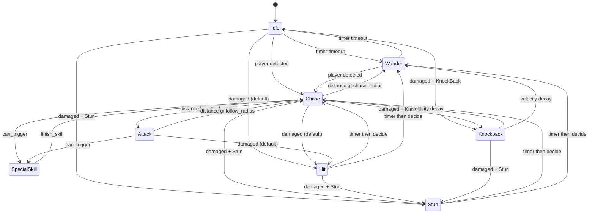

### Enemy locomotion 层 (BlendSpace2D)

```
BlendSpace2D 坐标点:
  (0, 0)     idle
  (-1, 0.5)  left_walk
  (1, 0.5)   right_walk
  (-1, 1.0)  left_run
  (1, 1.0)   right_run

用法:
  set_locomotion(Vector2(0, 0))        -> idle
  set_locomotion(Vector2(1, 0.5))      -> right_walk
  set_locomotion(Vector2(-1, 1.0))     -> left_run
  set_locomotion(Vector2(dir.x, clamp(speed/max_speed, 0, 1)))
```

### Enemy 关键状态生命周期

```gdscript
# Idle
enter(): stop_movement(), set_locomotion(0,0), start_timer(1~3s)
process_state(): try_attack() / try_chase()
timeout: -> Wander

# Chase
enter(): set_locomotion(1, 1)
physics: check SpecialSkill -> Attack (in range) -> Wander (out of range)
         move_toward_target + update blend_position

# Attack
enter(): stop_movement(), fire_attack() OneShot
physics: timer countdown -> perform_attack()
exit(): abort_attack()

# Hit (REACTION)
enter(): stop_movement(), enter_control_state("hit"), timer(0.2s)
timeout: decide_next_state() -> Chase/Wander
exit(): exit_control_state()

# Stun (CONTROL)
enter(): enter_control_state("stunned"), owner.stunned=true, timer(1.0s)
physics: friction decelerate if knockback velocity
timeout: decide_next_state(), owner.stunned=false
exit(): exit_control_state(), reset_time_scale()
```

---

## 8. Boss 场景模板

### 场景树

```
BossBase (CharacterBody2D) [Layer=8, Mask=128]
+-- Sprite2D
+-- CollisionShape2D (48x64)
+-- AnimationPlayer
+-- AnimationTree [active]
+-- HurtBoxComponent (Area2D) [Layer=8, Mask=4]
|   +-- CollisionShape2D (40x56)
+-- HealthComponent (Node) [max_health=1000]
+-- HealthBar (ProgressBar)
+-- DamageNumbersAnchor (Node2D)
+-- BossAttackManager (Node)            <-- Boss only
+-- BossStateMachine (Node) [init_state="Idle"]
    +-- Idle    (BossIdle)
    +-- Patrol  (BossPatrol)            <-- Boss only
    +-- Chase   (BossChase)
    +-- Circle  (BossCircle)            <-- Boss only
    +-- Attack  (BossAttack)
    +-- Retreat (BossRetreat)           <-- Boss only
    +-- Stun    (BossStun)
```

### Boss vs Enemy 差异表

| 维度 | Enemy | Boss |
|------|-------|------|
| 生命值 | 30~100 | 1000 |
| 状态 | 7 (Idle/Wander/Chase/Attack/Hit/Knockback/Stun) | 7 (Idle/Patrol/Chase/Circle/Attack/Retreat/Stun) |
| 攻击 | AttackState inline + OneShot | BossAttackManager + attack pools + Combo |
| 阶段 | None | 3 phases |
| 移动 | Direct pursuit | 8-dir + orbit + patrol |
| locomotion | BlendSpace2D | StateMachine (idle/walk) |

### Boss 战斗状态流转图

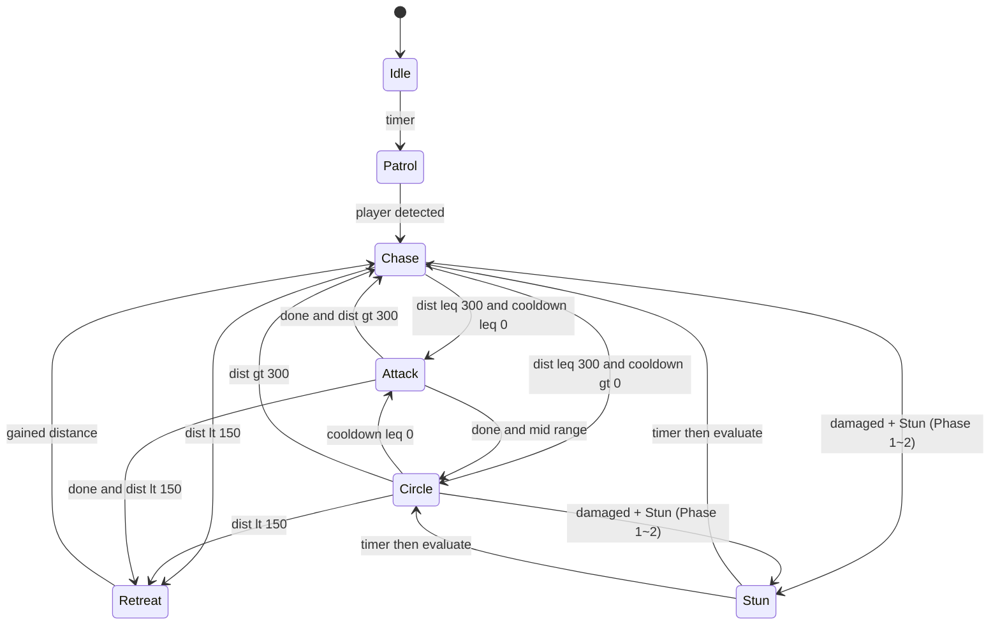

### 三阶段系统

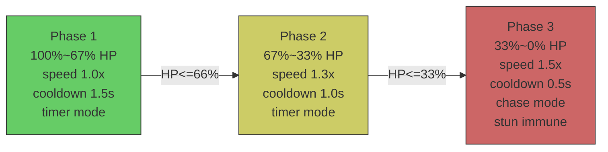

Phase transition triggers: 1s invincibility + 200px knockback wave + VFX

### BossPhaseConfig (Resource)

```gdscript
@export var attacks: Array        # main attack pool
@export var chase_attacks: Array  # attacks while chasing
@export var retreat_attacks: Array # attacks while retreating
@export var cooldown: float       # attack cooldown
@export var attack_duration: float
@export_enum("timer", "chase") var behavior: String
@export var speed_multiplier: float
@export var immune: bool          # stun immunity
```

### BossAttackManager methods

```gdscript
fire_projectiles(count, spread_angle)    # fan spread
fire_spiral_projectiles(count, offset)   # 360 spiral
fire_rapid_projectiles(target, count, interval)  # rapid fire
fire_laser_at_player()                   # charge 2.5s + fire 1.5s
fire_aoe() / fire_aoe_at(position)      # expanding circle r=200
execute_combo(BossComboAttack)           # multi-step sequence
```

### Boss 距离判定图

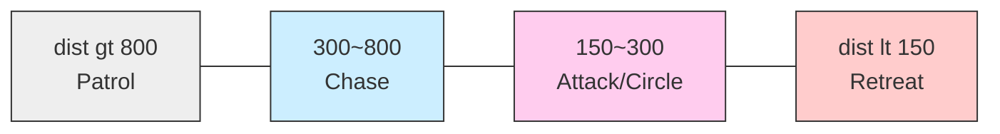

---

## 9. 必需动画清单

### Enemy

| 动画名 | 用途 | 所属层 |
|--------|------|--------|
| idle | 静止 | locomotion (BlendSpace2D) |
| left_walk / right_walk | 走 | locomotion |
| left_run / right_run | 跑 | locomotion |
| attack | 攻击 | attack_oneshot |
| hit | 受击 | control_sm |
| stunned | 眩晕 | control_sm |
| death | 死亡 | control_sm |

### Player

| 动画名 | 用途 | 所属层 |
|--------|------|--------|
| idle, run | 静止/跑 | locomotion (StateMachine) |
| atk_1, atk_2, atk_3 | 地面连招 | control_sm |
| atk_air | 空中攻击 | control_sm |
| atk_sp | 特殊技能 | control_sm |
| j_up, j_down | 跳跃 | control_sm |
| roll | 翻滚 | control_sm |
| take_hit | 受击 | control_sm |

### Boss

| 动画名 | 用途 | 所属层 |
|--------|------|--------|
| idle, walk | 静止/走 | locomotion (StateMachine) |
| attack | 攻击 | control_sm |
| hit | 受击 | control_sm |
| stunned | 眩晕 | control_sm |
| death | 死亡 | control_sm |
| phase_transition | 阶段转换(optional) | control_sm |

---

## 10. 伤害系统完整数据流

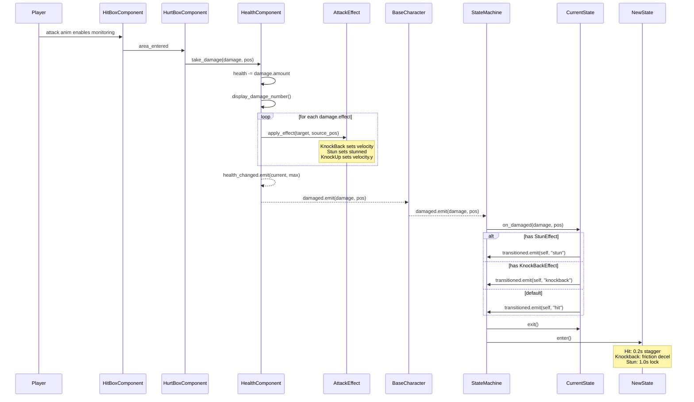
