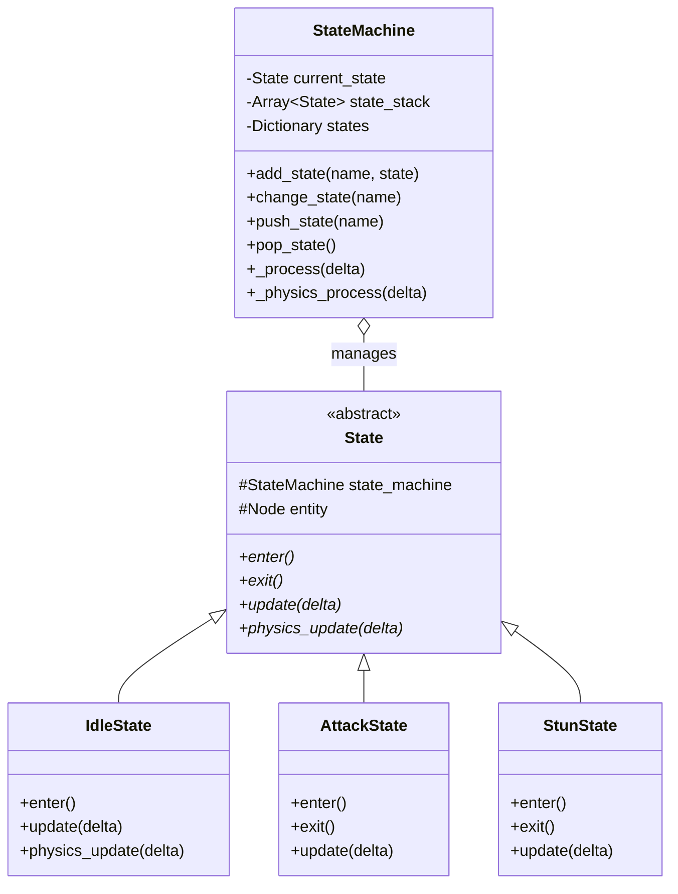
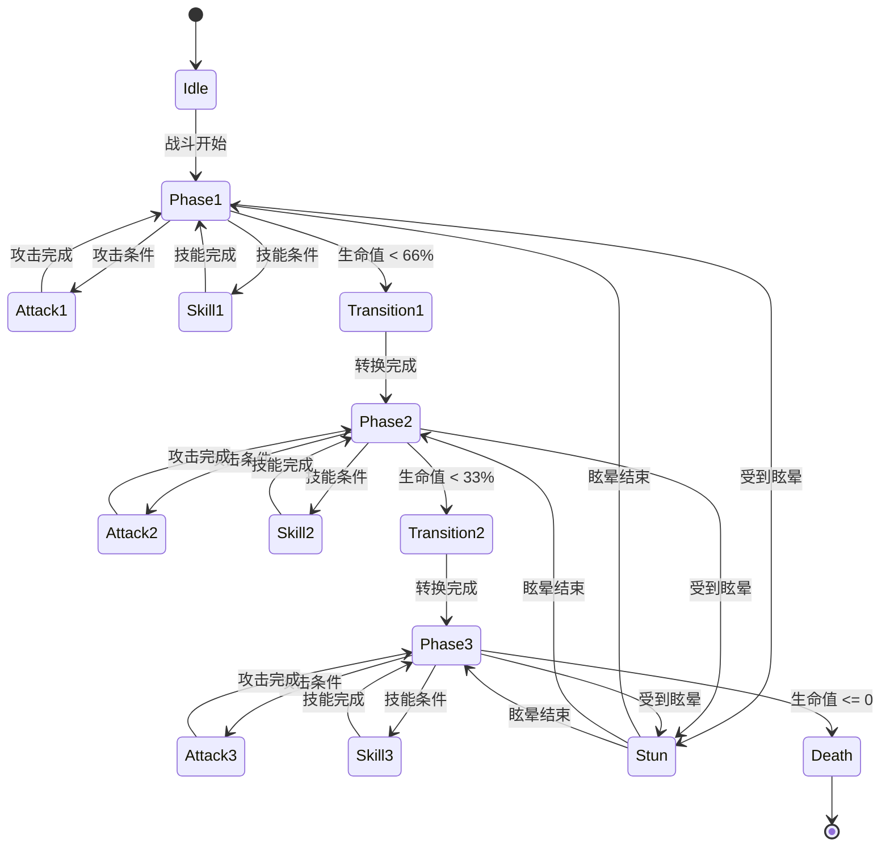

# 状态机系统架构

> **文档类型**: 核心架构 - 状态机系统
> **创建日期**: 2026-01-20
> **Godot版本**: 4.4.1
> **架构模式**: 状态模式 + 堆栈模式

---

## 📋 架构概述

### 设计目标

状态机系统用于管理复杂的实体行为（如Boss战斗、Player动作），通过状态封装和转换实现：

- ✅ **行为封装**: 每个状态封装特定的行为逻辑
- ✅ **清晰转换**: 明确的状态转换规则
- ✅ **状态堆栈**: 支持状态暂停和恢复
- ✅ **可复用性**: 状态类可在不同实体间复用

### 核心概念

```
复杂行为 = 状态集合 + 转换规则
- 状态 (State): 封装特定行为的独立类
- 转换 (Transition): 状态切换的条件和逻辑
- 堆栈 (Stack): 支持状态暂停/恢复
```

---

## 🏗️ 状态机基础架构

### 状态机执行流程（ASCII）

```
StateMachine节点
   │
   ├─→ _ready()
   │   ├─→ 收集所有State子节点
   │   ├─→ 初始化states字典
   │   └─→ 进入初始状态
   │       └─→ current_state.enter() ✅
   │
   └─→ 每帧执行：
       │
       ├─→ _process(delta)
       │   └─→ current_state.update(delta)
       │       └─→ if condition:
       │           └─→ transition_to("NextState")
       │               │
       │               ├─→ 1. current_state.exit()
       │               ├─→ 2. current_state = new_state
       │               └─→ 3. current_state.enter() ✅
       │
       └─→ _physics_process(delta)
           └─→ current_state.physics_update(delta)
```

### UML类图



### 核心实现

```gdscript
# StateMachine - 状态管理器
class_name StateMachine
extends Node

signal transitioned(from_state: State, to_state_name: String)

var current_state: State
var states: Dictionary = {}
var state_stack: Array[State] = []
@onready var entity = get_parent()

func _ready():
    # 收集所有State子节点
    for child in get_children():
        if child is State:
            states[child.name] = child
            child.state_machine = self
            child.entity = entity
    # 进入初始状态
    if states.size() > 0:
        change_state(states.keys()[0])

func _process(delta):
    if current_state:
        current_state.update(delta)

func change_state(new_state_name: String) -> bool:
    var new_state = states.get(new_state_name)
    if not new_state: return false

    if current_state:
        current_state.exit()

    current_state = new_state
    current_state.enter()
    transitioned.emit(current_state, new_state_name)
    return true

# State - 状态基类
class_name State
extends Node

var state_machine: StateMachine
var entity: Node

func enter(): pass
func exit(): pass
func update(delta: float): pass
func physics_update(delta: float): pass

func transition_to(state_name: String):
    state_machine.change_state(state_name)
```

---

## 🎯 实战案例：Boss状态机

### Boss阶段转换流程（ASCII）

```
Boss进入Phase1
   │
   ├─→ 攻击循环
   │   └─→ Phase1.update(delta)
   │       ├─→ time_since_skill >= 8s
   │       │   └─→ transition_to("Skill1")
   │       │       └─→ Skill1.enter() → 执行技能
   │       │           └─→ transition_to("Phase1") ✅
   │       │
   │       └─→ time_since_attack >= 3s
   │           └─→ transition_to("Attack1")
   │               └─→ Attack1.enter() → 执行攻击
   │                   └─→ transition_to("Phase1") ✅
   │
   ├─→ 生命值检测
   │   └─→ health_changed signal
   │       └─→ if health < 66%:
   │           └─→ change_state("Transition1")
   │               └─→ Transition1.enter()
   │                   └─→ 播放转换动画
   │                       └─→ transition_to("Phase2") ✅
   │
   └─→ Phase2（重复Phase1逻辑）
       └─→ if health < 33%:
           └─→ transition_to("Phase3") ✅
```

### Boss状态图



### 核心代码

```gdscript
# Boss状态机 - 监听生命值触发阶段转换
extends StateMachine

func _ready():
    super._ready()
    health_component.health_changed.connect(_on_health_changed)

func _on_health_changed(current: float, maximum: float):
    var health_percent = current / maximum * 100

    if health_percent < 33:
        change_state("Transition2")  # Phase3转换
    elif health_percent < 66 and current_state.name == "Phase1":
        change_state("Transition1")  # Phase2转换

# Phase1状态 - 控制攻击和技能循环
extends State

@export var attack_interval: float = 3.0
@export var skill_interval: float = 8.0
var time_since_attack: float = 0
var time_since_skill: float = 0

func update(delta):
    time_since_attack += delta
    time_since_skill += delta

    if time_since_skill >= skill_interval:
        transition_to("Skill1")
        time_since_skill = 0
    elif time_since_attack >= attack_interval:
        transition_to("Attack1")
        time_since_attack = 0
```

---

## 🔄 状态堆栈模式

### 状态暂停与恢复流程（ASCII）

```
Boss正在Attack1
   │
   └─→ 受到眩晕效果
       │
       ├─→ push_state("Stun")
       │   ├─→ 1. state_stack.push(Attack1)
       │   ├─→ 2. Attack1.exit()
       │   └─→ 3. Stun.enter() ✅
       │
       ├─→ Stun持续3秒
       │   └─→ Stun.update(delta) × N
       │
       └─→ 眩晕结束
           │
           └─→ pop_state()
               ├─→ 1. Stun.exit()
               ├─→ 2. state_stack.pop() → Attack1
               └─→ 3. Attack1.enter() ✅ (恢复)
```

### 实现示例

```gdscript
# 状态堆栈操作
func push_state(new_state_name: String):
    state_stack.append(current_state)
    current_state.exit()
    change_state(new_state_name)

func pop_state():
    if not state_stack.is_empty():
        current_state.exit()
        current_state = state_stack.pop_back()
        current_state.enter()

# 应用眩晕
func apply_stun(duration: float):
    state_machine.push_state("Stun")
    await get_tree().create_timer(duration).timeout
    state_machine.pop_state()
```

---

## 💡 状态机最佳实践

### ✅ 推荐做法

#### 1. 清晰的状态命名

```gdscript
# ✅ 清晰
IdleState, AttackState, Phase1State

# ❌ 模糊
State1, BossState, TempState
```

#### 2. 使用transition_to()切换状态

```gdscript
# ✅ 推荐
func update(delta):
    if condition:
        transition_to("NextState")

# ❌ 避免直接访问
state_machine.current_state = states["NextState"]
```

#### 3. 监听状态转换信号

```gdscript
# StateMachine发出信号
signal transitioned(from_state, to_state_name)

# 外部监听
state_machine.transitioned.connect(_on_state_changed)
```

### ❌ 常见错误

#### 1. 状态间直接耦合

```gdscript
# ❌ 错误：状态直接引用其他状态
class AttackState:
    var idle_state: IdleState  # ❌ 耦合
    func exit():
        idle_state.do_something()

# ✅ 正确：通过状态机切换
func update(delta):
    if attack_finished:
        transition_to("Idle")
```

#### 2. 状态直接操作实体

```gdscript
# ❌ 错误：跳过组件层
func enter():
    entity.velocity = Vector2.ZERO

# ✅ 正确：通过组件
func enter():
    entity.movement_component.stop()
    entity.animation_component.play("attack")
```

---

## 🎓 状态机设计模式

### 策略模式变体

状态机是**策略模式**的变体，每个状态就是一个策略：

```
Context (StateMachine) → Strategy (State)
```

**优点**:
- ✅ 将行为封装在独立的类中
- ✅ 易于添加新状态
- ✅ 符合开放-封闭原则

---

## 🔗 相关文档

- [组件系统架构](03_component_system_architecture.md) - 状态机作为组件使用
- [信号驱动架构](04_signal_driven_architecture.md) - 状态转换通知
- [Boss战系统](../archive/boss_battle_design.md) - Boss状态机完整实现

---

**维护者**: 开发团队
**最后更新**: 2026-01-20
**Token估算**: ~850
