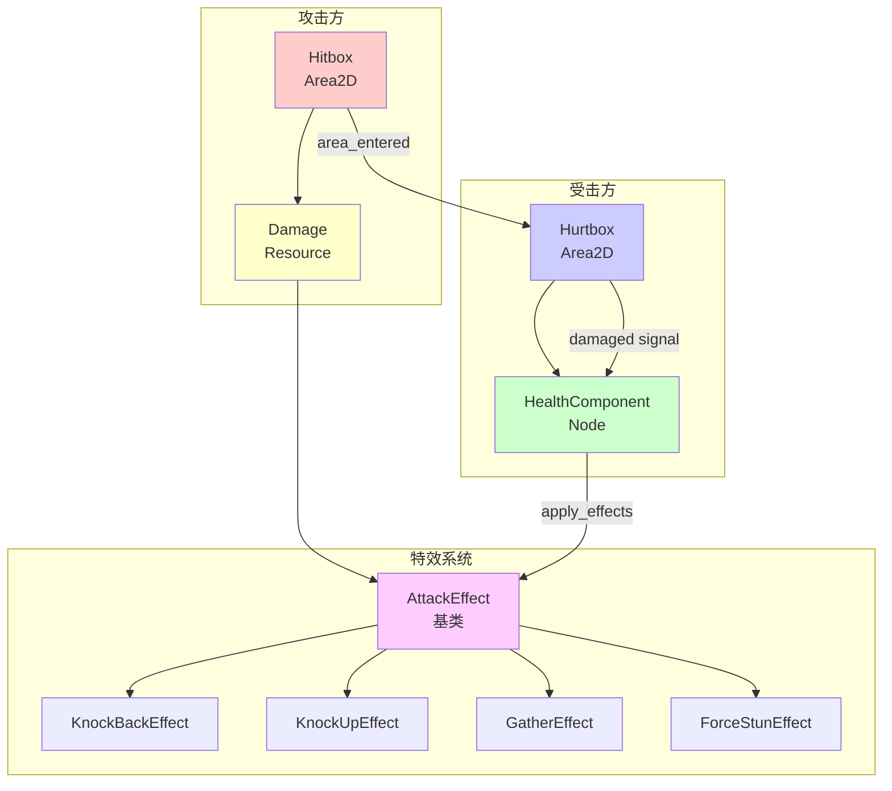
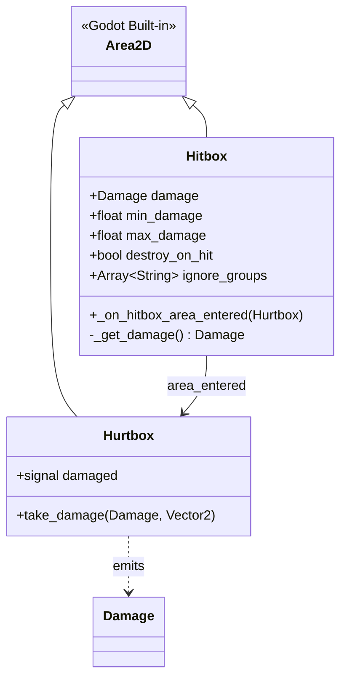
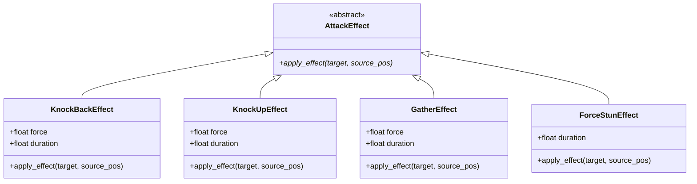
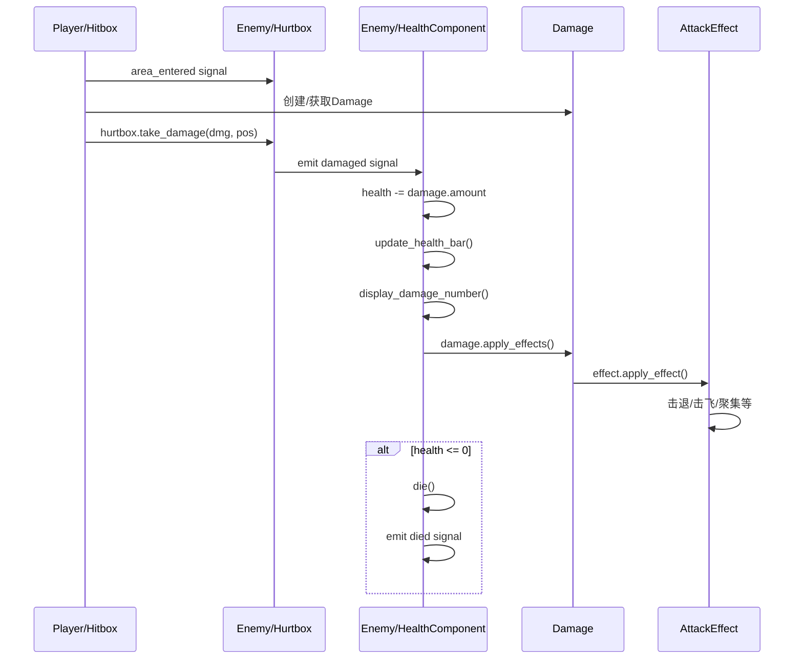

# 战斗系统架构

> **文档类型**: 核心架构 - 战斗系统
> **创建日期**: 2026-01-20
> **Godot版本**: 4.4.1
> **架构模式**: 信号驱动 + 组件化 + 策略模式

---

## 📋 目录

1. [架构概览](#1-架构概览)
2. [Hitbox/Hurtbox 碰撞系统](#2-hitboxhurtbox-碰撞系统)
3. [Damage 伤害系统](#3-damage-伤害系统)
4. [AttackEffect 攻击特效](#4-attackeffect-攻击特效)
5. [HealthComponent 生命值管理](#5-healthcomponent-生命值管理)
6. [完整交互流程](#6-完整交互流程)
7. [最佳实践](#7-最佳实践)

---

## 1. 架构概览

### 1.1 系统目标

战斗系统负责处理游戏中的所有伤害判定、效果应用和生命值管理，主要包括：

- ⚔️ **攻击检测**：Hitbox检测攻击范围内的敌人
- 🛡️ **受击判定**：Hurtbox接收伤害并发送信号
- 💥 **伤害计算**：Damage资源定义伤害值和特效
- ✨ **特效应用**：AttackEffect实现击退、击飞、聚集等效果
- ❤️ **生命值管理**：HealthComponent处理生命值和死亡

### 1.2 核心组件



### 1.3 碰撞层配置

| 层级 | 名称 | 用途 | 代表组件 |
|-----|------|------|---------|
| **Layer 2** | Player Hurtbox | 玩家受击区域 | Hahashin/Hurtbox |
| **Layer 4** | Player Hitbox | 玩家攻击区域 | Hahashin/Hitbox |
| **Layer 8** | Enemy Hurtbox | 敌人受击区域 | Enemy/Hurtbox |
| **Layer 16** | Enemy Hitbox | 敌人攻击区域 | Enemy/Hitbox |

**规则**:
- Player Hitbox (Layer 4) 检测 Enemy Hurtbox (Mask 8)
- Enemy Hitbox (Layer 16) 检测 Player Hurtbox (Mask 2)
- 同阵营不互相伤害

---

## 2. Hitbox/Hurtbox 碰撞系统

### 2.1 Hitbox 设计

**职责**: 检测攻击范围内的敌人，传递伤害数据

**核心配置**:
```gdscript
@export var damage: Damage  # Damage资源
@export var min_damage: float = 5.0
@export var max_damage: float = 10.0
@export_flags_2d_physics var collision_layer: int = 4
@export_flags_2d_physics var collision_mask: int = 8
@export var destroy_on_hit: bool = false
@export var ignore_groups: Array[String] = []
```

**工作流程**:
```gdscript
func _on_hitbox_area_entered(hurtbox: Hurtbox):
    # 1. 检查忽略组
    # 2. 创建/获取Damage实例
    # 3. hurtbox.take_damage(dmg, pos)
    # 4. 可选：销毁自身（子弹）
```

### 2.2 Hurtbox 设计

**职责**: 接收伤害，发出damaged信号

```gdscript
class_name Hurtbox
extends Area2D

signal damaged(damage: Damage, attacker_position: Vector2)

func take_damage(damage: Damage, attacker_position: Vector2):
    damaged.emit(damage, attacker_position)
```

**说明**: Hurtbox只负责转发信号，实际伤害处理由HealthComponent完成。

### 2.3 UML类图



---

## 3. Damage 伤害系统

### 3.1 Damage Resource设计

**职责**: 封装伤害数据和攻击特效

**核心字段**:
```gdscript
@export var max_amount: float = 10.0
@export var min_amount: float = 5.0
@export var amount: float  # 实际伤害值
@export var effects: Array[AttackEffect] = []
```

**核心方法**:
```gdscript
func randomize_damage()  # 随机生成伤害值
func apply_effects(target, source_pos)  # 应用所有特效
func has_effect(effect_type) -> bool  # 检查是否包含特效
static func create_damage(dmg) -> Damage  # 工厂方法
```

### 3.2 使用示例

```gdscript
# 方式1：配置Damage资源（推荐）
var fireball_damage = preload("res://Resources/Damages/fireball_damage.tres")
# 资源配置:
#   max_amount = 15.0
#   min_amount = 10.0
#   effects = [KnockBackEffect, BurnEffect]

# 方式2：代码创建
var simple_damage = Damage.create_damage(20.0)

# 方式3：复杂配置
var complex_damage = Damage.new()
complex_damage.min_amount = 30.0
complex_damage.max_amount = 50.0
complex_damage.effects = [
    KnockUpEffect.new(),
    StunEffect.new()
]
complex_damage.randomize_damage()
```

---

## 4. AttackEffect 攻击特效

### 4.1 基类设计

**架构模式**: 策略模式 (Strategy Pattern)

```gdscript
# Util/Classes/AttackEffect.gd
class_name AttackEffect
extends Resource

## 抽象方法：由子类实现
func apply_effect(target: Node2D, source_pos: Vector2):
    push_error("AttackEffect.apply_effect() must be overridden")
```

### 4.2 特效实现示例

#### KnockBackEffect (击退)

```gdscript
# Util/Classes/KnockBackEffect.gd
class_name KnockBackEffect
extends AttackEffect

@export var force: float = 300.0
@export var duration: float = 0.3

func apply_effect(target: Node2D, source_pos: Vector2):
    if not target is CharacterBody2D:
        return

    var direction = (target.global_position - source_pos).normalized()

    # 使用信号替代await（避免内存泄漏）
    var timer = target.get_tree().create_timer(duration)
    timer.timeout.connect(_apply_knockback.bind(target, direction))

func _apply_knockback(target: CharacterBody2D, direction: Vector2):
    target.velocity = direction * force
```

#### GatherEffect (聚集)

```gdscript
# Util/Classes/GatherEffect.gd
class_name GatherEffect
extends AttackEffect

@export var force: float = 800.0
@export var duration: float = 0.5

func apply_effect(target: Node2D, source_pos: Vector2):
    if not target is CharacterBody2D:
        return

    # 向源头聚集
    var direction = (source_pos - target.global_position).normalized()

    var timer = target.get_tree().create_timer(duration)
    timer.timeout.connect(_apply_gather.bind(target, direction))

func _apply_gather(target: CharacterBody2D, direction: Vector2):
    target.velocity = direction * force
```

### 4.3 特效UML类图



---

## 5. HealthComponent 生命值管理

### 5.1 组件设计

**职责**: 生命值管理、伤害处理、死亡逻辑、血条显示

**信号**:
```gdscript
signal health_changed(current: float, maximum: float)
signal damaged(damage: Damage, attacker_position: Vector2)
signal died()
```

**核心方法**:
```gdscript
func take_damage(damage: Damage, attacker_position: Vector2):
    # 1. 扣除生命值
    # 2. 更新血条
    # 3. 发送信号
    # 4. 显示伤害数字
    # 5. 应用攻击特效
    # 6. 检查死亡 → die()

func die():
    is_alive = false
    died.emit()
```

**自动初始化**:
```gdscript
func _ready():
    # 自动连接Hurtbox的damaged信号
    var hurtbox = get_parent().get_node_or_null("Hurtbox")
    if hurtbox:
        hurtbox.damaged.connect(take_damage)
```

### 5.2 血条自动创建

```gdscript
func setup_health_bar():
    # 查找Canvas层
    var canvas = get_parent().get_node_or_null("Canvas")
    if not canvas:
        push_warning("No Canvas node found")
        return

    # 查找ProgressBar
    health_bar = canvas.get_node_or_null("HealthBar")
    if health_bar:
        health_bar.max_value = 100
        health_bar.value = 100
```

---

## 6. 完整交互流程

### 6.1 玩家攻击敌人 - ASCII流程

```
Player攻击Enemy
   │
   Player/Hitbox.area_entered
   └─→ Enemy/Hurtbox检测到碰撞
       │
       ├─→ Hitbox._on_hitbox_area_entered()
       │   ├─→ 检查ignore_groups
       │   ├─→ 创建/获取Damage实例
       │   └─→ hurtbox.take_damage(damage, pos)
       │
       └─→ Hurtbox.take_damage()
           └─→ emit damaged(damage, pos)
               │
               └─→ HealthComponent.take_damage()
                   │
                   ├─→ 1. health -= damage.amount
                   ├─→ 2. update_health_bar()
                   ├─→ 3. emit health_changed
                   ├─→ 4. emit damaged
                   ├─→ 5. display_damage_number()
                   │
                   ├─→ 6. damage.apply_effects()
                   │   └─→ for each effect:
                   │       ├─→ KnockBackEffect.apply_effect()
                   │       ├─→ KnockUpEffect.apply_effect()
                   │       └─→ GatherEffect.apply_effect()
                   │
                   └─→ 7. if health <= 0:
                       └─→ die()
                           ├─→ is_alive = false
                           └─→ emit died ✅
```

### 6.2 时序图（组件交互）



---

## 7. 最佳实践

### 7.1 碰撞层配置原则

✅ **推荐**:
```gdscript
# 使用 @export_flags_2d_physics 在编辑器配置
@export_flags_2d_physics var collision_layer: int = 4
@export_flags_2d_physics var collision_mask: int = 8
```

❌ **避免**:
```gdscript
# 硬编码数字
collision_layer = 4
collision_mask = 8
```

### 7.2 Damage资源复用

✅ **推荐**:
```
# 创建可重用的Damage资源
res://Resources/Damages/
├── sword_slash.tres
├── fireball.tres
└── explosion.tres
```

❌ **避免**:
```gdscript
# 每次都创建新Damage对象
var dmg = Damage.new()
dmg.amount = 10
```

### 7.3 AttackEffect 避免内存泄漏

✅ **推荐**:
```gdscript
# 使用信号连接
var timer = target.get_tree().create_timer(duration)
timer.timeout.connect(_apply_effect.bind(target))
```

❌ **避免**:
```gdscript
# 直接await（target销毁后可能泄漏）
await target.get_tree().create_timer(duration).timeout
target.velocity = direction * force  # target可能已经free
```

### 7.4 组件解耦

✅ **推荐**:
```gdscript
# Hurtbox -> Signal -> HealthComponent
hurtbox.damaged.connect(health_component.take_damage)
```

❌ **避免**:
```gdscript
# Hurtbox直接调用HealthComponent
health_component.take_damage(dmg, pos)
```

---

## 📚 相关文档

- [信号驱动架构](04_signal_driven_architecture.md) - 信号通信模式
- [组件系统架构](03_component_system_architecture.md) - 组件化设计
- [技能系统架构](06_skill_system_architecture.md) - 技能与战斗集成

---

**维护者**: 开发团队
**最后更新**: 2026-01-20
**Token估算**: ~1500
