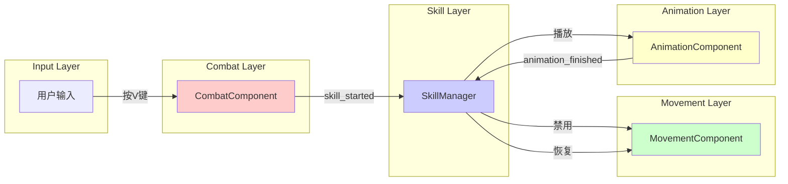

# 信号驱动架构

> **文档类型**: 核心架构 - 信号驱动
> **创建日期**: 2026-01-20
> **Godot版本**: 4.4.1
> **架构模式**: 观察者模式 (Observer Pattern)

---

## 📋 架构概述

### 设计目标

信号驱动架构通过Godot内置的信号系统实现组件间解耦通信：

- ✅ **零耦合**: 发送者不知道接收者，接收者不依赖发送者
- ✅ **一对多**: 一个信号可以被多个对象监听
- ✅ **动态绑定**: 运行时连接/断开信号
- ✅ **类型安全**: 支持类型化参数

### 核心理念

```
直接调用（耦合） → 信号通信（解耦）

# ❌ 紧耦合
class A:
    var b: B
    func do_something():
        b.handle_event()  # A依赖B

# ✅ 信号解耦
class A:
    signal event_occurred
    func do_something():
        event_occurred.emit()  # A不知道谁在监听

class B:
    func _ready():
        a.event_occurred.connect(handle_event)
```

---

## 🎯 信号定义规范

### 基础信号定义

```gdscript
# 无参数信号
signal died()
signal animation_finished()

# 单参数信号
signal health_changed(current_health: float)
signal state_changed(new_state: String)

# 多参数信号
signal damaged(damage: Damage, attacker_position: Vector2)
signal item_collected(item_type: String, amount: int)
```

### 命名规范

| 模式 | 示例 | 用途 |
|------|------|------|
| **过去式** | `died`, `damaged`, `collected` | 已完成的事件 |
| **进行式** | `dying`, `attacking` | 正在进行的事件 |
| **完成式** | `health_changed`, `state_changed` | 状态变化通知 |

**推荐**：使用**过去式**表示事件已发生

```gdscript
# ✅ 推荐
signal died()
signal damaged(damage)
signal skill_started(skill_name)

# ❌ 避免
signal die()
signal damage(damage)
signal start_skill(skill_name)
```

---

## 📡 信号连接模式

### 信号通信流程（ASCII）

```
组件A（发送者）
   │
   └─→ signal event_occurred.emit(data)
       │
       ├─→ 组件B._on_event(data)
       │   └─→ 处理逻辑A ✅
       │
       ├─→ 组件C._on_event(data)
       │   └─→ 处理逻辑B ✅
       │
       └─→ 组件D._on_event(data)
           └─→ 处理逻辑C ✅
```

**核心特点**:
- ✅ 一对多：一个信号触发多个监听者
- ✅ 解耦：组件A不知道谁在监听
- ✅ 异步：监听者独立处理，互不影响

### 1. 基础连接

```gdscript
# 发送者
class_name HealthComponent
extends Node

signal died()
signal health_changed(current: float, maximum: float)

func take_damage(amount: float):
    health -= amount
    health_changed.emit(health, max_health)
    if health <= 0:
        died.emit()

# 接收者
func _ready():
    health_comp.died.connect(_on_died)
    health_comp.health_changed.connect(_on_health_changed)
```

### 2. 信号连接生命周期（ASCII）

```
节点初始化
   │
   └─→ _ready()
       ├─→ 1. 获取信号源
       │   └─→ var health = get_node("HealthComponent")
       │
       ├─→ 2. 连接信号
       │   └─→ health.died.connect(_on_died)
       │
       └─→ 运行时：
           │
           ├─→ 事件触发
           │   └─→ health.take_damage(10)
           │       └─→ if health <= 0:
           │           └─→ died.emit() ✅
           │
           └─→ 回调执行
               └─→ _on_died()
                   └─→ 处理死亡逻辑 ✅
```

### 3. 高级连接模式

```gdscript
# 一次性连接（触发一次后自动断开）
animation.animation_finished.connect(_on_anim, CONNECT_ONE_SHOT)

# 延迟连接（下一帧执行）
health.died.connect(_on_died, CONNECT_DEFERRED)

# Lambda表达式（内联逻辑）
button.pressed.connect(func(): print("点击"))
health.health_changed.connect(func(cur, max):
    health_bar.value = cur / max * 100
)
```

---

## 🔥 Damage 信号传递链详解

### 完整传递路径

Damage 信号是本项目最核心的信号链，从攻击检测到状态响应经历多个组件：

```
┌─────────────────────────────────────────────────────────────────────────────┐
│                        DAMAGE 信号传递完整链路                              │
├─────────────────────────────────────────────────────────────────────────────┤
│                                                                             │
│   ┌───────────┐     碰撞检测        ┌───────────┐                          │
│   │  Hitbox   │ ─────────────────→ │  Hurtbox  │                          │
│   │ (攻击者)   │  area_entered      │ (受击者)   │                          │
│   └───────────┘  调用take_damage()  └─────┬─────┘                          │
│                                           │                                 │
│                                           │ damaged.emit(damage, pos)       │
│                                           ↓                                 │
│   ┌─────────────────────────────────────────────────────────────────────┐  │
│   │                  信号订阅者（统一组件化架构）                        │  │
│   ├─────────────────────────────────────────────────────────────────────┤  │
│   │              统一组件化架构（Player/Enemy/Boss）                    │  │
│   │  ┌──────────────────────────────────────────────────────────────┐   │  │
│   │  │                    HealthComponent                           │   │  │
│   │  │  .take_damage(damage, attacker_pos)                          │   │  │
│   │  │  ├─ 无敌状态检查                                              │   │  │
│   │  │  ├─ 扣除生命值                                                │   │  │
│   │  │  ├─ 更新血条                                                  │   │  │
│   │  │  ├─ 显示伤害数字（支持暴击）                                   │   │  │
│   │  │  ├─ 应用攻击特效（击飞/击退）                                  │   │  │
│   │  │  └─ 发出 damaged 信号                                         │   │  │
│   │  └────────────────────────────┬─────────────────────────────────┘   │  │
│   └─────────────────────────────────┼───────────────────────────────────┘  │
│                                     │                                      │
│                                     │ damaged 信号                         │
│                                     ↓                                      │
│   ┌─────────────────────────────────────────────────────────────────────┐  │
│   │                      BaseStateMachine                                │  │
│   │  _setup_signals():                                                   │  │
│   │      owner_node.damaged.connect(_on_owner_damaged)                   │  │
│   │                                                                      │  │
│   │  _on_owner_damaged(damage, attacker_pos):                            │  │
│   │      current_state.on_damaged(damage, attacker_pos)                  │  │
│   └──────────────────────────────────┬──────────────────────────────────┘  │
│                                      │                                     │
│                                      ↓                                     │
│   ┌─────────────────────────────────────────────────────────────────────┐  │
│   │                    当前状态 (如 StunState)                           │  │
│   │  on_damaged(damage, attacker_pos):                                   │  │
│   │      ├─ 检查击飞特效 (KnockUpEffect)                                 │  │
│   │      ├─ 检查击退特效 (KnockBackEffect)                               │  │
│   │      └─ 重置眩晕计时器                                               │  │
│   └─────────────────────────────────────────────────────────────────────┘  │
│                                                                             │
└─────────────────────────────────────────────────────────────────────────────┘
```

### 各组件职责

| 组件 | 职责 | 信号类型 |
|------|------|----------|
| **Hitbox** | 攻击检测，碰撞时调用 `take_damage()` | 无（直接方法调用） |
| **Hurtbox** | 受击区域，转发伤害信号 | 发出 `damaged` |
| **HealthComponent** | 统一伤害处理：扣血、血条、特效、伤害数字 | 监听 Hurtbox + 发出 `damaged` |
| **Enemy/Boss/Player** | 转发 damaged 信号给状态机 | 监听 HealthComponent + 发出 `damaged` |
| **BaseStateMachine** | 转发伤害到当前状态 | 监听 owner 的 `damaged` |
| **StunState** | 处理击飞/击退响应、重置计时器 | 接收 `on_damaged()` 回调 |

### 核心代码示例

#### 1. Hitbox 检测碰撞

```gdscript
# Util/Components/hitbox.gd
func _on_hitbox_area_entered_(area: Area2D):
    update_attack()
    if area is Hurtbox:
        # 关键：调用 Hurtbox 的 take_damage 方法
        area.take_damage(damage, attacker_position)
```

#### 2. Hurtbox 发出信号

```gdscript
# Util/Components/hurtbox.gd
signal damaged(damage: Damage, attacker_position: Vector2)

func take_damage(damage: Damage, attacker_position: Vector2 = Vector2.ZERO):
    # 关键：发出 damaged 信号，不直接处理伤害
    damaged.emit(damage, attacker_position)
```

#### 3. Enemy/Boss 连接并转发

```gdscript
# Scenes/enemies/boss/Scripts/boss.gd
func _ready() -> void:
    var hurtbox = get_node_or_null("Hurtbox")
    if hurtbox:
        # 关键：连接 Hurtbox 的 damaged 信号
        hurtbox.damaged.connect(on_damaged)

func on_damaged(damage: Damage, attacker_position: Vector2 = Vector2.ZERO):
    # 1. 显示伤害数字
    display_damage_number(damage)

    # 2. 应用攻击特效（击飞、击退等）
    damage.apply_effects(self, attacker_position)

    # 3. 关键：发出自己的 damaged 信号给状态机
    damaged.emit(damage, attacker_position)
```

#### 4. 状态机监听并转发

```gdscript
# Util/StateMachine/base_state_machine.gd
func _setup_signals() -> void:
    # 关键：连接 owner 的 damaged 信号
    if owner_node and owner_node.has_signal("damaged"):
        owner_node.damaged.connect(_on_owner_damaged)

func _on_owner_damaged(damage: Damage, attacker_position: Vector2 = Vector2.ZERO):
    # 关键：转发给当前状态
    if current_state and current_state.has_method("on_damaged"):
        current_state.on_damaged(damage, attacker_position)
```

#### 5. StunState 处理击飞/击退

```gdscript
# Util/StateMachine/CommonStates/stun_state.gd
func on_damaged(damage: Damage, attacker_position: Vector2) -> void:
    # 检查并处理击飞特效
    if damage.has_effect("KnockUpEffect"):
        # 特效已在 Enemy.on_damaged 中应用
        if stun_timer and reset_on_damage:
            stun_timer.start()  # 重置眩晕时间

    # 检查并处理击退特效
    if damage.has_effect("KnockBackEffect"):
        if stun_timer and reset_on_damage:
            stun_timer.start()
```

---

## 🎯 Hitbox/Hurtbox 碰撞检测架构

### 概述

Hitbox/Hurtbox 是战斗系统的基础碰撞检测组件，采用**方法调用 + 信号发射**的混合模式：

- **Hitbox**: 攻击区域（子弹、武器），检测到碰撞后**调用方法**
- **Hurtbox**: 受击区域（角色身体），被调用后**发出信号**

### 完整碰撞检测流程

```
┌─────────────────────────────────────────────────────────────────────────────┐
│                     HITBOX/HURTBOX 碰撞检测完整流程                          │
├─────────────────────────────────────────────────────────────────────────────┤
│                                                                             │
│   ┌───────────────┐                       ┌───────────────┐                │
│   │   Hitbox      │   Godot 物理引擎       │   Hurtbox     │                │
│   │  (Area2D)     │◄─────────────────────►│   (Area2D)    │                │
│   │ collision_mask│   碰撞层匹配检测        │collision_layer│                │
│   └───────┬───────┘                       └───────────────┘                │
│           │                                                                 │
│           │ area_entered 信号触发                                           │
│           ↓                                                                 │
│   ┌─────────────────────────────────────────────────────────────────────┐  │
│   │  Hitbox._on_hitbox_area_entered_(area)                              │  │
│   │  ├─ 1. 检查忽略碰撞组 (ignore_collision_groups)                     │  │
│   │  ├─ 2. update_attack() - 生成随机伤害值                             │  │
│   │  ├─ 3. if area is Hurtbox:                                          │  │
│   │  │      area.take_damage(damage)  ◄── 【方法调用，非信号】           │  │
│   │  └─ 4. if destroy_owner_on_hit: queue_free()                        │  │
│   └────────────────────────────┬────────────────────────────────────────┘  │
│                                │                                            │
│                                │ 方法调用                                   │
│                                ↓                                            │
│   ┌─────────────────────────────────────────────────────────────────────┐  │
│   │  Hurtbox.take_damage(damage, attacker_position)                     │  │
│   │  └─ damaged.emit(damage, attacker_position)  ◄── 【发出信号】        │  │
│   └────────────────────────────┬────────────────────────────────────────┘  │
│                                │                                            │
│                                │ damaged 信号                               │
│                                ↓                                            │
│   ┌─────────────────────────────────────────────────────────────────────┐  │
│   │  HealthComponent.take_damage(damage, attacker_position)             │  │
│   │  ├─ 无敌检查                                                         │  │
│   │  ├─ 扣血                                                             │  │
│   │  ├─ 发出 health_changed 信号 → 血条 UI                               │  │
│   │  ├─ 显示伤害数字                                                     │  │
│   │  ├─ apply_attack_effects() → 击飞/击退特效                           │  │
│   │  └─ 发出 damaged 信号 → 实体/状态机                                  │  │
│   └─────────────────────────────────────────────────────────────────────┘  │
│                                                                             │
└─────────────────────────────────────────────────────────────────────────────┘
```

### 碰撞层配置

```
┌─────────────────────────────────────────────────────────────────┐
│                      碰撞层配置示例                              │
├─────────────────────────────────────────────────────────────────┤
│                                                                 │
│  玩家攻击敌人:                                                  │
│  ┌──────────────────┐         ┌──────────────────┐             │
│  │ Player Hitbox    │         │ Enemy Hurtbox    │             │
│  │ collision_mask=8 │ ──────► │ collision_layer=8│             │
│  │ (检测第4层)       │         │ (在第4层)         │             │
│  └──────────────────┘         └──────────────────┘             │
│                                                                 │
│  敌人攻击玩家:                                                  │
│  ┌──────────────────┐         ┌──────────────────┐             │
│  │ Enemy Hitbox     │         │ Player Hurtbox   │             │
│  │ collision_mask=4 │ ──────► │ collision_layer=4│             │
│  │ (检测第3层)       │         │ (在第3层)         │             │
│  └──────────────────┘         └──────────────────┘             │
│                                                                 │
│  碰撞层定义:                                                    │
│  Layer 3 (4)  = Player Hurtbox                                 │
│  Layer 4 (8)  = Enemy Hurtbox                                  │
│  Layer 8 (128)= 地形/障碍物                                     │
│                                                                 │
└─────────────────────────────────────────────────────────────────┘
```

### 核心代码

#### Hitbox - 攻击检测

```gdscript
# Util/Components/hitbox.gd
extends Area2D
class_name Hitbox

@export var damage: Damage = null
@export var destroy_owner_on_hit: bool = false
@export var ignore_collision_groups: Array[String] = []

func _ready() -> void:
    if damage == null:
        damage = Damage.new()
    # 连接 Godot 内置的碰撞信号
    area_entered.connect(_on_hitbox_area_entered_)

func update_attack():
    if damage:
        damage.randomize_damage()  # 生成随机伤害

func _on_hitbox_area_entered_(area: Area2D):
    # 1. 检查忽略组
    for group in ignore_collision_groups:
        if area.is_in_group(group):
            return

    # 2. 更新伤害值
    update_attack()

    # 3. 【关键】调用 Hurtbox 的方法（非信号）
    if area is Hurtbox:
        area.take_damage(damage)

    # 4. 可选：命中后销毁
    if destroy_owner_on_hit:
        get_owner().queue_free()
```

#### Hurtbox - 受击区域

```gdscript
# Util/Components/hurtbox.gd
extends Area2D
class_name Hurtbox

# 【关键】受伤信号 - 通知 HealthComponent
signal damaged(damage: Damage, attacker_position: Vector2)

func take_damage(damage: Damage, attacker_position: Vector2 = Vector2.ZERO):
    # 【关键】发出信号，让 HealthComponent 处理
    damaged.emit(damage, attacker_position)
```

### 信号连接配置

在实体的 `_setup_signals()` 中连接：

```gdscript
# Enemy/Boss/Player 的信号连接
func _setup_signals() -> void:
    var hurtbox = get_node_or_null("Hurtbox")
    if hurtbox and health_component:
        # 【关键】Hurtbox.damaged → HealthComponent.take_damage
        hurtbox.damaged.connect(health_component.take_damage)
```

### 设计选择说明

| 环节 | 通信方式 | 原因 |
|------|----------|------|
| Hitbox → Hurtbox | **方法调用** | 同步、立即执行，确保伤害数据传递 |
| Hurtbox → HealthComponent | **信号** | 解耦，Hurtbox 不关心谁处理伤害 |
| HealthComponent → Entity | **信号** | 解耦，支持多种实体类型 |

---

## ⚡ 攻击特效信号传递架构

### 概述

攻击特效（击飞 KnockUp、击退 KnockBack 等）通过 Damage 资源的 `effects` 数组传递，在 HealthComponent 中统一执行。

### 攻击特效执行流程

```
┌─────────────────────────────────────────────────────────────────────────────┐
│                        攻击特效完整执行流程                                  │
├─────────────────────────────────────────────────────────────────────────────┤
│                                                                             │
│   ┌───────────────────────────────────────────────────────────────────────┐│
│   │                    Damage 资源配置                                    ││
│   │  ┌─────────────────────────────────────────────────────────────────┐ ││
│   │  │ Damage.tres                                                     │ ││
│   │  │ ├─ min_amount: 10                                               │ ││
│   │  │ ├─ max_amount: 20                                               │ ││
│   │  │ └─ effects: [                                                   │ ││
│   │  │      ├─ KnockUpEffect.tres (击飞)                               │ ││
│   │  │      └─ KnockBackEffect.tres (击退)                             │ ││
│   │  │    ]                                                            │ ││
│   │  └─────────────────────────────────────────────────────────────────┘ ││
│   └───────────────────────────────────────────────────────────────────────┘│
│                                    │                                        │
│                                    │ Hitbox 携带 Damage                     │
│                                    ↓                                        │
│   ┌───────────────────────────────────────────────────────────────────────┐│
│   │  HealthComponent.take_damage(damage_data, attacker_position)         ││
│   │  ├─ 1. 无敌检查                                                       ││
│   │  ├─ 2. 扣血: health -= damage_data.amount                            ││
│   │  ├─ 3. health_changed.emit() → 血条更新                              ││
│   │  ├─ 4. display_damage_number() → 伤害数字                            ││
│   │  ├─ 5. 【关键】apply_attack_effects(damage_data, attacker_position)  ││
│   │  │      └─ 遍历 effects 数组，逐个应用                                ││
│   │  └─ 6. damaged.emit() → 状态机响应                                   ││
│   └────────────────────────────────┬──────────────────────────────────────┘│
│                                    │                                        │
│                                    │ 遍历特效                               │
│                                    ↓                                        │
│   ┌───────────────────────────────────────────────────────────────────────┐│
│   │  HealthComponent.apply_attack_effects()                              ││
│   │  for effect in damage_data.effects:                                  ││
│   │      if effect.has_method("apply_effect"):                           ││
│   │          effect.apply_effect(owner_body, attacker_position)          ││
│   └────────────────────────────────┬──────────────────────────────────────┘│
│                                    │                                        │
│               ┌────────────────────┼────────────────────┐                   │
│               ↓                    ↓                    ↓                   │
│   ┌───────────────────┐ ┌───────────────────┐ ┌───────────────────┐        │
│   │  KnockUpEffect    │ │  KnockBackEffect  │ │  GatherEffect     │        │
│   │  击飞特效          │ │  击退特效          │ │  聚拢特效          │        │
│   │  ├─ Tween动画     │ │  ├─ 设置velocity  │ │  ├─ 吸引目标      │        │
│   │  ├─ 上升+下落     │ │  ├─ 禁用can_move  │ │  └─ 改变position  │        │
│   │  └─ 恢复can_move  │ │  └─ 定时恢复      │ │                   │        │
│   └───────────────────┘ └───────────────────┘ └───────────────────┘        │
│                                                                             │
└─────────────────────────────────────────────────────────────────────────────┘
```

### 特效执行与状态机响应

```
┌─────────────────────────────────────────────────────────────────────────────┐
│                     特效执行 vs 状态机响应 分工                              │
├─────────────────────────────────────────────────────────────────────────────┤
│                                                                             │
│   ┌─────────────────────────────────────────────────────────────────────┐  │
│   │                  HealthComponent (特效执行层)                        │  │
│   │  apply_attack_effects():                                            │  │
│   │      ├─→ KnockUpEffect.apply_effect()   ◄── 【执行击飞动画】         │  │
│   │      │       ├─ Tween 上升动画                                      │  │
│   │      │       ├─ Tween 下落动画                                      │  │
│   │      │       └─ 设置 can_move = false                               │  │
│   │      │                                                              │  │
│   │      └─→ KnockBackEffect.apply_effect() ◄── 【执行击退】            │  │
│   │              ├─ 设置 velocity                                       │  │
│   │              └─ 设置 can_move = false                               │  │
│   └────────────────────────────────┬────────────────────────────────────┘  │
│                                    │                                        │
│                                    │ damaged 信号                           │
│                                    ↓                                        │
│   ┌─────────────────────────────────────────────────────────────────────┐  │
│   │                  StunState (状态响应层)                              │  │
│   │  on_damaged(damage, attacker_position):                             │  │
│   │      if damage.has_effect("KnockUpEffect"):                         │  │
│   │          # 【不执行】击飞（已由 HealthComponent 执行）                │  │
│   │          # 【仅重置】眩晕计时器                                       │  │
│   │          stun_timer.start()                                         │  │
│   │                                                                      │  │
│   │      if damage.has_effect("KnockBackEffect"):                       │  │
│   │          stun_timer.start()                                         │  │
│   └─────────────────────────────────────────────────────────────────────┘  │
│                                                                             │
│   职责分离:                                                                 │
│   ┌───────────────────┬───────────────────────────────────────────────┐    │
│   │ 组件               │ 职责                                          │    │
│   ├───────────────────┼───────────────────────────────────────────────┤    │
│   │ KnockUpEffect     │ 执行 Tween 击飞动画、控制 can_move             │    │
│   │ KnockBackEffect   │ 设置 velocity、控制 can_move                   │    │
│   │ HealthComponent   │ 触发特效执行、发出 damaged 信号                │    │
│   │ StunState         │ 响应伤害、重置眩晕计时、管理眩晕状态           │    │
│   └───────────────────┴───────────────────────────────────────────────┘    │
│                                                                             │
└─────────────────────────────────────────────────────────────────────────────┘
```

### 核心代码

#### AttackEffect 基类

```gdscript
# Util/Classes/AttackEffect.gd (假设的基类)
extends Resource
class_name AttackEffect

@export var effect_name: String = ""
@export var duration: float = 0.5
@export var show_debug_info: bool = false

func apply_effect(target: CharacterBody2D, damage_source_position: Vector2) -> void:
    # 子类实现具体特效
    pass
```

#### KnockUpEffect - 击飞特效

```gdscript
# Util/Classes/KnockUpEffect.gd
extends AttackEffect
class_name KnockUpEffect

@export var launch_height: float = 80.0
@export var rise_duration: float = 0.25
@export var fall_duration: float = 0.2

func apply_effect(target: CharacterBody2D, damage_source_position: Vector2) -> void:
    var original_position = target.global_position
    var peak_position = Vector2(original_position.x, original_position.y - launch_height)

    # 禁用移动
    if "can_move" in target:
        target.can_move = false

    # Tween 动画
    var tween = target.create_tween()
    tween.tween_property(target, "global_position", peak_position, rise_duration) \
        .set_ease(Tween.EASE_OUT).set_trans(Tween.TRANS_QUAD)
    tween.tween_property(target, "global_position", original_position, fall_duration) \
        .set_ease(Tween.EASE_IN).set_trans(Tween.TRANS_QUAD)

    # 完成后恢复
    tween.finished.connect(func():
        if is_instance_valid(target) and "can_move" in target:
            if not ("stunned" in target and target.stunned):
                target.can_move = true
    , CONNECT_ONE_SHOT)
```

#### KnockBackEffect - 击退特效

```gdscript
# Util/Classes/KnockBackEffect.gd
extends AttackEffect
class_name KnockBackEffect

@export var knockback_force: float = 200.0

func apply_effect(target: CharacterBody2D, damage_source_position: Vector2) -> void:
    # 计算击退方向
    var direction = (target.global_position - damage_source_position).normalized()
    target.velocity = direction * knockback_force

    # 禁用移动
    if "can_move" in target:
        target.can_move = false
        target.get_tree().create_timer(duration).timeout.connect(func():
            if is_instance_valid(target) and "can_move" in target:
                if not ("stunned" in target and target.stunned):
                    target.can_move = true
        , CONNECT_ONE_SHOT)
```

#### HealthComponent 触发特效

```gdscript
# Util/Components/HealthComponent.gd
func apply_attack_effects(damage_data: Damage, attacker_position: Vector2) -> void:
    for effect in damage_data.effects:
        if effect != null:
            if effect.has_method("apply_effect"):
                # 【关键】调用特效的 apply_effect 方法
                effect.apply_effect(owner_body, attacker_position)
```

### 特效配置方式

```
# 在编辑器中配置 Damage 资源
res://Util/Data/SkillBook/KnockUp.tres
├─ min_amount: 15
├─ max_amount: 25
└─ effects: [
     └─ res://Util/Effects/KnockUpEffect.tres
         ├─ launch_height: 80
         ├─ rise_duration: 0.25
         └─ fall_duration: 0.2
   ]
```

### 特效类型总结

| 特效类 | 作用 | 实现方式 |
|--------|------|----------|
| **KnockUpEffect** | 击飞（上升+下落） | Tween 动画移动 position |
| **KnockBackEffect** | 击退（远离攻击者） | 设置 velocity |
| **GatherEffect** | 聚拢（吸向攻击者） | Tween 动画移动 position |

---

### 统一组件化架构

所有实体（Player、Enemy、Boss）现在统一使用 HealthComponent 处理伤害：

```gdscript
# ============ 实体端（Enemy/Boss/Player）============
func _setup_signals() -> void:
    # 1. 连接 Hurtbox → HealthComponent
    hurtbox.damaged.connect(health_component.take_damage)

    # 2. 监听 HealthComponent 信号
    health_component.damaged.connect(_on_health_component_damaged)
    health_component.died.connect(on_death)

func _on_health_component_damaged(damage: Damage, attacker_position: Vector2) -> void:
    # 转发给状态机
    damaged.emit(damage, attacker_position)

# ============ HealthComponent 端 ============
func take_damage(damage_data: Damage, attacker_position: Vector2) -> void:
    if is_invincible: return      # 无敌检查
    health -= damage_data.amount  # 扣血
    update_health_bar()           # 更新血条
    display_damage_number()       # 显示伤害数字
    apply_attack_effects()        # 应用击飞/击退
    damaged.emit(damage_data, attacker_position)  # 通知实体
    if health <= 0: die()         # 死亡检查
```

**优点**：
- ✅ 统一的伤害处理逻辑，减少代码重复
- ✅ 无敌状态、暴击显示等功能开箱即用
- ✅ 实体只需转发信号给状态机，职责清晰

### 信号命名规范

```gdscript
# ✅ 信号使用过去分词，表示"已受伤"
signal damaged(damage: Damage, attacker_position: Vector2)

# ✅ 回调使用 on_ 前缀
func on_damaged(damage, pos): ...

# ✅ 状态机内部使用 _on_ 前缀（私有方法）
func _on_owner_damaged(damage, pos): ...
```

---

## 🏗️ 信号架构实例

### Player特殊攻击信号流（ASCII）

```
用户按V键
   │
   └─→ CombatComponent._process()
       └─→ emit skill_started("special_attack")
           │
           └─→ SkillManager._on_skill_started()
               │
               ├─→ 1. 禁用移动
               │   └─→ movement.can_move = false
               │
               ├─→ 2. 播放动画
               │   └─→ animation.play("special_attack")
               │       └─→ emit animation_finished
               │           │
               │           └─→ 3. 等待完成
               │               └─→ await animation_finished ✅
               │
               └─→ 4. 恢复移动
                   └─→ movement.can_move = true ✅
```

### 组件交互图



### 核心代码

```gdscript
# CombatComponent - 发送技能信号
signal skill_started(skill_name: String)

func _process(delta):
    if Input.is_action_just_pressed("special_attack"):
        skill_started.emit("special_attack")

# SkillManager - 监听并执行
func _ready():
    combat.skill_started.connect(_on_skill_started)

func _on_skill_started(skill_name: String):
    movement.can_move = false
    animation.play(skill_name)
    await animation.animation_finished
    movement.can_move = true
```

---

## 💡 最佳实践

### ✅ 推荐模式

#### 1. 使用类型化信号

```gdscript
# ✅ 类型安全
signal damaged(damage: Damage, position: Vector2)

# ❌ 无类型检查
signal damaged(damage, position)
```

#### 2. 在_ready中集中连接

```gdscript
# ✅ 统一管理
func _ready():
    _connect_signals()

func _connect_signals():
    health_component.died.connect(_on_died)
    health_component.damaged.connect(_on_damaged)
    combat_component.skill_started.connect(_on_skill_started)
```

#### 3. 规范回调命名

```gdscript
# ✅ 清晰：_on_[signal_name]
func _on_died()
func _on_health_changed(cur, max)
func _on_skill_started(skill_name)

# ❌ 模糊
func handle_death()
func health_update(cur, max)
```

### ❌ 常见错误

#### 1. 信号循环依赖

```gdscript
# ❌ 错误：A和B互相触发 → 死循环
class A:
    func _on_b():
        event_a.emit()  # 触发B

class B:
    func _on_a():
        event_b.emit()  # 触发A → 循环！

# ✅ 正确：使用标志位防止循环
class A:
    var is_processing = false

    func _on_b():
        if is_processing: return
        is_processing = true
        event_a.emit()
        is_processing = false
```

#### 2. 忘记断开信号

```gdscript
# ❌ 错误：节点销毁后信号仍连接
func _ready():
    some_node.my_signal.connect(_on_signal)

# ✅ 正确：手动断开（更安全）
func _exit_tree():
    some_node.my_signal.disconnect(_on_signal)
```

**注意**：Godot会自动断开，但显式断开更安全

#### 3. 信号参数不匹配

```gdscript
# ❌ 错误：参数数量不匹配
signal damaged(damage: Damage, position: Vector2)

func _on_damaged(damage):  # ❌ 缺少position
    print(damage)

# ✅ 正确：参数匹配
func _on_damaged(damage: Damage, position: Vector2):
    print(damage, position)

# ✅ 或使用下划线忽略不需要的参数
func _on_damaged(damage: Damage, _position: Vector2):
    print(damage)
```

---

## 🔄 常见信号模式

### 1. 状态变化通知

```gdscript
signal health_changed(current: float, maximum: float)
signal state_changed(old_state: String, new_state: String)
signal phase_changed(phase: int)
```

### 2. 事件通知

```gdscript
signal died()
signal damaged(damage: Damage, attacker_pos: Vector2)
signal skill_started(skill_name: String)
signal animation_finished()
```

### 3. 请求-响应模式

```gdscript
# 发送请求
signal damage_request(target: Node, damage: Damage)

# 响应处理
func _ready():
    combat.damage_request.connect(_handle_damage_request)

func _handle_damage_request(target: Node, damage: Damage):
    if target.has_node("HealthComponent"):
        target.get_node("HealthComponent").take_damage(damage)
```

---

## 🎓 设计模式：观察者模式

信号系统是**观察者模式**的完美实现：

```
Subject (发布者) → Signal → Observer (订阅者)
```

**优点**:
- ✅ 松耦合：Subject不知道Observer
- ✅ 动态订阅：运行时添加/移除Observer
- ✅ 广播通信：一个事件通知多个Observer

**应用**:
- UI更新（血条监听生命值变化）
- 成就系统（监听玩家行为）
- 音效播放（监听游戏事件）

---

## 📚 相关文档

- [组件系统架构](03_component_system_architecture.md) - 组件间信号通信
- [战斗系统架构](02_combat_system_architecture.md) - Hurtbox信号传递
- [状态机架构](01_state_machine_architecture.md) - 状态转换信号

---

**维护者**: 开发团队
**最后更新**: 2026-01-27
**Token估算**: ~2500
