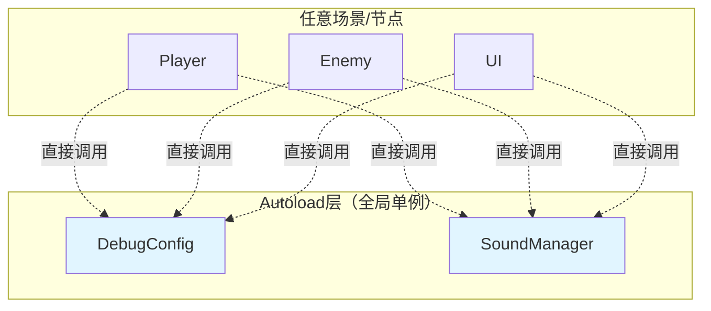

# Autoload系统架构

> **文档类型**: 核心架构 - Autoload全局管理
> **创建日期**: 2026-01-20
> **Godot版本**: 4.4.1
> **架构模式**: 单例模式 (Singleton Pattern)

---

## 📋 架构概述

### 设计目标

Autoload系统提供全局单例访问，用于管理跨场景的功能：

- ✅ **全局访问**: 任何节点都可直接调用
- ✅ **场景持久**: 切换场景时不销毁
- ✅ **统一管理**: 集中管理全局状态和功能
- ✅ **零依赖注入**: 无需手动传递引用

### 核心理念

```
局部功能 → 组件化
全局功能 → Autoload单例
```

**适合Autoload的场景**:
- 🔧 调试系统 (DebugConfig)
- 🔊 音频管理 (SoundManager)
- 💾 存档系统 (SaveManager)
- 🌍 场景切换 (SceneManager)
- ⚙️ 配置管理 (GameConfig)

---

## 🏗️ 项目Autoload架构

### 当前Autoload列表

| Autoload名称 | 文件路径 | 职责 | 优先级 |
|-------------|---------|------|--------|
| **DebugConfig** | Util/DebugConfig.gd | 调试开关和日志输出 | ⭐⭐⭐⭐⭐ |
| **SoundManager** | Util/SoundManager.gd | 音效和音乐管理 | ⭐⭐⭐⭐ |

### 架构图



---

## 🔧 Autoload实现示例

### Autoload调用流程（ASCII）

```
任意场景节点（Player/Enemy/UI）
   │
   └─→ 直接调用Autoload
       │
       ├─→ DebugConfig.debug(msg, obj, category)
       │   │
       │   ├─→ 1. 检查enable_debug
       │   ├─→ 2. 检查category开关
       │   ├─→ 3. 格式化输出
       │   └─→ print("[COMBAT] (Player) 攻击") ✅
       │
       └─→ SoundManager.play_sound(path)
           │
           ├─→ 1. load(sound_path)
           ├─→ 2. 查找空闲播放器
           └─→ player.play() ✅
```

### 1. DebugConfig - 调试系统

```gdscript
# Util/DebugConfig.gd - 全局调试管理
extends Node

@export var enable_debug: bool = true
@export var enable_combat_debug: bool = true
@export var enable_state_debug: bool = true
@export var enable_boss_debug: bool = true

func debug(message: String, object: String = "", category: String = "general"):
    if not enable_debug:
        return

    # 按类别过滤
    match category:
        "combat": if not enable_combat_debug: return
        "state": if not enable_state_debug: return
        "boss": if not enable_boss_debug: return

    # 格式化输出
    var prefix = "[%s]" % category.to_upper()
    if object != "": prefix += " (%s)" % object
    print("%s %s" % [prefix, message])

# 使用示例
# DebugConfig.debug("玩家受伤", "Hahashin", "combat")
# 输出: [COMBAT] (Hahashin) 玩家受伤
```

**配置**: Project Settings → Autoload → `res://Util/DebugConfig.gd`

**使用**:
```gdscript
# 任意节点中直接调用
DebugConfig.debug("特殊攻击开始", self.name, "combat")
DebugConfig.debug("进入Phase2", "", "boss")
```

### 2. SoundManager - 音频管理

```gdscript
# Util/SoundManager.gd - 全局音频管理
extends Node

var sfx_players: Array[AudioStreamPlayer] = []
var music_player: AudioStreamPlayer

@export var max_sfx_players: int = 10

func _ready():
    # 创建音效播放器池
    for i in range(max_sfx_players):
        var player = AudioStreamPlayer.new()
        add_child(player)
        sfx_players.append(player)

    # 创建音乐播放器
    music_player = AudioStreamPlayer.new()
    music_player.bus = "Music"
    add_child(music_player)

func play_sound(sound_path: String, volume_db: float = 0.0):
    var stream = load(sound_path)
    if not stream: return

    # 查找空闲播放器
    for player in sfx_players:
        if not player.playing:
            player.stream = stream
            player.volume_db = volume_db
            player.play()
            return

func play_music(music_path: String, volume_db: float = 0.0):
    var stream = load(music_path)
    if stream:
        music_player.stream = stream
        music_player.volume_db = volume_db
        music_player.play()

func stop_music():
    music_player.stop()
```

**使用**:
```gdscript
# 播放攻击音效
SoundManager.play_sound("res://Audio/SFX/sword_slash.wav")

# 播放Boss音乐
SoundManager.play_music("res://Audio/Music/boss_theme.ogg", -5.0)
```

---

## 💡 Autoload最佳实践

### ✅ 推荐做法

#### 1. 只用于真正全局的功能

```gdscript
# ✅ 适合Autoload
- DebugConfig (全局调试)
- SoundManager (全局音频)
- SaveManager (全局存档)

# ❌ 不适合Autoload
- PlayerData (应该是组件)
- EnemyPool (应该是场景管理器)
- UITheme (应该是Resource)
```

#### 2. 避免Autoload间相互依赖

```gdscript
# ❌ 错误：循环依赖
# SoundManager → DebugConfig → SoundManager

# ✅ 正确：单向或零依赖
func play_sound(path):
    print("播放音效: " + path)  # 不依赖其他Autoload
```

#### 3. 使用@export配置

```gdscript
# ✅ 编辑器可配置
@export var enable_debug: bool = true
@export var max_sfx_players: int = 10

# ❌ 硬编码
const ENABLE_DEBUG = true
```

### ❌ 常见错误

#### 1. 过度使用Autoload

```gdscript
# ❌ 错误：所有东西都Autoload
PlayerManager, EnemyManager, BulletManager, UIManager

# ✅ 正确：只有真正全局的
DebugConfig, SoundManager, SaveManager
```

#### 2. 在Autoload中保存场景级数据

```gdscript
# ❌ 错误：在Autoload保存玩家状态
var player_health: float = 100

# ✅ 正确：状态在Player组件中
@onready var health_component = $HealthComponent
```

---

## 🎓 设计模式：单例模式

Autoload是Godot对**单例模式**的实现：

```
全局唯一实例 + 全局访问点 = Autoload
```

**优点**:
- ✅ 全局唯一：确保只有一个实例
- ✅ 懒加载：首次访问时初始化
- ✅ 全局访问：无需依赖注入

**缺点**:
- ❌ 全局状态：可能导致隐式依赖
- ❌ 测试困难：难以mock和隔离
- ❌ 过度使用：破坏模块化

---

## 📊 Autoload vs 组件

| 特性 | Autoload | 组件 |
|------|----------|------|
| **生命周期** | 全局，场景切换不销毁 | 随节点销毁 |
| **访问方式** | 直接调用 | 依赖注入/查找 |
| **适用场景** | 跨场景功能 | 场景内功能 |
| **耦合度** | 高（全局依赖） | 低（局部依赖） |
| **测试性** | 难 | 易 |

**原则**:
```
能用组件就用组件，万不得已才用Autoload
```

---

## 📚 相关文档

- [组件系统架构](03_component_system_architecture.md) - 组件vs Autoload
- [信号驱动架构](04_signal_driven_architecture.md) - Autoload与信号

---

**维护者**: 开发团队
**最后更新**: 2026-01-20
**Token估算**: ~650
