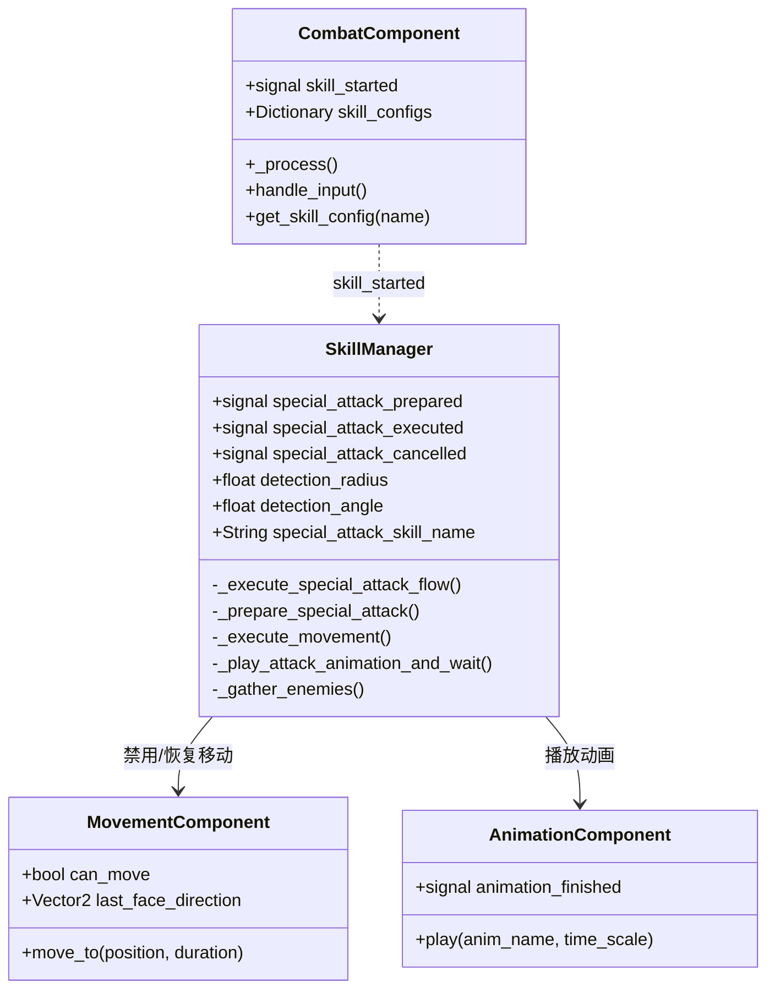
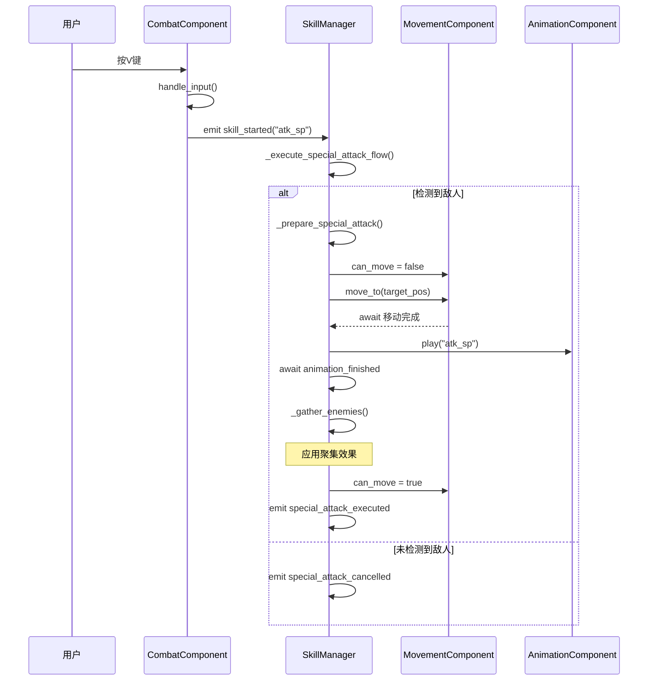

# 技能系统架构

> **文档类型**: 核心架构 - 技能系统
> **创建日期**: 2026-01-20
> **Godot版本**: 4.4.1
> **架构模式**: 策略模式 + 模板方法 + 信号驱动

---

## 📋 架构概述

### 设计目标

技能系统负责管理角色的技能执行流程，实现：

- ✅ **技能配置化**: 技能参数可在编辑器配置
- ✅ **流程自动化**: 技能执行流程完全自动化
- ✅ **组件协调**: 与Movement/Animation/Combat组件协作
- ✅ **可扩展**: 易于添加新技能类型

### 核心组件

```
CombatComponent（输入） → SkillManager（执行） → 其他组件（协调）
```

---

## 🏗️ 系统架构

### UML类图



---

## ⚔️ 特殊攻击流程

### 流程图



### ASCII调用流程

```
用户输入
   │
   ├─→ 方向键
   │   └─→ MovementComponent.get_input()
   │       └─→ MovementComponent.process_movement()
   │           └─→ character.move_and_slide()
   │
   └─→ V键（特殊攻击）
       └─→ CombatComponent.handle_input()
           └─→ emit skill_started("atk_sp")
               │
               └─→ SkillManager._on_skill_started()
                   └─→ _execute_special_attack_flow()
                       │
                       ├─→ 1. _prepare_special_attack()
                       │   ├─→ 检测扇形范围内敌人
                       │   ├─→ 计算目标中心位置
                       │   └─→ emit special_attack_prepared ✅
                       │
                       ├─→ 2. movement_component.can_move = false
                       │
                       ├─→ 3. await _execute_movement()
                       │   └─→ Tween移动到目标位置
                       │
                       ├─→ 4. await _play_attack_animation_and_wait()
                       │   ├─→ animation_component.play("atk_sp")
                       │   └─→ await animation_finished signal
                       │
                       ├─→ 5. _gather_enemies()
                       │   └─→ 对每个敌人应用GatherEffect
                       │
                       ├─→ 6. movement_component.can_move = true ✅
                       │
                       └─→ emit special_attack_executed ✅
```

### 关键代码片段

```gdscript
# 核心流程（简化版）
func _execute_special_attack_flow():
    # 1. 检测
    if not _prepare_special_attack(...):
        special_attack_cancelled.emit()
        return

    # 2. 禁用移动
    movement_component.can_move = false

    # 3-4. 执行攻击
    await _execute_movement(...)
    await _play_attack_animation_and_wait()

    # 5. 特效
    _gather_enemies()

    # 6. 恢复移动
    movement_component.can_move = true
    special_attack_executed.emit()
```

---

## 🎯 技能配置系统

### CombatComponent技能配置

```gdscript
# Util/Components/CombatComponent.gd
class_name CombatComponent
extends Node

signal skill_started(skill_name: String)

## 技能配置字典
var skill_configs: Dictionary = {
    "atk_1": {
        "animation": "atk_1",
        "time_scale": 2.0,
        "sound_effect": "res://Audio/SFX/attack1.wav",
        "damage": preload("res://Resources/Damages/attack1.tres")
    },
    "atk_sp": {
        "animation": "atk_sp",
        "time_scale": 1.0,
        "sound_effect": "res://Audio/SFX/special.wav",
        "damage": preload("res://Resources/Damages/special_attack.tres")
    },
    "roll": {
        "animation": "roll",
        "time_scale": 1.5,
        "sound_effect": "res://Audio/SFX/roll.wav"
    }
}

func _process(delta):
    handle_input()

func handle_input():
    if Input.is_action_just_pressed("attack"):
        skill_started.emit("atk_1")
    elif Input.is_action_just_pressed("special_attack"):
        skill_started.emit("atk_sp")
    elif Input.is_action_just_pressed("roll"):
        skill_started.emit("roll")

func get_skill_config(skill_name: String) -> Dictionary:
    return skill_configs.get(skill_name, {})
```

### 技能配置结构

| 字段 | 类型 | 说明 |
|------|------|------|
| `animation` | String | 动画名称 |
| `time_scale` | float | 动画播放速度 |
| `sound_effect` | String | 音效路径 |
| `damage` | Damage | 伤害资源 |

---

## 🔍 敌人检测算法

### 扇形检测

```gdscript
func _prepare_special_attack(position: Vector2, direction: Vector2) -> bool:
    var detected_enemies = []

    # 获取检测范围内所有Area2D
    var space_state = get_world_2d().direct_space_state
    var query = PhysicsShapeQueryParameters2D.new()
    query.collision_mask = 8  # Enemy layer

    # 创建圆形检测范围
    var circle = CircleShape2D.new()
    circle.radius = detection_radius
    query.shape = circle
    query.transform.origin = position

    var results = space_state.intersect_shape(query)

    for result in results:
        var enemy = result["collider"].get_parent()

        # 检查是否在扇形范围内
        var to_enemy = (enemy.global_position - position).normalized()
        var angle = rad_to_deg(direction.angle_to(to_enemy))

        if abs(angle) <= detection_angle:
            detected_enemies.append(enemy)

    if detected_enemies.is_empty():
        return false

    # 计算目标位置（所有敌人的中心）
    var center = Vector2.ZERO
    for enemy in detected_enemies:
        center += enemy.global_position
    center /= detected_enemies.size()

    special_attack_target_position = center
    special_attack_detected_enemies = detected_enemies

    special_attack_prepared.emit(center, detected_enemies.size())
    return true
```

### 检测可视化

```
        ╱ ← detection_angle
       ╱
Player ────→ direction
       ╲
        ╲ ← detection_angle
         ╲___detection_radius___╱
```

---

## 💡 最佳实践

### ✅ 推荐做法

#### 1. 使用await保证流程完整性

```gdscript
# ✅ 正确：等待动画完成
func _execute_attack():
    movement.can_move = false
    await _play_animation()  # 等待
    movement.can_move = true  # 恢复

# ❌ 错误：立即返回
func _execute_attack():
    movement.can_move = false
    _play_animation()  # 不等待
    # can_move永远不会恢复！
```

#### 2. 将技能配置提取到字典

```gdscript
# ✅ 集中配置
var skill_configs = {
    "atk_1": {...},
    "atk_sp": {...}
}

# ❌ 分散在代码中
func handle_attack1():
    animation.play("atk_1")
    animation.speed_scale = 2.0
    SoundManager.play("attack1.wav")
```

#### 3. 使用信号触发技能

```gdscript
# ✅ 解耦设计
combat_component.skill_started.connect(_on_skill_started)

# ❌ 直接调用
if Input.is_action_just_pressed("attack"):
    skill_manager.execute_attack()  # 耦合
```

### ❌ 常见错误

#### 1. 忘记恢复状态

```gdscript
# ❌ 错误
func execute_skill():
    can_move = false
    play_animation()
    # ❌ 忘记恢复 can_move

# ✅ 正确
func execute_skill():
    can_move = false
    await play_animation()
    can_move = true  # ✅ 恢复
```

#### 2. 在不同组件重复检测

```gdscript
# ❌ 错误：CombatComponent和SkillManager都检测
# CombatComponent.gd
if Input.is_action_just_pressed("special"):
    var enemies = detect_enemies()  # ❌ 重复检测
    skill_started.emit("sp")

# SkillManager.gd
func _on_skill_started(name):
    var enemies = detect_enemies()  # ❌ 重复检测

# ✅ 正确：只在SkillManager检测
# CombatComponent.gd
if Input.is_action_just_pressed("special"):
    skill_started.emit("sp")  # 只发信号

# SkillManager.gd
func _on_skill_started(name):
    var enemies = detect_enemies()  # ✅ 单一职责
```

---

## 🔗 相关文档

- [战斗系统架构](02_combat_system_architecture.md) - 伤害和特效
- [组件系统架构](03_component_system_architecture.md) - 组件协作
- [信号驱动架构](04_signal_driven_architecture.md) - 技能触发机制

---

**维护者**: 开发团队
**最后更新**: 2026-01-20
**Token估算**: ~1000
