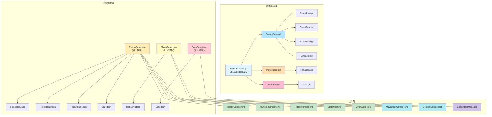
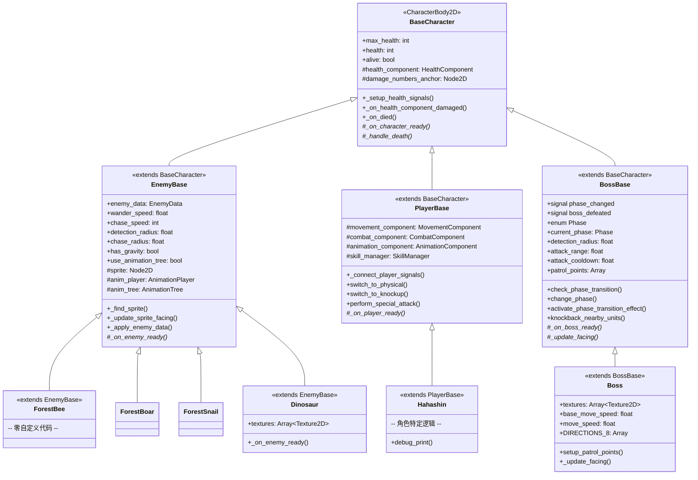
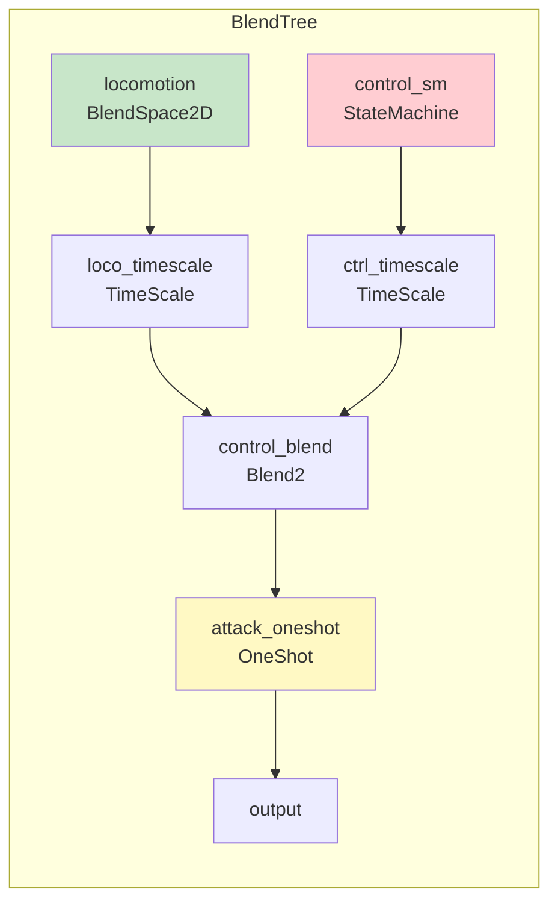
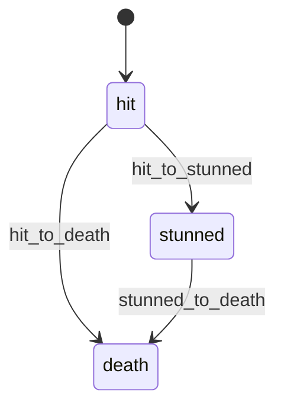
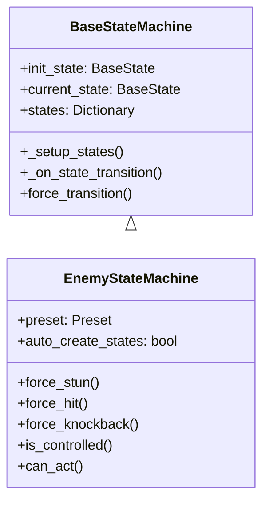

# 角色模板系统架构

> **文档类型**: 核心架构 - 角色模板系统
> **创建日期**: 2026-02-25
> **更新日期**: 2026-02-26
> **Godot版本**: 4.6
> **架构模式**: 继承 + 组件化 + 信号驱动 + 数据驱动
> **模板数量**: 3 个（EnemyBase, PlayerBase, BossBase）

---

## 📋 目录

1. [设计背景与目标](#1-设计背景与目标)
2. [架构总览](#2-架构总览)
3. [三层继承体系](#3-三层继承体系)
4. [模板场景设计](#4-模板场景设计)
5. [AnimationTree 混合树架构](#5-animationtree-混合树架构)
6. [状态机集成](#6-状态机集成)
7. [组件系统](#7-组件系统)
8. [场景继承与覆盖模式](#8-场景继承与覆盖模式)
9. [使用示例](#9-使用示例)
10. [遇到的问题与解决方案](#10-遇到的问题与解决方案)
11. [最佳实践](#11-最佳实践)

---

## 1. 设计背景与目标

### 1.1 痛点

项目初期每个敌人独立实现，导致：
- **大量重复代码** — HitBox/HurtBox/HealthComponent/状态机在每个敌人场景中重复搭建
- **维护困难** — 修改一个通用行为（如受击逻辑）需要逐个修改所有敌人
- **不一致性** — 不同敌人的碰撞层、信号连接方式不统一
- **新敌人创建成本高** — 创建一个新敌人需要从零搭建完整的节点树

### 1.2 设计目标

| 目标 | 说明 |
|------|------|
| **可复用** | 通用功能在模板中实现一次，所有敌人继承 |
| **可继承** | Godot Inherited Scene 实现场景级继承 |
| **可配置** | 通过 Inspector 导出属性即可定制差异化行为 |
| **可组合** | 非通用功能（RayCast、AnimatedSprite2D）按需添加 |
| **零代码创建** | 简单敌人无需编写任何 GDScript，纯配置即可 |

### 1.3 设计灵感

参考 `DevLog/planning/charactor_template.md` 中的工业级 Enemy 模板设计方案，结合项目实际需求，采用了 **模板继承 + 组件化** 的混合架构。

---

## 2. 架构总览

### 2.1 系统全景图



### 2.2 核心设计决策

| 决策 | 选择 | 理由 |
|------|------|------|
| 脚本继承 vs 组件 | **混合** | 脚本继承处理核心生命周期，组件处理可插拔功能 |
| 场景继承 vs 实例化 | **Inherited Scene** | Godot 原生支持，Inspector 直接覆盖属性 |
| 动画方案 | **AnimationTree BlendTree** | 统一管理移动/攻击/受击动画混合 |
| 状态机位置 | **模板内置** | 所有敌人共享相同的 7 个基础状态结构 |
| 通用 vs 组合 | **通用放模板，差异化组合** | 状态机/HitBox/HurtBox 通用；RayCast/AnimatedSprite2D 组合 |

---

## 3. 三层继承体系

### 3.1 类图



### 3.2 各层职责

#### 第一层：BaseCharacter（所有角色的根基）

**文件**: `Core/Characters/BaseCharacter.gd`

```gdscript
extends CharacterBody2D

## 所有角色的基类 - 提供统一的生命值系统集成和信号路由

@export var max_health: int = 100
@export var health: int = 100
var alive: bool = true

func _ready() -> void:
    _setup_health_signals()
    _on_character_ready()  # 子类钩子

func _setup_health_signals() -> void:
    # HurtBox.damaged → HealthComponent.take_damage → state machine
    var hurtbox = get_node_or_null("HurtBoxComponent")
    if hurtbox:
        hurtbox.damaged.connect(health_component.take_damage)
    health_component.died.connect(_on_died)
```

**职责**: 健康信号链路、死亡判定、子类钩子

#### 第二层：EnemyBase（敌人通用逻辑）

**文件**: `Core/Characters/EnemyBase.gd`

```gdscript
extends BaseCharacter

## 敌人通用逻辑：AI参数、精灵管理、AnimationTree、重力、死亡动画

@export_group("Wander")
@export var wander_speed: float = 30.0
@export var detection_radius: float = 100.0

@export_group("Animation")
@export var use_animation_tree: bool = false

func _on_character_ready() -> void:
    _find_sprite()                    # 自动发现 Sprite2D 或 AnimatedSprite2D
    if use_animation_tree:
        anim_tree.active = true       # 启用 AnimationTree
    _on_enemy_ready()                 # 子类钩子

func _handle_death() -> void:
    # 禁用状态机，播放 death 动画
    if anim_tree and anim_tree.active:
        anim_tree.set("parameters/control_blend/blend_amount", 1.0)
```

**职责**: AI 参数导出、精灵自动发现、AnimationTree 激活、重力处理、死亡动画流程

#### 第二层B：PlayerBase（玩家通用逻辑）

**文件**: `Core/Characters/PlayerBase.gd`

```gdscript
extends BaseCharacter
class_name PlayerBase

## 玩家通用逻辑：组件引用、委托API、死亡处理

@onready var movement_component: MovementComponent = $MovementComponent
@onready var combat_component: CombatComponent = $CombatComponent
@onready var animation_component: AnimationComponent = $AnimationComponent
@onready var skill_manager: SkillManager = $SkillManager

func _on_character_ready() -> void:
    _connect_player_signals()         # 连接玩家特有信号
    _on_player_ready()                # 子类钩子

func _handle_death() -> void:
    hide()                            # 隐藏角色
    set_collision_mask_value(1, false)
    get_tree().call_group("ui", "show_game_over")
```

**职责**: 组件引用管理、委托 API（切换伤害类型、特殊攻击）、玩家死亡 UI 处理

#### 第二层C：BossBase（Boss 通用逻辑）

**文件**: `Core/Characters/BossBase.gd`

```gdscript
extends BaseCharacter
class_name BossBase

## Boss 通用逻辑：阶段系统、巡逻点、攻击冷却、死亡处理

signal phase_changed(new_phase: int)
signal boss_defeated()

enum Phase { PHASE_1, PHASE_2, PHASE_3 }

@export var detection_radius := 800.0
@export var attack_range := 300.0
@export var phase_2_health_percent := 0.66
@export var phase_3_health_percent := 0.33

var current_phase: Phase = Phase.PHASE_1
var attack_cooldown := 0.0

func check_phase_transition() -> void:
    var health_percent = float(health) / float(max_health)
    if health_percent <= phase_3_health_percent:
        change_phase(Phase.PHASE_3)
    elif health_percent <= phase_2_health_percent:
        change_phase(Phase.PHASE_2)
```

**职责**: 阶段系统（3 阶段切换）、阶段转换特效（无敌+击退）、巡逻点管理、攻击冷却

#### 第三层：具体角色（按需覆盖）

```gdscript
# ForestBee.gd - 最简实现：零自定义代码
extends EnemyBase

# Dinosaur.gd - 带自定义功能
extends EnemyBase

@export var textures: Array[Texture2D] = []

func _on_enemy_ready() -> void:
    if not textures.is_empty() and sprite is Sprite2D:
        (sprite as Sprite2D).texture = textures.pick_random()
```

**职责**: 仅实现该敌人特有的逻辑，其他全部继承

---

## 4. 模板场景设计

### 4.1 EnemyBase.tscn 节点树

**文件**: `Scenes/Characters/Templates/EnemyBase.tscn`

```
EnemyBase (CharacterBody2D) [EnemyBase.gd]
│   collision_layer = 8, collision_mask = 128
│
├── Sprite2D                          ← 空，子场景填充纹理
├── AnimationPlayer                   ← 仅含 RESET 动画，子场景覆盖
├── AnimationTree                     ← 完整 BlendTree（所有敌人共享结构）
│
├── HurtBoxComponent (Area2D)         ← 受击检测 [HurtBoxComponent.gd]
│   └── CollisionShape2D (CircleShape2D r=12)
│
├── FloorCollision (CollisionShape2D) ← 物理碰撞 (CapsuleShape2D)
├── HealthComponent (Node)            ← 生命值管理 [HealthComponent.gd]
│
├── EnemyStateMachine (Node)          ← 状态机 [EnemyStateMachine.gd]
│   ├── Idle      [IdleState.gd]      ← 7 个通用状态
│   ├── Wander    [WanderState.gd]       预置在模板中
│   ├── Chase     [ChaseState.gd]
│   ├── Attack    [AttackState.gd]
│   ├── Hit       [HitState.gd]
│   ├── Stun      [StunState.gd]
│   └── Knockback [KnockbackState.gd]
│
├── HitBoxComponent (Area2D)          ← 攻击判定 [HitBoxComponent.gd]
│   └── CollisionShape2D (CircleShape2D r=12)
│
├── HealthBar (ProgressBar)           ← 血条UI（内嵌脚本）
├── DamageNumbersAnchor (Node2D)      ← 伤害数字锚点
└── AttackAnchor (Node2D)             ← 攻击生成点
```

### 4.2 PlayerBase.tscn 节点树

**文件**: `Scenes/Characters/Templates/PlayerBase.tscn`

```
PlayerBase (CharacterBody2D) [PlayerBase.gd]
│   collision_layer = 2, collision_mask = 128, groups=["player"]
│
├── FloorCollision (CollisionShape2D)     ← CircleShape2D r=15
├── AnimatedSprite2D                      ← 空，子场景填充 SpriteFrames
├── AnimationPlayer                       ← 仅含 RESET 动画
├── AnimationTree                         ← 设置 anim_player 路径
│
├── HurtBoxComponent (Area2D)             ← collision_layer=2, mask=0
│   └── CollisionShape2D (CircleShape2D r=15)
│
├── DamageNumbersAnchor (Node2D)
├── HitBoxComponent (Area2D) [PlayerHitbox.gd]  ← collision_layer=4, mask=8
│   └── CollisionShape2D (RectangleShape2D, disabled)
│
├── HealthComponent (Node)
├── HealthBar (ProgressBar)               ← 玩家血条（绿色）
│
├── MovementComponent (Node)              ← 玩家移动逻辑
├── AnimationComponent (Node)             ← 动画状态管理
├── CombatComponent (Node)                ← 战斗系统
├── SkillManager (Node)                   ← 技能管理
├── CameraManager (Node)                  ← 相机跟随
└── AudioStreamPlayer                     ← 音效播放
```

### 4.3 BossBase.tscn 节点树

**文件**: `Scenes/Characters/Templates/BossBase.tscn`

```
BossBase (CharacterBody2D) [BossBase.gd]
│   collision_layer = 8, collision_mask = 128, groups=["enemy"]
│
├── Sprite2D                              ← 空，子场景填充纹理
├── CollisionShape2D                      ← RectangleShape2D 40x60
├── DamageNumbersAnchor (Node2D)          ← position(0, -40)
├── AnimationPlayer
│
├── HurtBoxComponent (Area2D)             ← collision_layer=8, mask=0
│   └── CollisionShape2D (RectangleShape2D 40x56)
│
├── HealthComponent (Node)
├── HealthBar (ProgressBar)               ← Boss 血条（红色）
│
├── BossAttackManager (Node)              ← 攻击技能管理器
│
└── StateMachine (BossStateMachine)       ← 9 个 Boss 状态
    ├── Idle          [BossIdle.gd]
    ├── Patrol        [BossPatrol.gd]
    ├── Chase         [BossChase.gd]
    ├── Circle        [BossCircle.gd]
    ├── Attack        [BossAttack.gd]
    ├── Retreat       [BossRetreat.gd]
    ├── Stun          [BossStun.gd]
    ├── Enrage        [BossEnrage.gd]
    └── SpecialAttack [BossSpecialAttack.gd]
```

### 4.4 模板 vs 组合 决策表

| 节点 | 归属 | 理由 |
|------|------|------|
| **Enemy 通用** | | |
| 7 个状态节点 | **模板** | 所有敌人共享相同的状态结构 |
| HitBoxComponent | **模板** | 所有敌人都有，形状/damage 可在子场景覆盖 |
| HurtBoxComponent | **模板** | 所有敌人都有，形状可覆盖 |
| HealthComponent | **模板** | 所有敌人都有 |
| AnimationTree | **模板** | BlendTree 结构统一，子场景只需提供动画数据 |
| RayGround / RayWall | **组合** | 仅地面敌人需要（Boar/Snail），飞行敌人不需要 |
| AnimatedSprite2D | **组合** | Forest 敌人使用帧动画，与 Sprite2D + AnimationPlayer 方案互斥 |
| **Player 通用** | | |
| MovementComponent | **模板** | 所有玩家都有移动逻辑 |
| CombatComponent | **模板** | 所有玩家都有战斗系统 |
| AnimationComponent | **模板** | 所有玩家都有动画管理 |
| SkillManager | **模板** | 所有玩家都有技能系统 |
| CameraManager | **模板** | 所有玩家都有相机跟随 |
| HealthBar | **模板** | 玩家血条（绿色） |
| **Boss 通用** | | |
| 9 个 Boss 状态 | **模板** | 所有 Boss 共享状态结构（比敌人多 2 个） |
| BossAttackManager | **模板** | 所有 Boss 都有攻击管理器 |
| HealthBar | **模板** | Boss 血条（红色，较大） |
| BossStateMachine | **模板** | Boss 状态机（支持阶段切换） |

---

## 5. AnimationTree 混合树架构

### 5.1 BlendTree 结构图



### 5.2 locomotion BlendSpace2D

5 个混合点，由 `velocity.x` 和 `speed_ratio` 驱动：

```
          speed_ratio (y)
              1.0
              │
   left_run ──┼── right_run
    (-1,1)    │    (1,1)
              │
              0.5
              │
  left_walk ──┼── right_walk
   (-1,0.5)  │   (1,0.5)
              │
     idle ────┤ (0,0)
              └──────── direction (x)
            -1    0    1
```

### 5.3 control StateMachine

处理受击/眩晕/死亡等不可打断动画：



### 5.4 动画切换机制

```
control_blend.blend_amount:
  0.0 → 播放 locomotion（移动/待机）
  1.0 → 播放 control_sm（受击/眩晕/死亡）

attack_oneshot:
  OneShot 触发 → 临时覆盖为攻击动画
  结束后自动恢复 locomotion/control
```

### 5.5 两种动画方案

| 方案 | 适用对象 | 配置 |
|------|----------|------|
| **Sprite2D + AnimationPlayer + AnimationTree** | Dinosaur, Skull | `use_animation_tree = true` |
| **AnimatedSprite2D** (直接帧动画) | ForestBee, ForestBoar, ForestSnail | `use_animation_tree = false` |

AnimationTree 需要的 10 个动画：

| 动画名 | 用途 | 循环 |
|--------|------|------|
| RESET | 重置所有属性 | - |
| idle | 待机 | loop |
| left_walk | 左移走路 | loop |
| right_walk | 右移走路 | loop |
| left_run | 左移奔跑 | loop |
| right_run | 右移奔跑 | loop |
| attack | 攻击 | - |
| hit | 受击 | - |
| stunned | 眩晕 | loop |
| death | 死亡（含消亡特效） | - |

---

## 6. 状态机集成

### 6.1 EnemyStateMachine 架构

**文件**: `Core/StateMachine/EnemyStateMachine.gd`



### 6.2 状态优先级系统

```
CONTROL (2)  ── stun, frozen           ← 最高优先级，打断一切
REACTION (1) ── hit, knockback, launch ← 中优先级，打断行为
BEHAVIOR (0) ── idle, wander, chase    ← 最低优先级，日常行为
```

**转换规则**:
- 高优先级 **总是** 可以打断低优先级
- 同优先级检查 `can_be_interrupted` 标志
- 当前状态可以主动转换到任何低优先级状态

### 6.3 模板内置 vs 自动创建

```gdscript
# EnemyStateMachine 配置
init_state = NodePath("Idle")     # 初始状态指向 Idle 节点
auto_create_states = false         # 子节点已在模板中存在，跳过自动创建
```

**关键**: `auto_create_states` 在模板中设为 `false`，因为 7 个状态节点已经作为子节点存在。如果设为 `true`，状态机会尝试根据 `preset` 动态创建节点，导致重复。

### 6.4 状态覆盖模式

子场景可以覆盖单个状态的脚本：

```
# ForestBee.tscn 中仅覆盖需要自定义的状态
[node name="Idle" parent="EnemyStateMachine"]
script = ExtResource("6_idle")     ← BeeIdle.gd 替换默认 IdleState.gd

[node name="Chase" parent="EnemyStateMachine"]
script = ExtResource("8_chase")    ← BeeChase.gd 替换默认 ChaseState.gd

# Hit / Knockback 不覆盖 → 使用模板中的 CommonStates 默认实现
```

---

## 7. 组件系统

### 7.1 伤害信号链路

```
攻击碰撞流程:

HitBoxComponent          HurtBoxComponent          HealthComponent
    │                        │                        │
    │  area_entered(area)    │                        │
    ├───────────────────────►│                        │
    │  update_attack()       │                        │
    │  take_damage(dmg, pos) │                        │
    │                        │  damaged.emit()        │
    │                        ├───────────────────────►│
    │                        │                        │ take_damage()
    │                        │                        │ 1. 检查无敌
    │                        │                        │ 2. 扣血
    │                        │                        │ 3. 显示伤害数字
    │                        │                        │ 4. 应用攻击效果*
    │                        │                        │ 5. emit health_changed
    │                        │                        │ 6. emit damaged
    │                        │                        │ 7. 检查死亡
    │                        │                        │
    │                        │              ┌─────────┤
    │                        │              │         │
    │                        │              ▼         ▼
    │                        │         HealthBar   StateMachine
    │                        │         (UI更新)    on_damaged()
    │                        │                     ├─ StunEffect → Stun
    │                        │                     ├─ KnockEffect → Knockback
    │                        │                     └─ else → Hit
```

> **关键设计**: 攻击效果（如击退速度）在 `emit damaged` **之前** 应用。这确保状态机收到信号时，角色速度已被正确设置，避免速度覆盖问题。

### 7.2 碰撞层配置

| Layer | 用途 | 数值 |
|-------|------|------|
| Layer 1 | 地形/墙壁 | 1 |
| Layer 2 | 玩家攻击 | 2 |
| Layer 3 | 玩家受击 | 4 |
| Layer 4 | 敌人 | 8 |
| Layer 8 | 地形碰撞 | 128 |

| 组件 | collision_layer | collision_mask | 含义 |
|------|----------------|----------------|------|
| Enemy Body | 8 | 129 (128+1) | 敌人实体，与地形碰撞 |
| HurtBoxComponent | 8 | 4 | 敌人受击区，接收玩家攻击 |
| HitBoxComponent | 8 | 2 | 敌人攻击区，命中玩家受击区 |

---

## 8. 场景继承与覆盖模式

### 8.1 Godot Inherited Scene 语法

模板定义（完整节点）：
```
[node name="Sprite2D" type="Sprite2D" parent="."]
```

子场景覆盖（仅覆盖属性，无 `type`）：
```
[node name="Sprite2D" parent="." index="0"]
texture = ExtResource("2_texture")
hframes = 4
vframes = 4
```

### 8.2 覆盖层级

```
EnemyBase.tscn (模板)
    │
    ├── ForestBee.tscn (继承)
    │   ├── 覆盖: 根节点参数 (health, speed, detection)
    │   ├── 覆盖: 5个状态脚本 (BeeIdle, BeeWander, BeeChase, BeeAttack, BeeStun)
    │   ├── 新增: AnimatedSprite2D (帧动画，组合方式)
    │   └── 继承: HitBoxComponent (默认 CircleShape2D r=12，无需覆盖)
    │
    ├── ForestBoar.tscn (继承)
    │   ├── 覆盖: 根节点参数
    │   ├── 覆盖: 5个状态脚本
    │   ├── 覆盖: HitBoxComponent (RectangleShape2D + Damage资源 + destroy_owner_on_hit)
    │   ├── 新增: AnimatedSprite2D + RayGround + RayWall (组合)
    │   └── 覆盖: FloorCollision/HurtBox 碰撞形状
    │
    └── Skull.tscn (继承)
        ├── 覆盖: 根节点参数 + use_animation_tree=true
        ├── 覆盖: Sprite2D (纹理 + hframes/vframes)
        ├── 覆盖: AnimationPlayer (完整10个动画的AnimationLibrary)
        ├── 覆盖: 碰撞形状 (CircleShape2D r=8，较小)
        └── 继承: 7个状态 + AnimationTree + HitBoxComponent (全部使用模板默认)
```

---

## 9. 使用示例

### 9.1 最简敌人：ForestBee（飞行型，零自定义代码）

**ForestBee.gd** — 完全空的脚本：
```gdscript
extends EnemyBase
# 所有行为继承自 EnemyBase，无自定义逻辑
```

**ForestBee.tscn** — 关键配置：
```
[node name="ForestBee" instance=ExtResource("1_base")]
collision_mask = 129
max_health = 30
health = 30
wander_speed = 40.0
detection_radius = 150.0
chase_speed = 80
use_animation_tree = false          ← 使用 AnimatedSprite2D

[node name="AnimatedSprite2D" type="AnimatedSprite2D" parent="."]
sprite_frames = SubResource("SpriteFrames_bee")
autoplay = "fly"                     ← 组合方式添加
```

### 9.2 地面敌人：ForestBoar（带 RayCast + 自定义 HitBox）

**ForestBoar.tscn** — 覆盖 HitBoxComponent：
```
[node name="HitBoxComponent" parent="."]
damage = SubResource("Resource_damage")     ← 自定义伤害值
destroy_owner_on_hit = true                 ← 冲撞后自毁

[node name="CollisionShape2D" parent="HitBoxComponent"]
shape = SubResource("RectangleShape2D_hitbox")   ← 覆盖为矩形

[node name="RayGround" type="RayCast2D" parent="."]   ← 组合：地面检测
[node name="RayWall" type="RayCast2D" parent="."]     ← 组合：墙壁检测
```

### 9.3 AnimationTree 敌人：Skull（4方向精灵表）

**Skull.tscn** — 覆盖 AnimationPlayer 提供 10 个动画：
```
[node name="Sprite2D" parent="." index="0"]
texture = ExtResource("2_texture")
hframes = 4                          ← 4列方向：下/上/左/右
vframes = 4                          ← 4行帧：行走周期

[node name="AnimationPlayer" parent="."]
libraries/ = SubResource("AnimationLibrary_skull")  ← 覆盖默认库
```

精灵帧映射（4x4 方向精灵表）：

```
        Col0(下)  Col1(上)  Col2(左)  Col3(右)
Row0      0        1        2        3
Row1      4        5        6        7
Row2      8        9       10       11
Row3     12       13       14       15

idle:       [0, 4, 8, 4]       ← 下方向（正面）
left_walk:  [2, 6, 10, 14]     ← 左方向列
right_walk: [3, 7, 11, 15]     ← 右方向列
left_run:   [2, 6, 10, 14]     ← 同帧，更快速度
right_run:  [3, 7, 11, 15]     ← 同帧，更快速度
attack:     [0, 4, 8, 12]      ← 正面方向
hit:        [0, 4, 0]          ← 快速闪烁
stunned:    [0, 4, 8, 4, 0]    ← 摇晃循环
death:      [0, 4, 8, 12]      ← + 旋转/淡出/上浮特效
```

### 9.4 带自定义功能：Dinosaur（随机纹理）

**Dinosaur.gd** — 仅覆盖 `_on_enemy_ready()` 钩子：
```gdscript
extends EnemyBase

@export var textures: Array[Texture2D] = []

func _on_enemy_ready() -> void:
    if not textures.is_empty() and sprite is Sprite2D:
        (sprite as Sprite2D).texture = textures.pick_random()
```

### 9.5 玩家角色：Hahashin（组件化架构）

**Hahashin.gd** — 最小化代码：
```gdscript
extends PlayerBase
class_name Hahashin

func _on_player_ready() -> void:
    pass  # Hahashin 特定初始化
```

**Hahashin.tscn** — 继承 PlayerBase.tscn：
```
[node name="Hahashin" instance=ExtResource("1_base")]
script = ExtResource("1_hahashin")
max_health = 10000
health = 10000

[node name="AnimatedSprite2D" parent="." index="1"]
sprite_frames = SubResource("SpriteFrames_hahashin")
animation = &"idle"

[node name="AnimationPlayer" parent="." index="2"]
libraries/ = SubResource("AnimationLibrary_hahashin")  ← 攻击动画

[node name="AnimationTree" parent="." index="3"]
tree_root = SubResource("AnimationNodeBlendTree_hahashin")  ← 完整状态机

[node name="MovementComponent" parent="." index="9"]
max_speed = 200.0

[node name="CombatComponent" parent="." index="11"]
damage_types = [Physical, KnockUp, SpecialAttack]  ← 3种伤害类型
```

**职责分离**:
- **PlayerBase.tscn**: 提供所有组件节点
- **Hahashin.tscn**: 仅覆盖动画、速度、伤害配置

### 9.6 Boss 角色：Boss (DemonCyclop)（阶段战斗）

**Boss.gd** — extends BossBase，实现 8 方位和纹理选择：
```gdscript
extends BossBase
class_name Boss

@export var textures: Array[Texture2D] = []
@export var base_move_speed := 150.0
@export var rotation_speed := 5.0

const DIRECTIONS_8 = [Vector2(1,0), Vector2(0.7,-0.7), ...]  # 8方位

var move_speed: float:
    get:
        match current_phase:
            Phase.PHASE_1: return base_move_speed * 1.0
            Phase.PHASE_2: return base_move_speed * 1.3
            Phase.PHASE_3: return base_move_speed * 1.5

func _on_boss_ready() -> void:
    if not textures.is_empty():
        sprite.texture = textures.pick_random()
    setup_patrol_points()

func _update_facing() -> void:
    # 平滑旋转到 8 方位方向
    var direction_index = int(round(velocity.angle() / (PI / 4))) % 8
    sprite.rotation = lerp_angle(sprite.rotation,
                                   DIRECTIONS_8[direction_index].angle(),
                                   rotation_speed * delta)
```

**Boss.tscn** — 继承 BossBase.tscn：
```
[node name="Boss" instance=ExtResource("1_base")]
script = ExtResource("1_boss")
max_health = 1001
health = 1001

[node name="Sprite2D" parent="." index="0"]
texture = ExtResource("2_demon_cyclop")

[node name="BossAttackManager" parent="." index="8"]
projectile_scene = ExtResource("5_projectile")
laser_scene = ExtResource("6_laser")
aoe_scene = ExtResource("7_aoe")
projectile_damage = ExtResource("8_proj_damage")
laser_damage = ExtResource("9_laser_damage")
aoe_damage = ExtResource("10_aoe_damage")
```

**职责分离**:
- **BossBase.gd**: 阶段系统、无敌特效、击退、巡逻点
- **Boss.gd**: 8 方位移动、纹理选择、速度倍率

### 9.7 创建新角色的步骤

#### 创建新敌人

1. **Godot 编辑器** → 右键 `EnemyBase.tscn` → **New Inherited Scene**
2. **设置参数** → Inspector 中配置 health、speed、detection 等
3. **添加动画** → 根据动画方案选择：
   - **方案 A**: 设置 `use_animation_tree = true`，覆盖 Sprite2D 纹理和 AnimationPlayer 库
   - **方案 B**: 设置 `use_animation_tree = false`，添加 AnimatedSprite2D 子节点
4. **（可选）自定义状态** → 覆盖需要的状态节点脚本
5. **（可选）调整碰撞** → 覆盖 FloorCollision/HurtBox/HitBox 的 CollisionShape2D

#### 创建新玩家

1. **Godot 编辑器** → 右键 `PlayerBase.tscn` → **New Inherited Scene**
2. **设置参数** → Inspector 中配置 max_health
3. **添加动画** → 覆盖 AnimatedSprite2D 的 SpriteFrames（idle, run, atk_1/2/3, sp_atk）
4. **配置组件** → 覆盖 MovementComponent.max_speed, CombatComponent.damage_types
5. **（可选）自定义脚本** → 覆盖 `_on_player_ready()` 钩子

#### 创建新 Boss

1. **Godot 编辑器** → 右键 `BossBase.tscn` → **New Inherited Scene**
2. **设置参数** → Inspector 中配置 max_health, detection_radius, phase 阈值
3. **配置攻击** → 覆盖 BossAttackManager 的 projectile/laser/aoe 场景和 damage 资源
4. **添加纹理** → 覆盖 Sprite2D.texture
5. **（可选）自定义逻辑** → 在子类脚本中覆盖 `_on_boss_ready()`, `_update_facing()` 钩子

### 9.8 创建新敌人的步骤（向后兼容）

1. **Godot 编辑器** → 右键 `EnemyBase.tscn` → **New Inherited Scene**
2. **设置参数** → Inspector 中配置 health、speed、detection 等
3. **添加动画** → 根据动画方案选择：
   - **方案 A**: 设置 `use_animation_tree = true`，覆盖 Sprite2D 纹理和 AnimationPlayer 库
   - **方案 B**: 设置 `use_animation_tree = false`，添加 AnimatedSprite2D 子节点
4. **（可选）自定义状态** → 覆盖需要的状态节点脚本
5. **（可选）调整碰撞** → 覆盖 FloorCollision/HurtBox/HitBox 的 CollisionShape2D

---

## 10. 遇到的问题与解决方案

### 10.1 空壳状态机脚本问题

**问题**: Forest 敌人最初各自有自己的 StateMachine 脚本（BeeStateMachine.gd 等），但它们仅 `extends BaseStateMachine`，没有任何自定义逻辑。更严重的是，它们继承了 `BaseStateMachine` 而非 `EnemyStateMachine`，丢失了 `force_stun()`/`force_hit()` 等便捷方法。

**解决方案**: 删除所有空壳脚本，统一使用模板中的 `EnemyStateMachine.gd`。子场景不再覆盖 EnemyStateMachine 的脚本，只覆盖个别状态子节点的脚本。

### 10.2 auto_create_states 冲突

**问题**: `EnemyStateMachine` 有 `auto_create_states` 功能，如果模板中已经手动放置了 7 个状态子节点，同时 `auto_create_states = true`，会导致状态重复创建。

**解决方案**: 模板中设置 `auto_create_states = false`。状态机的 `_ready()` 会检查 `get_child_count() == 0`，但显式设为 false 更安全。

```gdscript
# EnemyStateMachine._ready()
func _ready() -> void:
    if auto_create_states and get_child_count() == 0:
        _create_preset_states()  # 仅在没有子节点时才自动创建
    super._ready()
```

### 10.3 AnimationTree 动画查找时机

**问题**: EnemyBase.tscn 的 AnimationTree 引用了 "idle"、"hit" 等动画名，但模板的 AnimationPlayer 只包含 RESET 动画。其他动画由子场景提供。AnimationTree 能否在运行时正确找到这些动画？

**解决方案**: 可以。Godot 的 AnimationTree 在运行时解析动画名，此时子场景已经覆盖了 AnimationPlayer 的库。加载顺序为：模板 → 子场景覆盖 → `_ready()` → AnimationTree 激活。所以 AnimationTree 激活时，所有动画已就位。

### 10.4 Sprite2D 方向精灵表的帧映射

**问题**: Skull 的 SpriteSheet 是 4x4 方向精灵表（列=方向，行=帧），帧索引为 `row * hframes + col`。初始实现错误地按行解读（把每行当作一组动画），导致动画完全错误。

**解决方案**: 按列提取同方向帧。例如左方向为 col=2，帧索引为 [2, 6, 10, 14]（跨4行）。run 和 walk 使用相同帧，通过不同的动画速度（walk=0.4s, run=0.25s）区分。

### 10.5 攻击效果应用顺序

**问题**: 受击后角色的速度被覆盖。原因是 HealthComponent 先 emit `damaged` 信号（触发状态机转换和速度设置），然后才应用 AttackEffect（覆盖了刚设置的速度）。

**解决方案**: 在 `take_damage()` 中调整顺序 — **先应用效果，后发信号**：

```gdscript
func take_damage(damage_data, attacker_position) -> void:
    health -= damage_data.get_amount()
    display_damage_number(damage_data)
    apply_attack_effects(damage_data, attacker_position)  # ← 先应用效果
    health_changed.emit(health, max_health)                # ← 后发信号
    damaged.emit(damage_data, attacker_position)
```

### 10.6 PlayerBase 和 BossBase 类型引用更新

**问题**: 在创建 PlayerBase 和 BossBase 模板后，需要更新所有引用 `Hahashin` 或 `Boss` 类型的脚本，改为引用基类 `PlayerBase` 或 `BossBase`，以支持未来的多角色扩展。

**解决方案**: 系统性更新类型引用：

```gdscript
# PlayerHitbox.gd - 原来
@onready var player: Hahashin = get_owner()

# PlayerHitbox.gd - 更新后
@onready var player: PlayerBase = get_owner()  # 支持所有 PlayerBase 子类

# BossAttackManager.gd - 原来
@onready var boss: Boss = get_owner()

# BossAttackManager.gd - 更新后
@onready var boss: BossBase = get_owner()  # 支持所有 BossBase 子类

# BossStateMachine.gd - 原来
if owner_node is Boss and target_node is Hahashin:
    var boss = owner_node as Boss
    var player = target_node as Hahashin

# BossStateMachine.gd - 更新后
if owner_node is BossBase and target_node is PlayerBase:
    var boss = owner_node as BossBase
    var player = target_node as PlayerBase

# BossBaseState.gd - 阶段判断
if boss and boss.current_phase != BossBase.Phase.PHASE_3:
    transitioned.emit(self, "stun")
```

**要点**: 使用基类类型引用提高了代码的通用性，新的玩家/Boss 角色无需修改这些脚本即可使用。

### 10.7 Boss 不应继承 EnemyBase

**问题**: 最初考虑让 Boss 继承 EnemyBase，复用敌人的基础功能。但分析后发现 Boss 的架构与普通敌人差异过大：
- Boss 有 **3 阶段系统**，敌人没有
- Boss 使用 **8 方位旋转**，敌人使用简单的 flip_h
- Boss 有 **巡逻点系统**，敌人使用简单的 wander
- Boss 有 **BossAttackManager** 管理复杂攻击，敌人没有
- Boss 有 **9 个状态**（多 Enrage/SpecialAttack），敌人只有 7 个

**解决方案**: 创建独立的 `BossBase` 继承链：

```
BaseCharacter
  ├── EnemyBase (简单 AI, 7 状态)
  │     └── 普通敌人
  └── BossBase (阶段系统, 9 状态)
        └── Boss 角色
```

这样避免了强行复用导致的架构混乱。

### 10.8 Godot 版本差异导致 UID 警告

**问题**: 用户使用 Godot 4.6 编辑，MCP 工具使用 Godot 4.4.1 运行验证，导致 `.tscn` 中的 UID 格式不兼容，产生 `invalid UID` 警告。

**解决方案**: 这是已知的版本差异问题，不影响功能。Godot 会自动回退到文本路径加载。在 CI/CD 环境中应统一 Godot 版本。

---

## 11. 最佳实践

### ✅ 推荐

```gdscript
# ✅ 使用钩子方法，不要重写 _ready()
func _on_enemy_ready() -> void:
    # 敌人特有初始化
    pass

# ✅ 通过 Inspector 配置参数，不要硬编码
@export var chase_speed: int = 80
```

```
# ✅ 子场景仅覆盖需要变化的节点
[node name="Idle" parent="EnemyStateMachine"]
script = ExtResource("6_custom_idle")

# ✅ 非通用功能用组合方式添加
[node name="RayGround" type="RayCast2D" parent="."]
```

### ❌ 避免

```gdscript
# ❌ 不要在子类重写 _ready()，会破坏信号链路
func _ready() -> void:
    super._ready()  # 容易忘记调用 super

# ❌ 不要创建空壳继承脚本
extends BaseStateMachine  # 丢失 EnemyStateMachine 功能
```

```
# ❌ 不要在子场景重新定义模板已有的节点
[node name="Hit" type="Node" parent="EnemyStateMachine"]
script = ExtResource("hit_state")  # type="Node" 会创建新节点而非覆盖

# ❌ 不要把所有功能都放模板（RayCast 不是每个敌人都需要）
```

### 设计原则总结

| 原则 | 说明 |
|------|------|
| **通用放模板** | 所有角色共有的功能放在对应模板（EnemyBase/PlayerBase/BossBase） |
| **差异化组合** | 非通用功能（RayCast、特殊攻击）按需在子场景添加 |
| **覆盖而非重建** | 子场景覆盖属性/脚本，不重新定义整个节点 |
| **钩子优于重写** | 使用钩子方法（`_on_enemy_ready()`, `_on_player_ready()`, `_on_boss_ready()`） |
| **配置优于代码** | 尽量通过 Inspector 导出属性配置，减少脚本代码 |
| **效果先于信号** | 攻击效果在信号 emit 之前应用，避免速度覆盖 |
| **基类类型引用** | 脚本中使用 `PlayerBase`/`BossBase` 而非具体子类，提高通用性 |
| **职责清晰分离** | 基类处理通用逻辑，子类处理特定行为（8方位、纹理选择） |

### 三种模板对比

| 特性 | EnemyBase | PlayerBase | BossBase |
|------|-----------|-----------|----------|
| **状态数量** | 7 个（Idle ~ Knockback） | 无（组件化） | 9 个（多 Enrage/SpecialAttack） |
| **组件系统** | 无 | 5 个组件 | BossAttackManager |
| **动画方案** | AnimationTree 或 AnimatedSprite2D | AnimatedSprite2D + AnimationTree | AnimationPlayer |
| **朝向逻辑** | flip_h（简单翻转） | 组件处理 | 8 方位旋转 |
| **特殊系统** | 重力、地面检测 | 技能系统、相机跟随 | 阶段系统、巡逻点 |
| **目标用户** | 简单敌人 | 可操作角色 | 强大 Boss |

---

> **相关文档**:
> - [01_state_machine_architecture.md](01_state_machine_architecture.md) — 状态机系统详解
> - [02_combat_system_architecture.md](02_combat_system_architecture.md) — 战斗系统架构
> - [03_component_system_architecture.md](03_component_system_architecture.md) — 组件系统架构
> - [04_signal_driven_architecture.md](04_signal_driven_architecture.md) — 信号驱动架构
>
> **更新历史**:
> - 2026-02-25: 创建文档，记录 EnemyBase 模板系统
> - 2026-02-26: 新增 PlayerBase 和 BossBase 模板，完善三层模板体系
>
> **Token消耗**: ~5000 (更新后)
