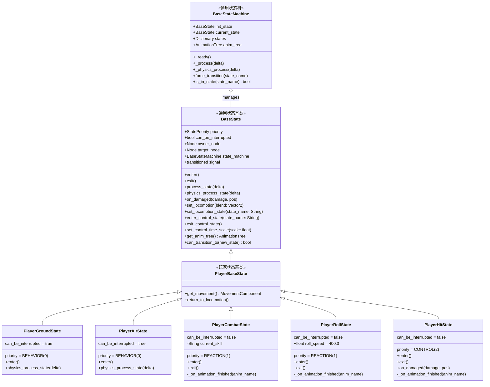
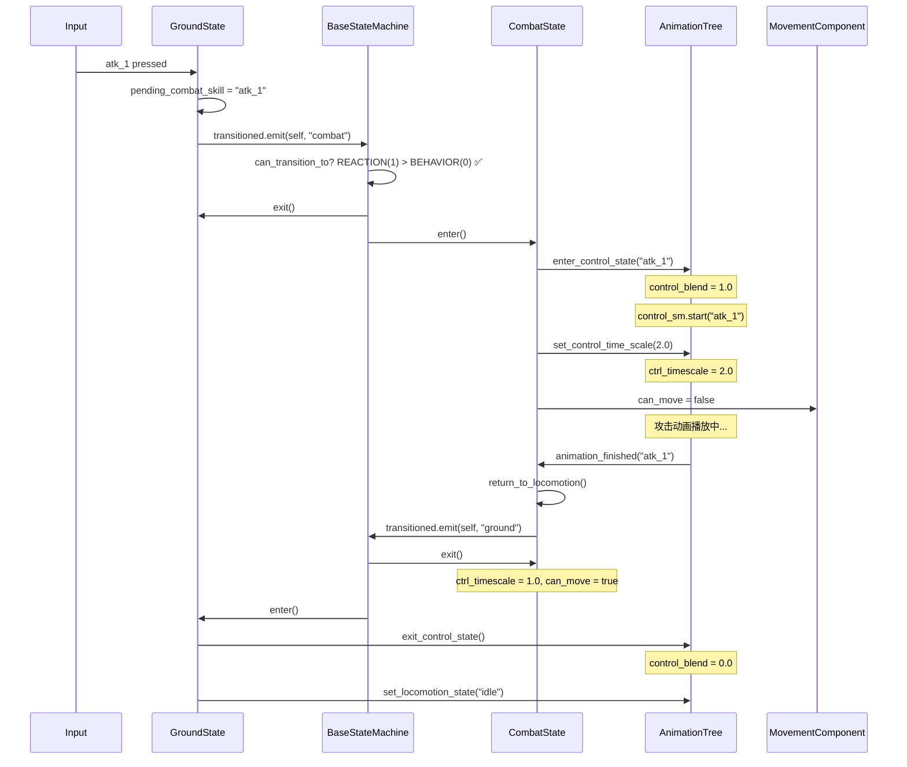
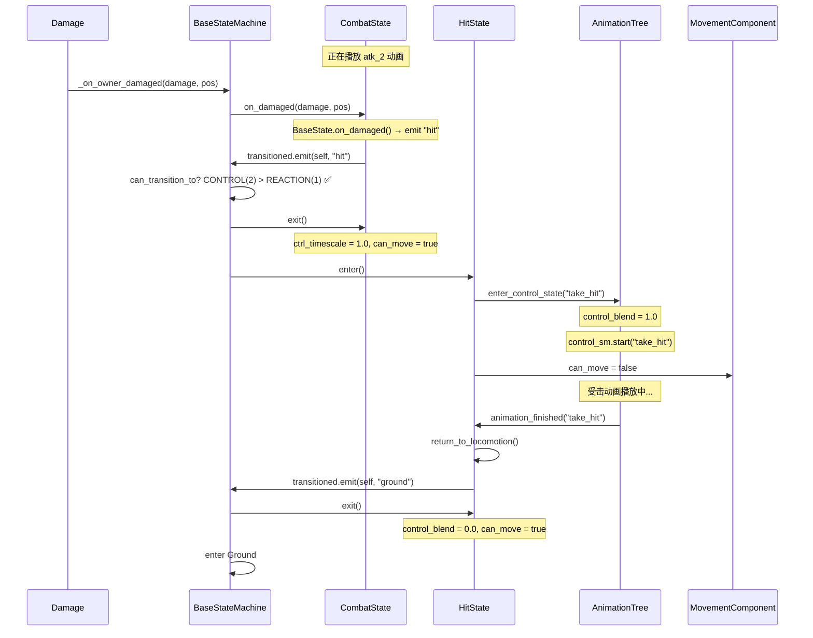

# Player 状态机与 AnimationTree 架构

> **文档类型**: 核心架构 - 玩家状态机系统
> **创建日期**: 2026-02-27
> **Godot版本**: 4.4.1
> **架构模式**: BaseState 统一框架 + BlendTree 动画混合
> **关联文档**: [状态机系统](01_state_machine_architecture.md) | [角色模板](07_character_template_architecture.md)

---

## 📋 目录

1. [架构概述](#1-架构概述)
2. [类继承体系](#2-类继承体系)
3. [AnimationTree BlendTree 架构](#3-animationtree-blendtree-架构)
4. [状态机详细设计](#4-状态机详细设计)
5. [状态转换流程](#5-状态转换流程)
6. [动画控制机制](#6-动画控制机制)
7. [场景节点树](#7-场景节点树)
8. [时序图](#8-时序图)
9. [设计决策与权衡](#9-设计决策与权衡)

---

## 1. 架构概述

### 设计目标

Player 状态机采用与 Enemy（Dinosaur 等）**完全一致**的 BaseState 框架，通过 BlendTree 模式统一动画控制：

- ✅ **框架统一**: Player 和 Enemy 共用 BaseState/BaseStateMachine 基础设施
- ✅ **动画一致**: 统一使用 `set_locomotion` / `enter_control_state` / `exit_control_state` helper
- ✅ **模板复用**: PlayerStateMachine 定义在 PlayerBase.tscn 模板中，所有玩家角色继承
- ✅ **优先级控制**: 三层优先级系统（BEHAVIOR < REACTION < CONTROL）防止低优先级状态打断高优先级

### 核心思想

```
状态机（逻辑层）  ←→  AnimationTree（动画层）
     │                      │
     │  set_locomotion_state("run")  →  locomotion SM: idle↔run
     │  enter_control_state("atk_1") →  control_sm SM: 播放 atk_1
     │  exit_control_state()         →  control_blend=0, 回到 locomotion
     │                      │
     └── BaseState helper 统一接口 ──┘
```

---

## 2. 类继承体系

### UML 类图



### ASCII 类图

```
┌─────────────────────────────────────────┐
│              BaseState                   │
│─────────────────────────────────────────│
│ + priority: StatePriority               │
│ + can_be_interrupted: bool              │
│ + owner_node: Node                      │
│ + state_machine: BaseStateMachine       │
│─────────────────────────────────────────│
│ + enter() / exit()                      │
│ + set_locomotion(blend: Vector2)        │
│ + set_locomotion_state(name: String)    │  ← Player 用（SM locomotion）
│ + enter_control_state(name: String)     │
│ + exit_control_state()                  │
│ + set_control_time_scale(scale: float)  │
│ + get_anim_tree(): AnimationTree        │
└──────────────────┬──────────────────────┘
                   │ extends
     ┌─────────────┴──────────────┐
     │       PlayerBaseState       │
     │────────────────────────────│
     │ + get_movement(): MC       │
     │ + return_to_locomotion()   │
     └─────────────┬──────────────┘
                   │ extends
    ┌──────┬───────┼───────┬──────────┐
    │      │       │       │          │
  Ground  Air   Combat   Roll       Hit
  (B=0)  (B=0)  (R=1)   (R=1)     (C=2)

  B=BEHAVIOR  R=REACTION  C=CONTROL
```

### 与 Enemy 状态机的对比

| 特性 | Enemy (Dinosaur) | Player (Hahashin) |
|------|-----------------|-------------------|
| 基类 | BaseState | BaseState → PlayerBaseState |
| locomotion 类型 | BlendSpace2D | StateMachine (idle/run) |
| locomotion 调用 | `set_locomotion(Vector2)` | `set_locomotion_state("idle"/"run")` |
| control_sm | hit, stunned, death | j_up, j_down, atk_1~3, atk_sp, atk_air, roll, take_hit |
| 攻击方式 | `fire_attack()` (OneShot) | `enter_control_state("atk_x")` (control_sm) |
| 状态机位置 | 角色场景内 | PlayerBase.tscn 模板（继承） |

---

## 3. AnimationTree BlendTree 架构

### BlendTree 节点结构

```
AnimationNodeBlendTree (root)
│
├── locomotion (AnimationNodeStateMachine)
│   ├── idle (AnimationNodeAnimation)
│   └── run (AnimationNodeAnimation)
│   └── transitions: Start→idle, idle↔run
│
├── loco_timescale (AnimationNodeTimeScale)
│
├── control_sm (AnimationNodeStateMachine)
│   ├── j_up (AnimationNodeAnimation)
│   ├── j_down (AnimationNodeAnimation)
│   ├── atk_1 (AnimationNodeAnimation)
│   ├── atk_2 (AnimationNodeAnimation)
│   ├── atk_3 (AnimationNodeAnimation)
│   ├── atk_sp (AnimationNodeAnimation)
│   ├── atk_air (AnimationNodeAnimation)
│   ├── roll (AnimationNodeAnimation)
│   └── take_hit (AnimationNodeAnimation)
│   └── transitions:
│       Start→j_up, j_up→j_down (travel)
│       atk_1→End, atk_2→End, atk_3→End (at_end, auto)
│       atk_sp→End, atk_air→End (at_end, auto)
│       roll→End, take_hit→End (at_end, auto)
│
├── ctrl_timescale (AnimationNodeTimeScale)
│
├── control_blend (AnimationNodeBlend2)
│   ├── input[0]: loco_timescale (locomotion 动画)
│   └── input[1]: ctrl_timescale (control 动画)
│
└── output ← control_blend
```

### 数据流图

```
                    ┌──────────────┐
                    │  locomotion  │ idle ↔ run
                    │  (StateMachine) │
                    └──────┬───────┘
                           │
                    ┌──────┴───────┐
                    │ loco_timescale│ ×1.0 (可调速)
                    └──────┬───────┘
                           │ input[0]
                    ┌──────┴───────┐
                    │ control_blend │ blend_amount
                    │  (Blend2)    │ 0.0=locomotion
                    │              │ 1.0=control
                    └──────┬───────┘
                           │ input[1]
                    ┌──────┴───────┐
                    │ ctrl_timescale│ ×1.0~2.0 (攻击加速)
                    └──────┬───────┘
                           │
                    ┌──────┴───────┐
                    │  control_sm  │ j_up, j_down, atk_1~3,
                    │ (StateMachine)│ atk_sp, atk_air, roll, take_hit
                    └──────────────┘

         ────────────────────────────────────────
                           │
                    ┌──────┴───────┐
                    │    output    │ → AnimationPlayer
                    └──────────────┘
```

### 关键参数路径

| 参数路径 | 类型 | 用途 | 控制方法 |
|---------|------|------|---------|
| `parameters/control_blend/blend_amount` | float | 0.0=locomotion, 1.0=control | `enter_control_state()` / `exit_control_state()` |
| `parameters/locomotion/playback` | Playback | locomotion SM 播放控制 | `set_locomotion_state()` |
| `parameters/control_sm/playback` | Playback | control SM 播放控制 | `enter_control_state()` |
| `parameters/loco_timescale/scale` | float | locomotion 动画速度 | `set_locomotion_time_scale()` |
| `parameters/ctrl_timescale/scale` | float | control 动画速度 | `set_control_time_scale()` |

---

## 4. 状态机详细设计

### 状态图

```mermaid
stateDiagram-v2
    [*] --> Ground: init_state

    state "BEHAVIOR 层 (priority=0)" as behavior {
        Ground --> Air: !is_on_floor()
        Air --> Ground: is_on_floor()
        Ground --> Ground: idle ↔ run
    }

    state "REACTION 层 (priority=1)" as reaction {
        Ground --> Combat: atk_1/2/3/sp
        Air --> Combat: atk_1/2/3 → atk_air
        Air --> Combat: atk_sp
        Ground --> Roll: roll
        Combat --> Ground: 动画结束 + on_floor
        Combat --> Air: 动画结束 + !on_floor
        Roll --> Ground: 动画结束 + on_floor
        Roll --> Air: 动画结束 + !on_floor
    }

    state "CONTROL 层 (priority=2)" as control {
        Ground --> Hit: damaged
        Air --> Hit: damaged
        Combat --> Hit: damaged (打断攻击)
        Roll --> Hit: damaged (打断翻滚)
        Hit --> Ground: 动画结束 + on_floor
        Hit --> Air: 动画结束 + !on_floor
    }
```

### 各状态详细说明

#### Ground（地面状态）

```
优先级: BEHAVIOR(0)  |  可打断: true
动画:   set_locomotion_state("idle" / "run")
────────────────────────────────────────
enter():
  exit_control_state()          // blend → locomotion
  set_locomotion_state("idle")  // 初始为 idle
  movement.can_move = true      // 允许移动

physics_process_state():
  !is_on_floor()         → emit "air"
  atk_1/2/3/sp pressed   → pending_combat_skill = action, emit "combat"
  roll pressed           → emit "roll"
  |velocity.x| > 1.0    → set_locomotion_state("run")
  else                   → set_locomotion_state("idle")
```

#### Air（空中状态）

```
优先级: BEHAVIOR(0)  |  可打断: true
动画:   enter_control_state("j_up" / "j_down")
────────────────────────────────────────
enter():
  velocity.y < 0 → enter_control_state("j_up")
  else           → enter_control_state("j_down")
  movement.can_move = true

physics_process_state():
  is_on_floor()          → emit "ground"
  atk_1/2/3 pressed      → pending_combat_skill = "atk_air", emit "combat"
  atk_sp pressed         → pending_combat_skill = "atk_sp", emit "combat"
  velocity.y > 0         → playback.travel("j_down")
```

#### Combat（战斗状态）

```
优先级: REACTION(1)  |  可打断: false
动画:   enter_control_state(current_skill)
────────────────────────────────────────
enter():
  current_skill = owner.pending_combat_skill
  enter_control_state(current_skill)  // 播放攻击动画
  set_control_time_scale(2.0)         // 2倍速播放
  movement.can_move = false           // 攻击时不能移动
  connect animation_finished

exit():
  set_control_time_scale(1.0)         // 恢复正常速度
  movement.can_move = true
  disconnect animation_finished

_on_animation_finished(anim_name):
  if anim_name == current_skill → return_to_locomotion()
```

#### Roll（翻滚状态）

```
优先级: REACTION(1)  |  可打断: false
动画:   enter_control_state("roll")
────────────────────────────────────────
enter():
  enter_control_state("roll")
  set_control_time_scale(2.0)
  movement.apply_dash_speed(roll_speed)  // 冲刺位移
  connect animation_finished

exit():
  set_control_time_scale(1.0)
  exit_control_state()
  movement.can_move = true
  disconnect animation_finished

_on_animation_finished(anim_name):
  if anim_name == "roll" → return_to_locomotion()
```

#### Hit（受击状态）

```
优先级: CONTROL(2)  |  可打断: false
动画:   enter_control_state("take_hit")
────────────────────────────────────────
enter():
  enter_control_state("take_hit")
  movement.can_move = false
  connect animation_finished

exit():
  exit_control_state()
  movement.can_move = true
  disconnect animation_finished

_on_animation_finished(anim_name):
  if anim_name == "take_hit" → return_to_locomotion()

on_damaged():  // 已在 Hit 状态中被再次攻击
  enter_control_state("take_hit")  // 重新播放受击动画
```

---

## 5. 状态转换流程

### 优先级矩阵

```
请求的新状态 →   Ground(0)  Air(0)  Combat(1)  Roll(1)  Hit(2)
当前状态 ↓
─────────────────────────────────────────────────────────────
Ground(0)          ✅        ✅       ✅         ✅       ✅
Air(0)             ✅        ✅       ✅         ✅       ✅
Combat(1)          ✅*       ✅*      ❌         ❌       ✅
Roll(1)            ✅*       ✅*      ❌         ❌       ✅
Hit(2)             ✅*       ✅*      ✅*        ✅*      ❌

✅  = 允许转换
❌  = 拒绝（优先级不足 + can_be_interrupted=false）
✅* = 仅允许自愿退出（由当前状态主动 emit transitioned）
```

### 转换规则

```gdscript
# BaseState.can_transition_to() 逻辑:
func can_transition_to(new_state: BaseState) -> bool:
    # 高优先级打断低优先级
    if new_state.priority > priority: return true
    # 同优先级看 can_be_interrupted
    if new_state.priority == priority: return can_be_interrupted
    # 低优先级：允许（当前状态自愿退出）
    return true
```

---

## 6. 动画控制机制

### BaseState Helper 方法调用链

```
┌─────────────────────────────────────────────────────────┐
│                    状态脚本调用                           │
├─────────────────────────────────────────────────────────┤
│                                                         │
│  set_locomotion_state("run")                            │
│    │                                                    │
│    ├─→ tree.set("parameters/control_blend/blend_amount", 0.0)  │
│    └─→ tree.get("parameters/locomotion/playback").travel("run")│
│                                                         │
│  enter_control_state("atk_1")                           │
│    │                                                    │
│    ├─→ tree.set("parameters/control_blend/blend_amount", 1.0)  │
│    └─→ tree.get("parameters/control_sm/playback").start("atk_1", true) │
│                                                         │
│  exit_control_state()                                   │
│    │                                                    │
│    └─→ tree.set("parameters/control_blend/blend_amount", 0.0)  │
│                                                         │
│  set_control_time_scale(2.0)                            │
│    │                                                    │
│    └─→ tree.set("parameters/ctrl_timescale/scale", 2.0)│
│                                                         │
└─────────────────────────────────────────────────────────┘
```

### 两种 locomotion 方法对比

| 方法 | 适用场景 | locomotion 节点类型 | 参数 |
|------|---------|-------------------|------|
| `set_locomotion(Vector2)` | Enemy（多方向移动） | BlendSpace2D | blend_position (x=方向, y=速度) |
| `set_locomotion_state(String)` | Player（二元 idle/run）| StateMachine | playback.travel(state_name) |

两者都会先将 `control_blend/blend_amount` 设为 `0.0`，确保动画切回 locomotion 层。

### control_sm 动画完成检测

```
control_sm 内部过渡:
  atk_1 ──[at_end, auto]──→ End
  atk_2 ──[at_end, auto]──→ End
  atk_3 ──[at_end, auto]──→ End
  atk_sp ──[at_end, auto]──→ End
  atk_air ──[at_end, auto]──→ End
  roll ──[at_end, auto]──→ End
  take_hit ──[at_end, auto]──→ End

                                AnimationTree.animation_finished 信号
                                         │
                   ┌─────────────────────┤
                   │                     │
            Combat 状态监听         Roll/Hit 状态监听
            anim_name == skill?     anim_name == "roll"/"take_hit"?
                   │                     │
            return_to_locomotion()  return_to_locomotion()
                   │
         ┌─────────┴─────────┐
         │                   │
    is_on_floor()?     !is_on_floor()?
         │                   │
    emit "ground"      emit "air"
```

---

## 7. 场景节点树

### PlayerBase.tscn（模板场景）

```
PlayerBase (CharacterBody2D) [group: player]
│   script: PlayerBase.gd
│   collision_layer: 2, collision_mask: 128
│
├── FloorCollision (CollisionShape2D)
│   └── CircleShape2D
│
├── AnimatedSprite2D
├── AnimationPlayer
│   └── libraries: RESET, down_walk, left_walk, right_walk, up_walk
├── AnimationTree
│
├── HurtBoxComponent (Area2D)
│   └── CollisionShape2D
├── DamageNumbersAnchor (Node2D)
├── HitBoxComponent (Area2D) [unique]
│   └── CollisionShape2D (disabled)
│
├── HealthComponent (Node)
├── HealthBar (ProgressBar)
├── MovementComponent (Node)
├── AnimationComponent (Node)
├── CombatComponent (Node)
├── SkillManager (Node)
├── CameraManager (Node)
├── AudioStreamPlayer
│
└── PlayerStateMachine (Node)  ← BaseStateMachine
    │   init_state → Ground
    │
    ├── Ground (Node)  ← PlayerGroundState [BEHAVIOR, interruptible]
    ├── Air (Node)     ← PlayerAirState    [BEHAVIOR, interruptible]
    ├── Combat (Node)  ← PlayerCombatState [REACTION, not interruptible]
    ├── Roll (Node)    ← PlayerRollState   [REACTION, not interruptible]
    └── Hit (Node)     ← PlayerHitState    [CONTROL, not interruptible]
```

### Hahashin.tscn（继承场景）

```
Hahashin (instance of PlayerBase.tscn)
│   script: hahashin.gd (extends PlayerBase)
│
├── [继承] FloorCollision — 覆盖 shape 尺寸
├── [继承] AnimatedSprite2D — 覆盖 SpriteFrames (Hahashin 精灵)
├── [继承] AnimationPlayer — 覆盖 libraries (完整动画库)
├── [继承] AnimationTree — 覆盖 tree_root:
│       └── BlendTree (locomotion + control_sm + control_blend)
│
├── [继承] HurtBoxComponent — 覆盖碰撞形状
├── [继承] MovementComponent — 覆盖 max_speed=200
├── [继承] CombatComponent — 覆盖 damage_types
│
└── [继承] PlayerStateMachine — 直接从模板继承，无需覆盖
    ├── Ground, Air, Combat, Roll, Hit — 全部继承
```

---

## 8. 时序图

### 地面攻击完整流程



### 受击打断攻击流程



---

## 9. 设计决策与权衡

### 决策 1: locomotion 用 StateMachine 而非 BlendSpace2D

- **原因**: Player 只有 idle / run 两种 locomotion 动画，不需要 BlendSpace2D 的多维混合
- **优点**: 简单直接，状态切换清晰
- **代价**: 新增 `set_locomotion_state()` helper（6行代码）
- **对比**: Enemy 使用 BlendSpace2D 因为有多方向 + 多速度等级的移动动画

### 决策 2: 攻击动画放入 control_sm 而非 OneShot

- **原因**: Dinosaur 的 `attack_oneshot` 实际上未连接到 BlendTree 输出，说明 OneShot 方案并不适用
- **优点**: 所有"中断 locomotion"的动画统一在 control_sm 中管理，逻辑一致
- **代价**: control_sm 节点较多（9个动画状态），但不影响性能

### 决策 3: PlayerStateMachine 定义在模板场景

- **原因**: 所有玩家角色共用相同的 Ground/Air/Combat/Roll/Hit 状态机结构
- **优点**: 新建玩家角色只需继承 PlayerBase.tscn，自动获得状态机
- **代价**: 如果某个角色需要不同的状态集合，需要在继承场景中覆盖

### 决策 4: 动画完成通过 `animation_finished` 信号检测

- **方式**: Combat/Roll/Hit 状态在 enter() 时 connect，exit() 时 disconnect
- **原因**: control_sm 中的攻击/翻滚/受击动画都有 `→ End` 过渡（at_end + auto），动画播完自动到 End 节点，触发 `animation_finished` 信号
- **注意**: 必须在 exit() 中断开信号，防止状态已退出后仍收到回调

### 决策 5: 攻击 2 倍速播放

- **方式**: `set_control_time_scale(2.0)` 在 enter() 设置，exit() 恢复为 1.0
- **原因**: 原始攻击动画偏慢，2倍速更符合游戏节奏
- **影响**: 通过 `ctrl_timescale` 节点实现，只影响 control_sm 层的动画速度

---

## 🔗 相关文档

- [状态机系统架构](01_state_machine_architecture.md) — BaseState/BaseStateMachine 基础框架
- [角色模板系统](07_character_template_architecture.md) — PlayerBase.tscn 模板设计
- [战斗系统架构](02_combat_system_architecture.md) — CombatComponent 与技能系统
- [组件系统架构](03_component_system_architecture.md) — MovementComponent 等组件
- [UML 架构图](architecture_uml_diagrams.md) — 全局架构图表

---

## 📁 文件索引

| 文件 | 用途 |
|------|------|
| `Core/StateMachine/BaseState.gd` | 通用状态基类（动画 helper） |
| `Core/StateMachine/BaseStateMachine.gd` | 通用状态机（状态管理 + 转换） |
| `Core/StateMachine/PlayerStates/PlayerBaseState.gd` | 玩家状态基类 |
| `Core/StateMachine/PlayerStates/PlayerGroundState.gd` | 地面状态 |
| `Core/StateMachine/PlayerStates/PlayerAirState.gd` | 空中状态 |
| `Core/StateMachine/PlayerStates/PlayerCombatState.gd` | 战斗状态 |
| `Core/StateMachine/PlayerStates/PlayerRollState.gd` | 翻滚状态 |
| `Core/StateMachine/PlayerStates/PlayerHitState.gd` | 受击状态 |
| `Core/Characters/PlayerBase.gd` | 玩家角色基类 |
| `Scenes/Characters/Templates/PlayerBase.tscn` | 玩家模板场景 |
| `Scenes/Characters/Player/Hahashin/Hahashin.tscn` | Hahashin 继承场景 |
| `Scenes/Characters/Player/Hahashin/hahashin.gd` | Hahashin 脚本 |

---

**维护者**: Claude + 用户
**最后更新**: 2026-02-27
**Token估算**: ~3500
