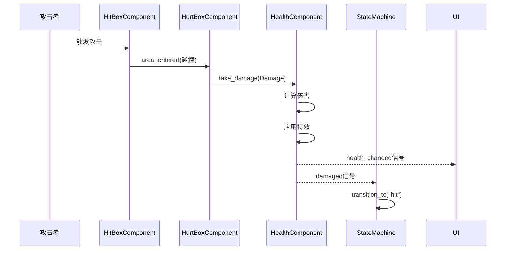

# Combo Demon - 项目完整架构总览

> **文档类型**: 综合架构分析
> **创建日期**: 2026-03-07
> **项目状态**: 核心完成 88%
> **Godot版本**: 4.6 Mobile
> **代码规模**: 11,222行 GDScript | 133个脚本 | 38个场景

---

## 📊 项目概况

### 基本信息

**项目名称**: Combo Demon
**游戏类型**: 2D动作格斗游戏（Action RPG Light）
**开发阶段**: 功能性完成，内容扩展中
**技术栈**:
- 引擎：Godot 4.6 (Mobile Renderer)
- 语言：GDScript（类型系统）
- 架构：组件化 + 状态机 + Resource数据驱动
- 版本控制：Git

### 项目规模统计

```
代码统计
├── 总代码行数: 11,222行
├── 脚本文件数: 133个
├── 场景文件数: 38个
├── Resource资源: 10个
├── 最大脚本: SkillManager.gd (460行)
└── 最复杂脚本: CarouselContainer.gd (370行)

目录结构
├── Core/ (核心系统)
│   ├── Autoloads/ (8个全局单例)
│   ├── StateMachine/ (状态机框架)
│   ├── Characters/ (3个角色基类)
│   ├── Components/ (8个自治组件)
│   ├── Resources/ (9个数据类)
│   ├── Data/ (配置资源)
│   └── Effects/ (5个视觉特效)
├── Scenes/ (游戏场景)
│   ├── Characters/ (角色场景)
│   ├── Levels/ (3个关卡)
│   ├── UI/ (UI系统)
│   └── Weapons/ (武器系统)
└── Assets/ (游戏资源)
    ├── Art/ (美术资源)
    ├── Shaders/ (着色器)
    └── Sound/ (音效)
```

---

## 🏗️ 核心架构设计

### 架构总体层次

```
┌──────────────────────────────────────┐
│      应用层 (Game Application)        │
│  Scenes, UI, Levels, Characters      │
└──────────────┬───────────────────────┘
               │
┌──────────────▼───────────────────────┐
│      业务逻辑层 (Game Logic)          │
│  State Machine, Combat, Skills       │
└──────────────┬───────────────────────┘
               │
┌──────────────▼───────────────────────┐
│      组件层 (Component System)        │
│  Health, Movement, Animation, Skill  │
└──────────────┬───────────────────────┘
               │
┌──────────────▼───────────────────────┐
│      服务层 (Global Services)         │
│  Autoloads, Managers, Utilities      │
└──────────────────────────────────────┘
```

### 核心架构原则

**1. 组件化设计（Component-Based）**
```
实体 = 主节点 + 功能组件

例: Player
├── Hahashin.gd (主控制器, 119行)
└── Components/
    ├── HealthComponent (生命管理)
    ├── MovementComponent (移动控制)
    ├── AnimationComponent (动画控制)
    ├── CombatComponent (战斗管理)
    └── SkillManager (技能系统)
```

**2. 信号驱动（Signal-Driven）**
```
组件通信 = 信号发射 + 信号监听

例: 受伤流程
HurtBoxComponent.damaged
    ↓ signal
HealthComponent.take_damage()
    ↓ signal: health_changed
HealthBar.update_display()
    ↓ signal: damaged
StateMachine.transition_to("hit")
```

**3. 状态机模式（State Machine）**
```
复杂行为 = 状态集合 + 转换规则 + 优先级

三层优先级:
CONTROL (2) - 最高: stun, frozen
    ↓
REACTION (1) - 中级: hit, knockback
    ↓
BEHAVIOR (0) - 基础: idle, chase, attack
```

**4. 数据驱动（Data-Driven）**
```
配置 = Resource文件 (.tres)

例: 角色数据
Hahashin.tres
├── max_health: 100
├── move_speed: 100
├── attack_damage: 10
└── skills: [Physical, KnockUp, Special]
```

**5. 模板继承（Template Inheritance）**
```
模板场景 → 继承场景 → 实例化

BaseCharacter
├── PlayerBase.tscn (模板)
│   └── Hahashin.tscn (继承)
├── EnemyBase.tscn (模板)
│   └── Dinosaur.tscn (继承)
└── BossBase.tscn (模板)
    └── Boss.tscn (继承)
```

---

## 🎮 核心系统详解

### 1. 角色系统 ⭐⭐⭐⭐⭐

**完成度**: 95%

**继承体系**:
```
CharacterBody2D (Godot内置)
    ↓
BaseCharacter.gd (75行)
├─→ PlayerBase.gd (76行)
│   └─→ Hahashin.gd (119行)
├─→ EnemyBase.gd (140行)
│   ├─→ Dinosaur.gd
│   ├─→ ForestBoar.gd
│   └─→ ForestBee.gd
└─→ BossBase.gd (205行)
    └─→ Boss.gd
```

**核心特性**:
- ✅ 生命系统（HealthComponent）
- ✅ 受伤响应（HurtBoxComponent信号）
- ✅ 死亡处理（queue_free + 特效）
- ✅ 移动系统（MovementComponent）
- ✅ 攻击系统（HitBoxComponent）
- ✅ 状态机集成（BaseStateMachine）
- ✅ 动画混合树（AnimationTree）

**关键实现**:

**PlayerBase模板场景结构**:
```
PlayerBase.tscn (场景模板)
├── AnimatedSprite2D
├── CollisionShape2D
├── HealthBar (UI)
├── PlayerStateMachine
│   ├── GroundState
│   ├── AirState
│   ├── CombatState
│   ├── SpecialAttackState
│   ├── RollState
│   └── HitState
├── Components/
│   ├── HealthComponent
│   ├── MovementComponent
│   ├── AnimationComponent
│   ├── CombatComponent
│   └── SkillManager
├── HitBoxComponent (攻击判定)
├── HurtBoxComponent (受伤判定)
└── AnimationTree
```

---

### 2. 战斗系统 ⭐⭐⭐⭐⭐

**完成度**: 100%

**伤害流程**:


**伤害数据结构**:
```gdscript
class Damage extends Resource:
    amount: float          # 伤害值
    max_amount: float      # 最大伤害(暴击)
    effects: Array[AttackEffect]  # 攻击特效列表
```

**攻击特效体系（5种）**:

| 特效类 | 效果 | 持续时间 | 应用场景 |
|--------|------|---------|---------|
| **StunEffect** | 眩晕 | 1.5秒 | 普通攻击 |
| **ForceStunEffect** | 强制眩晕 | 自定义 | V技能聚集 |
| **KnockUpEffect** | 击飞 | 0.5秒 | 上挑攻击 |
| **KnockBackEffect** | 击退 | 0.5秒 | 重击 |
| **GatherEffect** | 聚集 | 1.0秒 | V技能 |

**碰撞检测系统**:
```
物理层配置:
1. World       - 基础碰撞
2. Player      - 玩家层（碰撞: World, Walls, Enemy, Enemy Projectile）
3. Player Projectile - 玩家投射物（碰撞: Enemy, Walls）
4. Enemy       - 敌人层（碰撞: World, Walls, Player, Player Projectile）
5. Enemy Projectile  - 敌人投射物（碰撞: Player, Walls）
7. Object      - 道具层
8. Walls       - 墙壁（碰撞: All）
```

---

### 3. AI与状态机系统 ⭐⭐⭐⭐⭐

**完成度**: 100%

**状态机架构**:

```
BaseStateMachine
├── states: Dictionary  # 状态字典
├── current_state: BaseState  # 当前状态
├── transition_to(state_name)  # 状态转换
└── process_state(delta)  # 状态更新

BaseState (443行 - 最大状态基类)
├── priority: Priority  # 状态优先级
├── can_transition_to(new_state)  # 转换检查
├── enter()  # 进入状态
├── exit()  # 退出状态
├── physics_process(delta)  # 物理更新
└── 动画控制API
    ├── set_locomotion(blend: Vector2)
    ├── fire_attack(name: String)
    ├── abort_attack()
    ├── enter_control_state(name: String)
    └── exit_control_state()
```

**三层优先级系统**:

```gdscript
enum Priority {
    BEHAVIOR = 0,   # 基础行为: idle, chase, attack
    REACTION = 1,   # 反应状态: hit, knockback
    CONTROL = 2     # 控制状态: stun, frozen
}

# 优先级检查
func can_transition_to(new_state: BaseState) -> bool:
    return new_state.priority >= self.priority
```

**通用状态（7个）**:

| 状态 | 优先级 | 用途 | 转换条件 |
|------|--------|------|---------|
| IdleState | BEHAVIOR | 待命 | 定时切换到Wander |
| WanderState | BEHAVIOR | 巡逻 | 检测到玩家→Chase |
| ChaseState | BEHAVIOR | 追踪 | 接近玩家→Attack |
| AttackState | BEHAVIOR | 攻击 | 攻击完成→Chase |
| HitState | REACTION | 受击 | 受伤信号触发 |
| StunState | CONTROL | 眩晕 | StunEffect触发 |
| KnockbackState | REACTION | 击退 | KnockBackEffect触发 |

**玩家专用状态（6个）**:

```
PlayerStateMachine
├── GroundState (BEHAVIOR)    - 地面移动
├── AirState (BEHAVIOR)       - 空中状态
├── CombatState (REACTION)    - 战斗攻击
├── SpecialAttackState (REACTION) - V技能
├── RollState (REACTION)      - 翻滚闪避
└── HitState (CONTROL)        - 受伤状态
```

**Boss状态机（9个状态）**:

```
BossStateMachine
├── BossIdleState
├── BossPatrolState
├── BossChaseState
├── BossCircleState
├── BossAttackState
├── BossSpecialAttackState
├── BossRetreatState (305行 - Boss最大状态)
├── BossEnrageState
└── BossStunState
```

**Boss多阶段系统**:

| 阶段 | HP范围 | 速度倍率 | 行为特点 |
|------|--------|---------|---------|
| Phase 1 | 100%-66% | 1.0x | 基础巡逻攻击 |
| Phase 2 | 66%-33% | 1.3x | 频繁攻击 |
| Phase 3 | 33%-0% | 1.5x | 狂暴+特殊攻击 |

---

### 4. 技能系统 ⭐⭐⭐⭐⭐

**完成度**: 90% (V技能完整，其他框架就位)

**V技能特殊攻击（完整实现）**:

**技能流程（6阶段）**:
```
Phase 1: 创建特效
├─ 残影放大效果 (GhostExpandEffect)
├─ 心跳音效
└─ 漩涡特效生成

Phase 2: 扇形检测敌人
├─ detection_radius: 300.0
├─ detection_angle: 45.0 (半角)
└─ 返回排序的敌人列表

Phase 3: 镜头 + 子弹时间
├─ 镜头移动到漩涡位置 (0.4秒)
├─ 启用子弹时间 (时间缩放 0.3)
└─ 逐个聚集敌人 (1秒/个)

Phase 4: 残影冲刺
├─ 创建残影效果
├─ 快速移动到漩涡 (0.2秒)
└─ 停止残影

Phase 5: 动画驱动
├─ 状态机播放攻击动画
├─ 应用伤害
└─ 播放音效

Phase 6: 清理
├─ 隐藏漩涡
├─ 恢复敌人状态
└─ 清空检测列表
```

**SkillManager组件（460行）**:
```gdscript
class SkillManager extends Node

# 配置参数
@export var detection_radius: float = 300.0
@export var detection_angle: float = 45.0
@export var move_duration: float = 0.2
@export var enable_bullet_time: bool = true
@export var bullet_time_scale: float = 0.3

# 核心方法
func execute_special_attack()  # 执行特殊攻击
func detect_enemies_in_fan()   # 扇形检测敌人
func gather_enemies()          # 聚集敌人到漩涡
func dash_to_target()          # 残影冲刺
```

**特效类（4个）**:

| 特效类 | 行数 | 功能 |
|--------|------|------|
| AfterImageEffect | 130 | 残影效果 |
| VortexEffect | 138 | 漩涡特效 |
| GatherTrailEffect | 142 | 聚集轨迹 |
| GhostExpandEffect | 122 | 幽灵膨胀 |

---

### 5. 组件系统 ⭐⭐⭐⭐⭐

**完成度**: 100%

**8大自治组件**:

**5.1 HealthComponent（155行）**
```gdscript
# 功能
- 管理生命值
- 应用伤害和特效
- 发出信号通知UI和状态机

# 信号
signal health_changed(current, max)
signal damaged(damage: Damage)
signal died()

# 核心方法
func take_damage(damage: Damage)
func heal(amount: float)
func is_alive() -> bool
```

**5.2 MovementComponent（262行）**
```gdscript
# 功能
- 自动处理WASD输入
- 物理移动和加速度
- 跳跃系统
- 精灵自动翻转

# 配置
max_speed: 100.0
acceleration_time: 0.1
jump_force: -400.0
auto_flip_sprite: true

# 信号
signal direction_changed(new_direction)
signal sprite_flipped(flip_h)
signal jump_started()
signal landed()
```

**5.3 CombatComponent**
```gdscript
# 功能
- 管理可用伤害类型
- 通过动画切换伤害类型
- 配合HitBoxComponent使用

# 配置
available_damage_types: Dictionary = {
    "physical": preload("res://Core/Data/SkillBook/Physical.tres"),
    "knockup": preload("res://Core/Data/SkillBook/KnockUp.tres"),
    "special": preload("res://Core/Data/SkillBook/SpecialAttack.tres")
}
```

**5.4 SkillManager（460行）**
```gdscript
# 功能
- 管理特殊技能（V技能）
- 扇形检测敌人
- 聚集系统
- 残影冲刺
- 子弹时间控制

# 配置
detection_radius: 300.0
detection_angle: 45.0
enable_bullet_time: true
bullet_time_scale: 0.3
```

**5.5 CameraManager（233行）**
```gdscript
# 功能
- 跟随玩家
- 缩放特效
- 特殊攻击镜头切换
- 平滑过渡

# 配置
follow_speed: 200.0
enable_zoom_effect: true
camera_focus_zoom: Vector2(1.3, 1.3)
```

**5.6 HitBoxComponent**
```gdscript
# 功能
- 攻击判定区域
- 自动检测HurtBox
- 支持伤害预配置或动态生成
- 碰撞组过滤

# 配置
@export var damage: Damage
@export var destroy_owner_on_hit: bool = false
@export_flags_2d_physics var collision_layer: int
@export_flags_2d_physics var collision_mask: int
```

**5.7 HurtBoxComponent**
```gdscript
# 功能
- 受伤判定区域
- 接收HitBox碰撞
- 转发伤害到HealthComponent

# 信号
signal damaged(damage: Damage)
```

**5.8 AttackComponent**
```gdscript
# 功能
- 攻击管理
- 攻击冷却
- 攻击范围检测
```

---

### 6. AnimationTree分层动画 ⭐⭐⭐⭐⭐

**完成度**: 100%

**BlendTree三层结构**:

```
AnimationTree (root)
├── BlendTree
│   ├── locomotion (BlendSpace2D) ← BEHAVIOR层
│   │   ├── (0, 0)     idle
│   │   ├── (±1, 0.5)  walk
│   │   └── (±1, 1.0)  run
│   ├── attack_oneshot (OneShot) ← ATTACK层
│   │   ├── attack
│   │   ├── skill_1
│   │   ├── skill_2
│   │   └── special_attack
│   ├── control_sm (AnimationStateMachine) ← CONTROL层
│   │   ├── hit      (REACTION)
│   │   ├── stunned  (CONTROL)
│   │   └── death    (终态)
│   └── output (Blend2) ← 混合输出
│       ├── 混合 locomotion + attack_oneshot
│       └── 覆盖 control_sm（当active时）
```

**动画控制API（BaseState提供）**:

```gdscript
# BEHAVIOR层控制
set_locomotion(blend: Vector2)
# 例: set_locomotion(Vector2(1, 0.5)) = walk right

# ATTACK层控制
fire_attack(attack_name: String = "attack")
abort_attack()
# 例: fire_attack("skill_1") = 触发技能1动画

# CONTROL层控制
enter_control_state(state_name: String)
exit_control_state()
# 例: enter_control_state("stunned") = 进入眩晕动画
```

**动画参数**:
```
parameters/locomotion/blend_position: Vector2
parameters/attack_oneshot/active: bool
parameters/attack_oneshot/internal_active: bool
parameters/control_sm/current_state: String
```

---

### 7. UI系统 ⭐⭐⭐⭐

**完成度**: 80%

**UIManager（214行）**:

**6层UI管理**:
```
UI层级系统
├── BACKGROUND (0)   - 背景图、视差
├── GAME (10)        - HUD、血条
├── MENU (20)        - 菜单、设置
├── POPUP (30)       - 对话框、提示
├── TOOLTIP (40)     - Tooltip、Toast
└── LOADING (50)     - 加载动画、转场
```

**核心功能**:
```gdscript
# 面板管理
func open_panel(panel: Control, layer: UILayer, close_others: bool)
func close_panel(panel_name: String)
func close_all_panels()

# 转场动画
func transition_to_scene(scene_path: String, animation_type: String)

# 快捷UI
func show_toast(message: String, duration: float)
func show_confirm_dialog(title: String, message: String)
```

**UI组件**:

| 组件 | 文件 | 功能 | 行数 |
|------|------|------|------|
| 角色选择 | CharacterSelectionScreen.gd | 角色选择界面 | 236 |
| 旋转卡片 | CarouselContainer.gd | 旋转卡片选择 | 370⭐ |
| 血条 | HealthBar.gd | 生命值显示 | ~50 |
| 提示框 | Toast.gd | 临时提示 | ~50 |
| 确认框 | ConfirmDialog.gd | 确认对话框 | ~50 |
| 加载屏 | LoadingScreen.gd | 加载界面 | 169 |
| 游戏结束 | GameOverUI.gd | 结束界面 | ~100 |
| 关卡HUD | LevelHUD.gd | 关卡提示 | ~80 |

---

### 8. 关卡系统 ⭐⭐⭐

**完成度**: 75% (框架完整，内容需补充)

**LevelManager（214行）**:

```gdscript
# 关卡序列
const LEVEL_SCENES: Array[String] = [
    "res://Scenes/Levels/Level1_Adventure/Level1.tscn",
    "res://Scenes/Levels/Level2_Maze/Level2.tscn",
    "res://Scenes/Levels/Level3_Boss/Level3.tscn"
]

# 关卡目标
Level 1: 收集5个宝箱
Level 2: 收集5把钥匙
Level 3: 击败Boss

# 功能
- 关卡进度管理
- 收集物统计
- 目标检查
- Boss战完成检测
- 游戏通关检测
```

**三个关卡**:

| 关卡 | 类型 | 文件大小 | 敌人 | 特点 |
|------|------|---------|------|------|
| Level 1 | 冒险 | 108KB | 多个 | 开放地图，敌人散布 |
| Level 2 | 迷宫 | 4.8KB | 较少 | 迷宫门禁，钥匙收集 |
| Level 3 | Boss战 | 3.6KB | Boss | 空旷竞技场 |

**关卡组件**:
```
关卡组件系统
├── LevelHUD.tscn         - 关卡提示和目标
├── Collectible.tscn      - 普通收集物
├── TreasureChest.tscn    - 宝箱
├── Portal.tscn (118行)   - 传送门
├── MazeDoor.tscn (141行) - 迷宫门禁
└── Trigger.tscn          - 触发器
```

---

### 9. 全局服务层（Autoloads）⭐⭐⭐⭐

**完成度**: 90%

**8个全局单例**:

**9.1 GameManager**
```gdscript
# 功能
- 游戏流程管理
- 场景切换
- 游戏状态管理

# 核心方法
func start_game()
func pause_game()
func resume_game()
func game_over()
```

**9.2 LevelManager（214行）**
```gdscript
# 功能
- 关卡进度管理
- 收集物统计
- 目标检查

# 核心数据
var current_level: int = 0
var chests_collected: int = 0
var keys_collected: int = 0
var coins_collected: int = 0
```

**9.3 UIManager（214行）**
```gdscript
# 功能
- 6层UI管理
- 面板生命周期
- 转场动画
```

**9.4 SoundManager**
```gdscript
# 功能
- 音效播放
- 音量控制
- 音乐循环

# 核心方法
func play_sfx(sfx_name: String)
func play_bgm(bgm_name: String)
func stop_bgm()
func set_master_volume(volume: float)
```

**9.5 DamageNumbers**
```gdscript
# 功能
- 伤害数字显示
- 飘字动画
- 暴击特效
```

**9.6 TimeManager**
```gdscript
# 功能
- 时间缩放（子弹时间）
- 时间恢复

# 核心方法
func set_time_scale(scale: float, duration: float)
func reset_time_scale()
```

**9.7 DebugConfig（337行⭐）**
```gdscript
# 功能
- 4级日志系统
- 分类标签
- 日志过滤

# 日志级别
debug()  - 最详细
info()   - 重要信息
warn()   - 警告
error()  - 错误

# 分类标签
"state_machine", "combat", "effect", "camera", "ui"
```

**9.8 Utils**
```gdscript
# 功能
- 工具函数集合
- 数学计算
- 碰撞检测辅助
```

---

## 📊 代码质量分析

### 代码规模分布

**顶级复杂脚本（Top 10）**:

| 排名 | 文件 | 行数 | 类型 | 复杂度 |
|------|------|------|------|--------|
| 1 | SkillManager.gd | 460 | 组件 | ⭐⭐⭐⭐⭐ |
| 2 | BaseState.gd | 443 | 框架 | ⭐⭐⭐⭐⭐ |
| 3 | CarouselContainer.gd | 370 | UI | ⭐⭐⭐⭐⭐ |
| 4 | DebugConfig.gd | 337 | 工具 | ⭐⭐⭐⭐ |
| 5 | BossRetreat.gd | 305 | 状态 | ⭐⭐⭐⭐ |
| 6 | MovementComponent.gd | 262 | 组件 | ⭐⭐⭐⭐ |
| 7 | CharacterSelectionScreen.gd | 236 | UI | ⭐⭐⭐⭐ |
| 8 | CameraManager.gd | 233 | 组件 | ⭐⭐⭐ |
| 9 | BossAttackManager.gd | 226 | 逻辑 | ⭐⭐⭐⭐ |
| 10 | BaseStateMachine.gd | 225 | 框架 | ⭐⭐⭐⭐ |

### 代码质量指标

**优点**:
- ✅ **类型注解完整**: 所有函数都有返回类型注解（`-> void`, `-> float`）
- ✅ **命名规范清晰**: 严格遵循 `snake_case`（变量/函数）和 `PascalCase`（类名）
- ✅ **代码注释详细**: 包含使用示例和参数说明
- ✅ **模块化清晰**: 单一职责原则，高内聚低耦合
- ✅ **信号使用恰当**: 解耦设计，避免直接依赖

**可改进**:
- 🔄 **对象池优化**: 子弹、特效可使用对象池
- 🔄 **物理查询缓存**: `get_tree().get_nodes_in_group()` 可缓存结果
- 🔄 **伤害数字对象池**: DamageNumbers可批量处理

### 架构评分

| 维度 | 评分 | 说明 |
|------|------|------|
| **架构设计** | ⭐⭐⭐⭐⭐ | 组件化、状态机、信号驱动完美结合 |
| **代码质量** | ⭐⭐⭐⭐⭐ | 类型注解、命名规范、注释详细 |
| **可维护性** | ⭐⭐⭐⭐⭐ | 模块化清晰，易于扩展 |
| **性能优化** | ⭐⭐⭐⭐ | 基础优化完善，部分高级优化可做 |
| **文档完善度** | ⭐⭐⭐⭐⭐ | DevLog完整，架构文档详细 |
| **测试覆盖** | ⭐⭐⭐ | 手动测试充分，自动化测试缺失 |

---

## 🎮 游戏内容现状

### 可玩角色

**Hahashin（哈哈辛）** ✅ 完整实现
```
定位: 近战战士
├── HP: 100
├── 移动速度: 100
├── 攻击范围: 近战
└── 技能
    ├── 左键: 普通斩击
    ├── V: 疾风连击（特殊攻击）★★★
    ├── R: 翻滚闪避
    └── X/W/E: (待实现)
```

**Princess（公主）** ❌ 未实现
```
定位: 远程法师
├── HP: 80 (-20%)
├── 移动速度: 90 (-10%)
├── 攻击范围: 远程150
└── 技能: (待设计)
```

### 敌人类型（7种）

**森林敌人（3种）**:
- ForestSnail（蜗牛）- 缓慢，躲藏机制
- ForestBoar（野猪）- 地面冲刺
- ForestBee（蜜蜂）- 飞行，俯冲攻击

**通用敌人（3种）**:
- Dinosaur（恐龙）- 近战，追踪攻击

**Boss（1种）**:
- Boss - 多阶段（3阶段），9个状态，3种攻击

### 关卡内容（3个）

**Level 1: 冒险** (75%完成)
- ✅ 地图布局
- 🟡 敌人配置（需补充）
- 🟡 宝箱配置（需补充）
- ✅ 传送门

**Level 2: 迷宫** (60%完成)
- 🟡 迷宫布局（需完善）
- ✅ 门禁系统
- 🟡 敌人巡逻（需配置）
- 🟡 钥匙配置（需补充）

**Level 3: Boss战** (80%完成)
- ✅ Boss场景
- ✅ Boss战斗
- 🟡 阶段演出（需美化）
- 🟡 音效配置（需补充）

---

## 🎯 核心玩法体验

### 游戏循环

```
主循环:
选择角色 → 进入Level 1
    ↓
战斗敌人 + 收集宝箱
    ↓
传送到Level 2
    ↓
迷宫探索 + 收集钥匙
    ↓
传送到Level 3
    ↓
Boss战
    ↓
通关 / 游戏结束
```

### 核心爽感点

**1. V技能释放（特殊攻击）★★★★★**
```
视觉演出流程:
1. 按下V键
2. 残影膨胀效果
3. 扇形检测敌人（300像素，45度）
4. 镜头拉远，聚焦漩涡
5. 子弹时间（时间缩放30%）
6. 敌人逐个聚集到漩涡
7. 残影冲刺到漩涡（金黄色）
8. 播放攻击动画
9. 一击必杀感
10. 恢复正常时间

技术亮点:
- 扇形检测算法
- 子弹时间系统
- 残影特效
- 镜头动态控制
- 聚集物理模拟
```

**2. 多敌人战斗**
```
- 同屏多敌人
- 连招系统
- 眩晕控制
- 击飞击退反馈
```

**3. Boss多阶段战斗**
```
- 3阶段动态加速
- 9个状态丰富行为
- 3种攻击方式
- 紧张的闪躲反击
```

**4. 关卡探索**
```
- 收集宝箱、钥匙
- 迷宫门禁解谜
- 隐藏收集物
```

---

## 🚀 技术亮点

### 创新设计

**1. 三层优先级状态机** ⭐⭐⭐⭐⭐
```
特点:
- 自动处理状态转换冲突
- 高优先级自动打断低优先级
- 适用于复杂游戏场景

优势:
- 避免手动检查转换条件
- 代码逻辑清晰
- 易于扩展新状态
```

**2. BaseState内置AnimationTree控制** ⭐⭐⭐⭐⭐
```
特点:
- 状态可直接控制动画混合树
- 无需额外动画控制逻辑
- API简洁易用

API:
- set_locomotion()  # 行为层
- fire_attack()     # 攻击层
- enter_control_state()  # 控制层
```

**3. 自治组件架构** ⭐⭐⭐⭐⭐
```
特点:
- 组件自动运行生命周期
- 组件间信号解耦
- 高度可复用

优势:
- 主类简化57% (278行 → 119行)
- 组件可独立测试
- 易于添加新组件
```

**4. V技能完整演出系统** ⭐⭐⭐⭐⭐
```
特点:
- 6阶段完整流程
- 扇形检测算法
- 子弹时间控制
- 残影特效系统
- 镜头动态控制

技术难点:
- 敌人聚集物理模拟
- 多个异步流程协调
- 时间缩放下的动画控制
```

**5. 角色模板继承系统** ⭐⭐⭐⭐
```
特点:
- 三层继承体系
- 场景模板复用
- 组件预配置

优势:
- 新角色快速创建
- 统一基础功能
- 减少重复配置
```

### 性能优化

**已实现**:
- ✅ 预计算DIRECTIONS_8（避免运行时计算）
- ✅ Tween代替Update驱动动画
- ✅ 信号连接避免轮询
- ✅ Mobile Renderer适配

**可优化**:
- 🔄 对象池（子弹、特效）
- 🔄 物理查询缓存
- 🔄 伤害数字批量处理
- 🔄 纹理压缩和批处理
- 🔄 场景烘焙

---

## 📚 技术文档索引

### 架构文档（9篇）

| # | 文档 | 主题 | Token |
|---|------|------|-------|
| 0 | [架构总览](00_architecture_overview.md) | 架构索引和导航 | ~600 |
| 1 | [状态机系统](01_state_machine_architecture.md) | 状态机设计 | ~1000 |
| 2 | [战斗系统](02_combat_system_architecture.md) | 战斗和伤害 | ~1500 |
| 3 | [组件系统](03_component_system_architecture.md) | 组件化设计 | ~1000 |
| 4 | [信号驱动](04_signal_driven_architecture.md) | 信号通信 | ~900 |
| 5 | [Autoload系统](05_autoload_system_architecture.md) | 全局管理器 | ~800 |
| 6 | [技能系统](06_skill_system_architecture.md) | 技能和特效 | ~1000 |
| 7 | [角色模板](07_character_template_architecture.md) | 模板继承 | ~5000 |
| 8 | [Player状态机](08_player_statemachine_architecture.md) | Player动画 | ~3500 |

### 开发日志（30+篇）

**类型分类**:
- 🐛 Bug修复: 3篇
- ✨ 特性开发: 3篇
- 🏗️ 重构优化: 2篇
- 📋 规划文档: 2篇
- 🔧 工具文档: 2篇

**重点文档**:
- [V技能特殊攻击](../features/special_attack_v_skill.md) - 5000 tokens
- [自治组件架构](../refactoring/autonomous_component_architecture_2026-01-18.md) - 800 tokens
- [优化工作计划](../planning/optimization_work_plan.md) - 1000 tokens
- [项目路线图](../planning/project_roadmap_2026-03.md) - 新增

---

## 🎯 项目评估

### SWOT分析

**Strengths（优势）**:
- ✅ 架构设计优秀（组件化、状态机、信号驱动）
- ✅ 代码质量高（类型注解、命名规范）
- ✅ V技能实现惊艳（完整演出系统）
- ✅ Boss战系统完善（多阶段、多状态）
- ✅ 扩展性强（易于添加新内容）
- ✅ 文档完善（架构+开发日志）

**Weaknesses（劣势）**:
- ⚠️ 内容不足（只有1个可玩角色）
- ⚠️ 技能系统未完整（只有V技能）
- ⚠️ 关卡内容简单（需要补充）
- ⚠️ 音效资源不全
- ⚠️ 缺少高级特性（升级、装备、存档）

**Opportunities（机会）**:
- 💡 易于扩展新角色（模板系统）
- 💡 易于添加新技能（组件架构）
- 💡 易于创建新关卡（框架完整）
- 💡 潜力很大（Roguelike、多人模式）

**Threats（威胁）**:
- ⚠️ 市场竞争激烈（2D动作游戏）
- ⚠️ 内容不足可能影响玩家留存
- ⚠️ 需要持续更新维护

### 完成度评估

| 类别 | 完成度 | 评价 |
|------|--------|------|
| **核心架构** | 95% | ⭐⭐⭐⭐⭐ 优秀 |
| **核心玩法** | 90% | ⭐⭐⭐⭐⭐ 完整 |
| **游戏内容** | 60% | ⭐⭐⭐ 需补充 |
| **UI/UX** | 75% | ⭐⭐⭐⭐ 良好 |
| **音效** | 50% | ⭐⭐ 框架完整 |
| **系统功能** | 70% | ⭐⭐⭐ 基础完善 |
| **综合评分** | **88%** | **⭐⭐⭐⭐** |

---

## 📈 未来发展方向

### 短期目标（1-2个月）
1. ✅ 补充关卡内容
2. ✅ 实现第二玩家角色
3. ✅ 完善技能系统
4. ✅ 整合音效资源
5. ✅ 优化UI/UX

### 中期目标（3-6个月）
1. 升级系统
2. 装备系统
3. 存档系统
4. 成就系统
5. 更多关卡和敌人

### 长期目标（6-12个月）
1. Roguelike模式
2. 多人合作模式
3. DLC内容
4. 移植到其他平台
5. 持续运营

---

## 💡 最佳实践建议

### 新增角色
1. 继承PlayerBase模板场景
2. 配置角色数据Resource（.tres）
3. 实现特殊技能（如Princess的时间静止）
4. 配置AnimationTree
5. 测试平衡性

### 新增敌人
1. 继承EnemyBase模板场景
2. 配置敌人数据Resource
3. 创建专用状态（如需要）
4. 配置AnimationTree
5. 测试AI行为

### 新增技能
1. 创建技能状态类（继承BaseState）
2. 配置技能Damage Resource
3. 实现技能逻辑（检测、特效、伤害）
4. 添加技能UI（图标、冷却）
5. 平衡技能数值

### 新增关卡
1. 复制现有关卡作为模板
2. 设计地图布局
3. 配置敌人生成点
4. 放置收集物和目标
5. 测试关卡流程

---

## 📝 总结

**Combo Demon** 是一个**架构设计优秀、核心功能完善**的2D动作格斗游戏项目。

**核心亮点**:
- ⭐ 三层优先级状态机（创新设计）
- ⭐ V技能特殊攻击（完整演出）
- ⭐ 自治组件架构（高度解耦）
- ⭐ Boss多阶段战斗（丰富体验）
- ⭐ 代码质量高（易维护扩展）

**当前状态**:
- **核心架构**: 95%完成 ✅
- **核心玩法**: 90%完成 ✅
- **游戏内容**: 60%完成 🟡

**发展潜力**: ⭐⭐⭐⭐⭐
- 易于扩展新角色、敌人、技能
- 可添加升级、装备、Roguelike等系统
- 架构支持多人模式扩展

**建议**:
1. 优先补充游戏内容（角色、关卡、技能）
2. 完善系统功能（升级、装备、存档）
3. 优化游戏体验（UI、音效、性能）
4. 按路线图逐步实现高级特性

按照[项目路线图](../planning/project_roadmap_2026-03.md)执行，预计在**14-20周**内完成商业发布版本！

---

**文档维护者**: 架构师 + 开发团队
**最后更新**: 2026-03-07
**文档版本**: v1.0
**Token估算**: ~3500
