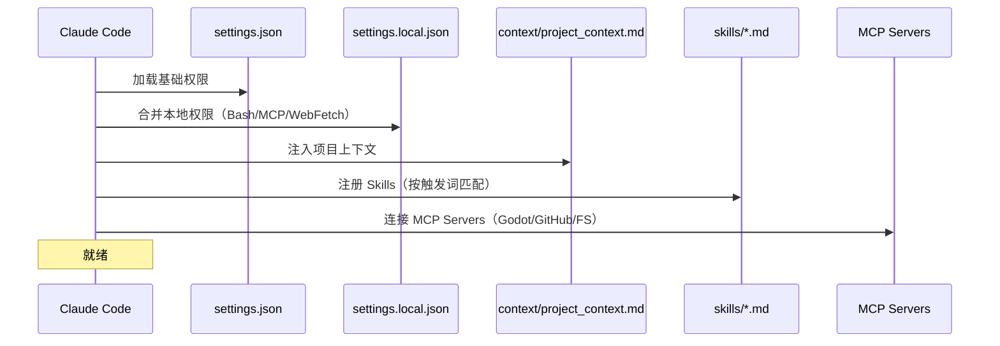
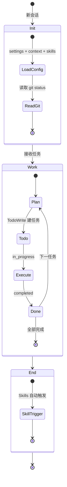
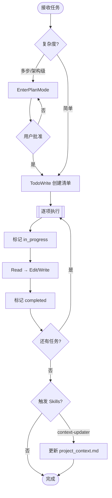
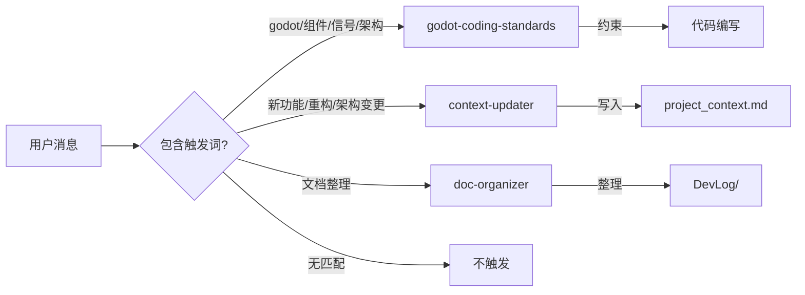
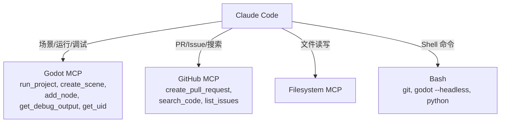
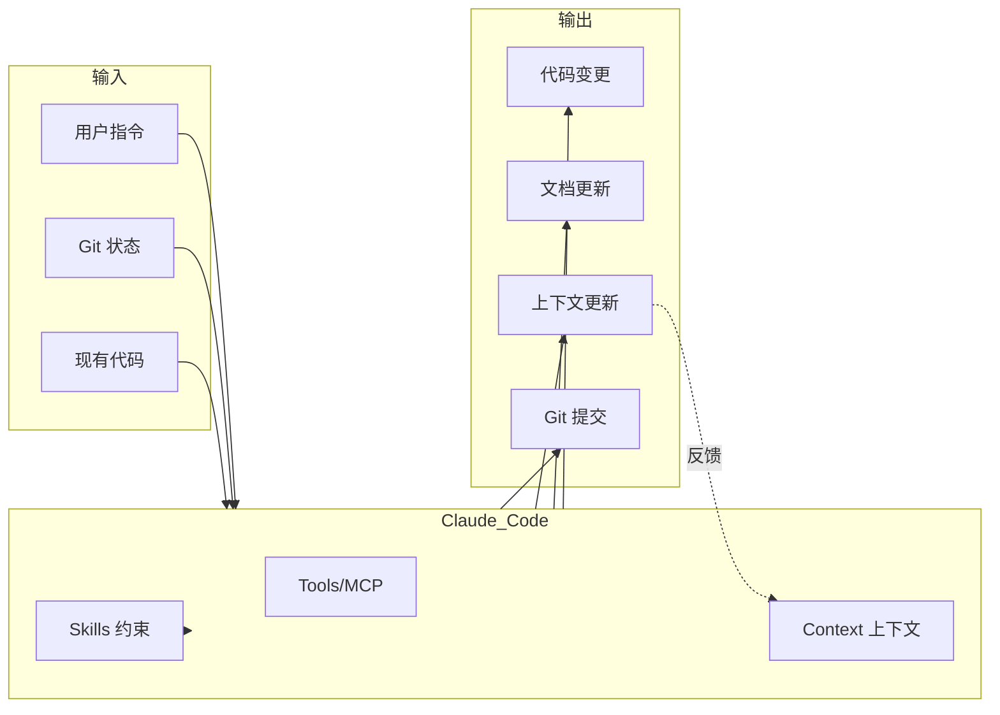

# Claude Code 工作流

> Claude Code 在本项目中的配置加载、工作流程与工具链

---

## 1. 配置加载



### .claude/ 目录

```
.claude/
├── settings.json              # 团队共享权限
├── settings.local.json        # 本地扩展权限
├── context/
│   └── project_context.md     # 项目上下文（自动注入，<4000 tokens）
└── skills/
    ├── godot-coding-standards/SKILL.md
    ├── context-updater/SKILL.md
    └── doc-organizer.md
```

### 权限配置

| 文件 | 作用 | 内容 |
|------|------|------|
| settings.json | 团队基线 | 仅允许 `mcp__godot__stop_project` |
| settings.local.json | 本地扩展 | Bash (git/godot/python)、MCP (run_project/get_debug_output/get_uid)、WebFetch 域名白名单 |

---

## 2. 工作流程

### 2.1 会话生命周期



### 2.2 任务处理流程



---

## 3. Skills 系统



| Skill | 触发词 | 作用 | 约束 |
|-------|--------|------|------|
| godot-coding-standards | godot, 组件, 信号, 架构, 设计 | 编码规范约束 | 组件模式、信号通信、Resource 设计、BlendTree 标准 |
| context-updater | 新功能, 重构, 架构变更, 新模块 | 更新项目上下文 | 总量 < 4000 tokens，每模块 ≤ 3 行 |
| doc-organizer | 文档整理, 优化文档 | 拆分/归档文档 | 每文档 ≤ 1500 tokens，无跨文档重复 |

---

## 4. MCP 工具链



---

## 5. 数据流总览



---

*v2.1 | 2026-03-15*
