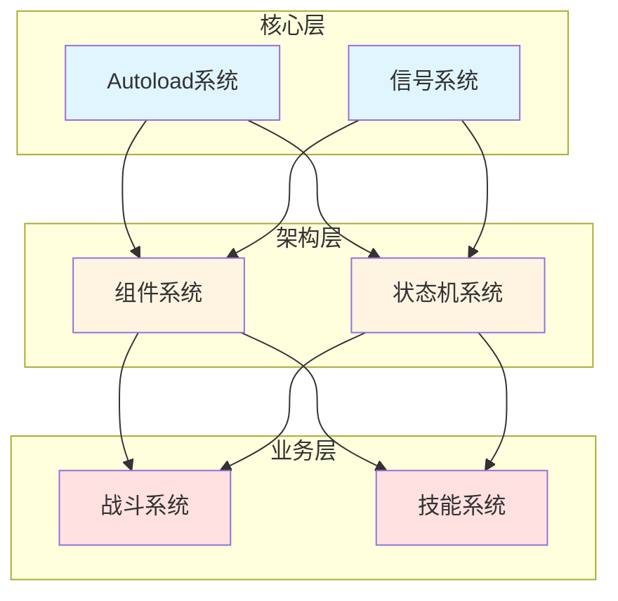

# Combo Demon 项目架构总览

> **文档类型**: 架构索引
> **创建日期**: 2026-01-20
> **Godot版本**: 4.4.1
> **项目阶段**: 开发中

---

## 📋 架构文档导航

本项目采用模块化架构设计，按功能特点拆分为以下子系统。每个子系统都有独立的架构文档和UML图表。

### 核心架构系统

| # | 架构模块 | 文档 | Token | 优先级 |
|---|---------|------|-------|--------|
| 1 | **状态机系统** | [01_state_machine_architecture.md](01_state_machine_architecture.md) | ~850 | ⭐⭐⭐⭐⭐ |
| 2 | **战斗系统** | [02_combat_system_architecture.md](02_combat_system_architecture.md) | ~1500 | ⭐⭐⭐⭐⭐ |
| 3 | **组件系统** | [03_component_system_architecture.md](03_component_system_architecture.md) | ~1000 | ⭐⭐⭐⭐⭐ |
| 4 | **信号驱动** | [04_signal_driven_architecture.md](04_signal_driven_architecture.md) | ~750 | ⭐⭐⭐⭐ |
| 5 | **Autoload系统** | [05_autoload_system_architecture.md](05_autoload_system_architecture.md) | ~650 | ⭐⭐⭐ |
| 6 | **技能系统** | [06_skill_system_architecture.md](06_skill_system_architecture.md) | ~1000 | ⭐⭐⭐⭐ |

### 补充文档

| 文档 | 用途 | Token |
|------|------|-------|
| [architecture_uml_diagrams.md](architecture_uml_diagrams.md) | 综合UML图表集合 | ~2000 |
| [architecture_review_2026-01-18.md](architecture_review_2026-01-18.md) | 架构评审和优化建议 | ~800 |

---

## 🎯 快速定位指南

### 按需求查找

**我想了解...**

- **如何设计状态机** → [01_state_machine_architecture.md](01_state_machine_architecture.md)
  - Boss状态机、Player状态机
  - 状态转换、状态堆栈
  - 可重用状态基类

- **战斗系统如何工作** → [02_combat_system_architecture.md](02_combat_system_architecture.md)
  - Hitbox/Hurtbox碰撞检测
  - Damage伤害系统
  - AttackEffect攻击特效
  - 血量显示和伤害通知

- **如何设计自洽组件** → [03_component_system_architecture.md](03_component_system_architecture.md)
  - 组件生命周期
  - 依赖注入
  - 组件通信
  - Player组件架构实例

- **信号如何使用** → [04_signal_driven_architecture.md](04_signal_driven_architecture.md)
  - 信号定义规范
  - 信号连接模式
  - 信号解耦设计
  - 常见信号模式

- **全局管理器怎么设计** → [05_autoload_system_architecture.md](05_autoload_system_architecture.md)
  - DebugConfig调试系统
  - SoundManager音频管理
  - 单例模式设计
  - Autoload最佳实践

- **技能系统架构** → [06_skill_system_architecture.md](06_skill_system_architecture.md)
  - 技能配置系统
  - 特殊攻击流程
  - 技能触发机制
  - SkillManager组件

### 按角色查找

**我是...**

- **新加入项目的开发者**
  1. [架构总览](00_architecture_overview.md) ← 你在这里
  2. [组件系统](03_component_system_architecture.md)
  3. [信号驱动](04_signal_driven_architecture.md)

- **要实现战斗功能**
  1. [战斗系统](02_combat_system_architecture.md)
  2. [技能系统](06_skill_system_architecture.md)
  3. [状态机系统](01_state_machine_architecture.md)

- **要优化现有代码**
  1. [架构评审](architecture_review_2026-01-18.md)
  2. [组件系统](03_component_system_architecture.md)
  3. [信号驱动](04_signal_driven_architecture.md)

- **要查看UML图**
  1. [综合UML图表](architecture_uml_diagrams.md)
  2. 各子系统文档中的专项UML图

---

## 🏗️ 核心架构原则

### 1. 组件化设计 (Component-Based)
```
实体 = 主节点 + 功能组件
- 主节点：最小化逻辑，只负责协调
- 组件：自洽、可复用、单一职责
```
→ 详见 [03_component_system_architecture.md](03_component_system_architecture.md)

### 2. 信号驱动 (Signal-Driven)
```
组件间通信 = 信号 (而非直接调用)
- 发射者：只发送信号，不关心接收者
- 接收者：监听信号，执行响应
- 解耦：双方互不依赖
```
→ 详见 [04_signal_driven_architecture.md](04_signal_driven_architecture.md)

### 3. 状态机模式 (State Machine)
```
复杂行为 = 状态 + 转换
- 状态：封装特定行为逻辑
- 转换：定义状态切换规则
- 堆栈：支持状态暂停/恢复
```
→ 详见 [01_state_machine_architecture.md](01_state_machine_architecture.md)

### 4. 依赖注入 (Dependency Injection)
```
组件查找 = 自动注入（onready）
- 减少耦合
- 便于测试
- 提高复用性
```
→ 详见 [03_component_system_architecture.md](03_component_system_architecture.md)

### 5. 单一职责 (Single Responsibility)
```
每个类/组件 = 一个明确的职责
- 易于理解
- 便于维护
- 降低复杂度
```
→ 应用于所有架构模块

---

## 📊 系统依赖关系



**层级说明**:
- **核心层**: Godot内置机制和全局管理器
- **架构层**: 可复用的架构模式
- **业务层**: 游戏具体功能实现

---

## 🎓 设计模式索引

| 设计模式 | 应用位置 | 文档 |
|---------|---------|------|
| **组件模式** | Player, Enemy, Boss | [03_component_system](03_component_system_architecture.md) |
| **状态模式** | 状态机系统 | [01_state_machine](01_state_machine_architecture.md) |
| **观察者模式** | 信号系统 | [04_signal_driven](04_signal_driven_architecture.md) |
| **单例模式** | Autoload管理器 | [05_autoload_system](05_autoload_system_architecture.md) |
| **策略模式** | AttackEffect子类 | [02_combat_system](02_combat_system_architecture.md) |
| **模板方法** | 组件基类 | [03_component_system](03_component_system_architecture.md) |
| **工厂模式** | Damage.create_damage() | [02_combat_system](02_combat_system_architecture.md) |

---

## 📈 架构演进历史

### 第一阶段：单体架构 (2025-12 ~ 2026-01-17)
- 单一大类实现所有功能
- 代码耦合度高
- 难以维护和扩展

### 第二阶段：组件化重构 (2026-01-18 ~ 2026-01-19)
- 拆分自洽组件
- 引入信号驱动
- 主类简化57%

→ 详见 [refactoring/autonomous_component_architecture_2026-01-18.md](../refactoring/autonomous_component_architecture_2026-01-18.md)

### 第三阶段：模块化架构 (2026-01-20 ~)
- 按功能特点分类
- 完善架构文档
- 建立设计规范

---

## 🔍 常见问题 (FAQ)

### Q1: 为什么要拆分这么多架构文档？

**A**: 每个文档专注一个主题，Token友好且易于维护。按需加载，避免每次都读取全部内容。

### Q2: 我应该先看哪个文档？

**A**:
- 新手: [组件系统](03_component_system_architecture.md) → [信号驱动](04_signal_driven_architecture.md)
- 实现功能: 直接看对应的功能架构文档
- 全面了解: 按编号顺序阅读

### Q3: UML图在哪里？

**A**:
- 综合UML图: [architecture_uml_diagrams.md](architecture_uml_diagrams.md)
- 专项UML图: 各子系统架构文档中

### Q4: 如何贡献架构设计？

**A**:
1. 阅读相关架构文档
2. 遵循现有设计原则
3. 更新对应文档
4. 添加UML图和代码示例

---

## 📚 相关文档

### 实现指南
- [Player组件重构](../refactoring/autonomous_component_architecture_2026-01-18.md)
- [优化工作计划](../planning/optimization_work_plan.md)

### Bug修复记录
- [特殊攻击Bug修复](../bug-fixes/player_autonomous_components_implementation_2026-01-19.md)
- [await内存泄漏修复](../bug-fixes/await_memory_leak_fix_2026-01-18.md)

### 工具文档
- [Token优化报告](../tools/token_optimization_report.md)
- [开发日志索引](../INDEX.md)

---

**维护者**: 开发团队
**最后更新**: 2026-01-20
**文档版本**: v1.0
**Token估算**: ~600
