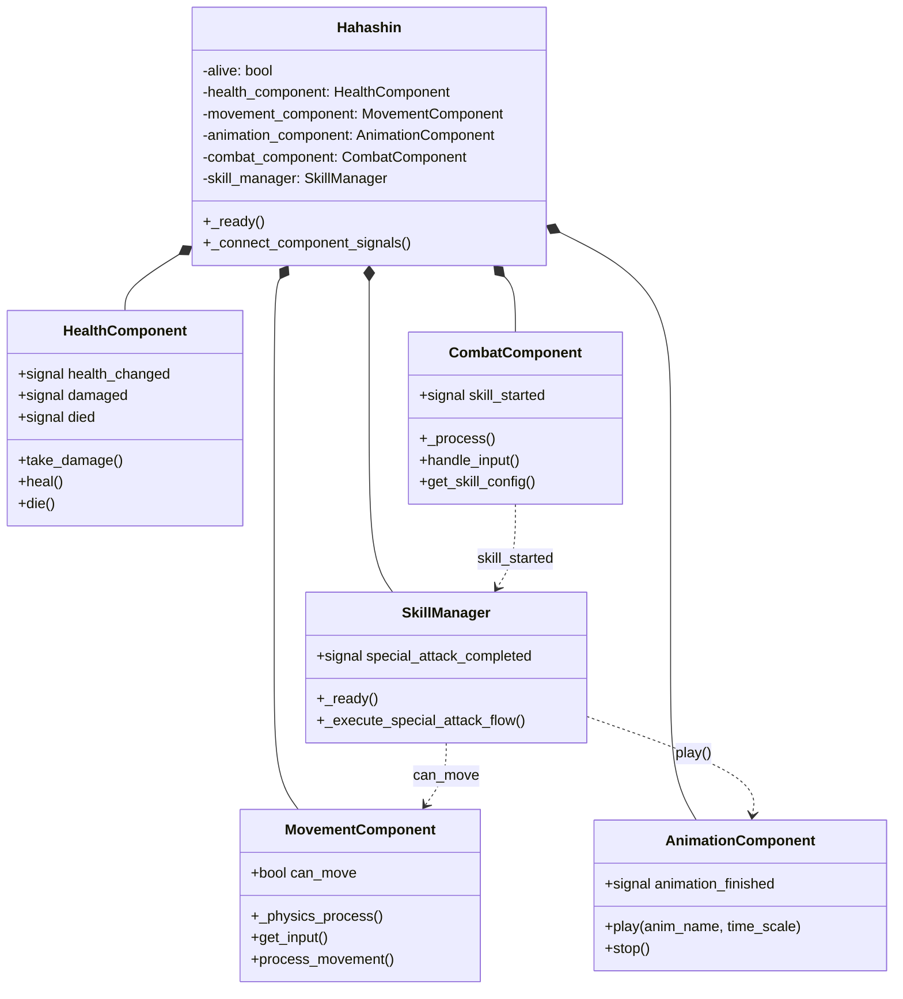

# 组件系统架构

> **文档类型**: 核心架构 - 组件系统
> **创建日期**: 2026-01-20
> **Godot版本**: 4.4.1
> **架构模式**: 组件模式 + 模板方法 + 依赖注入

---

## 📋 架构概述

### 设计目标

将复杂的游戏实体（Player, Enemy, Boss）拆分为独立、可复用的组件，实现：

- ✅ **高内聚低耦合**: 每个组件专注单一职责
- ✅ **自洽运行**: 组件自动管理生命周期
- ✅ **信号解耦**: 组件间通过信号通信
- ✅ **易于复用**: 组件可应用于不同实体

###核心原则

```
实体 = 主节点（协调者） + 功能组件（执行者）
```

- **主节点**: 最小化逻辑，只负责组件协调和生命周期管理
- **组件**: 自洽运行，完全独立，通过信号通信

---

## 🏗️ Player组件架构实例

### 架构对比

**重构前** (278行单体类):
```gdscript
hahashin.gd (278行)
├── 生命值管理 (50行)
├── 移动控制 (80行)
├── 战斗系统 (60行)
├── 技能系统 (50行)
└── 动画管理 (38行)
```

**重构后** (119行主类 + 5个组件):
```gdscript
hahashin.gd (119行, -57%)
├── HealthComponent (150行)
├── MovementComponent (180行)
├── AnimationComponent (97行)
├── CombatComponent (238行)
└── SkillManager (256行)
```

**成果**:
- 主类代码量: **-57%**
- 组件自治率: **100%**
- 组件耦合度: **0** (纯信号通信)

### UML类图



---

## 🔧 组件设计模式

### 1. 自洽组件模板

**组件生命周期（ASCII）**:
```
组件Node添加到场景
   │
   └─→ _ready()
       ├─→ 1. 依赖注入（@onready自动）
       │   ├─→ parent = get_parent()
       │   └─→ other_component = parent.get_node_or_null(...)
       │
       ├─→ 2. initialize()  # 子类重载
       │   └─→ 初始化组件状态
       │
       └─→ 3. connect_signals()  # 子类重载
           └─→ 连接其他组件的信号

每帧执行：
   _process(delta) / _physics_process(delta)
   └─→ 执行组件逻辑（自动运行）
```

**基类模板**:
```gdscript
class_name BaseComponent
extends Node

@onready var parent = get_parent()

func _ready():
    initialize()
    connect_signals()

func initialize():
    pass  # 子类重载

func connect_signals():
    pass  # 子类重载
```

### 2. MovementComponent 实现示例

**组件执行流程（ASCII）**:
```
MovementComponent._physics_process(delta)
   │
   ├─→ if not can_move: return  # 状态检查
   │
   ├─→ 1. get_input() → input_vector
   │   └─→ Input.get_vector(...)
   │
   ├─→ 2. process_movement(input_vector, delta)
   │   ├─→ 计算velocity (加速/减速)
   │   └─→ character.velocity = velocity
   │
   ├─→ 3. flip_sprite(input_vector)
   │   └─→ sprite.flip_h = (input < 0)
   │
   └─→ 4. character.move_and_slide() ✅
```

**关键代码**:
```gdscript
class_name MovementComponent
extends Node

@export var speed: float = 300.0
var can_move: bool = true

@onready var character: CharacterBody2D = get_parent()

func _physics_process(delta):
    if not can_move: return
    var input = get_input()
    process_movement(input, delta)
    character.move_and_slide()
```

---

## 📡 组件通信模式

### 信号驱动通信

```gdscript
# CombatComponent 发送信号
signal skill_started(skill_name: String)

func handle_skill_input():
    if Input.is_action_just_pressed("special_attack"):
        skill_started.emit("special_attack")

# SkillManager 监听信号
func _ready():
    var combat = get_parent().get_node("CombatComponent")
    combat.skill_started.connect(_on_skill_started)

func _on_skill_started(skill_name: String):
    if skill_name == "special_attack":
        _execute_special_attack_flow()
```

**优点**:
- ✅ CombatComponent 不知道 SkillManager 存在
- ✅ SkillManager 可以独立测试
- ✅ 新增监听者无需修改发送者

---

## 🎯 组件生命周期

### 完整生命周期管理

```gdscript
func autonomous_operation() -> void:
    # 1. 保存状态
    var original_state = save_state()

    # 2. 初始化操作
    initialize_operation()

    # 3. 执行操作
    await perform_operation()

    # 4. 恢复状态 ← 关键！
    restore_state(original_state)

    # 5. 清理资源
    cleanup()
```

**反面教材**（特殊攻击Bug）:
```gdscript
# ❌ 错误：忘记恢复状态
func _execute_special_attack_flow():
    movement_component.can_move = false
    _play_attack_animation()  # 立即返回
    # ❌ 从未恢复 can_move = true

# ✅ 正确：等待完成后恢复
func _execute_special_attack_flow():
    movement_component.can_move = false
    await _play_attack_animation_and_wait()  # 等待
    movement_component.can_move = true  # ✅ 恢复
```

---

## 📚 完整文档参考

详细的Player组件重构实施细节，请参阅：
- [Player自治组件架构设计](../refactoring/autonomous_component_architecture_2026-01-18.md)
- [Player组件实施记录](../bug-fixes/player_autonomous_components_implementation_2026-01-19.md)

---

**维护者**: 开发团队
**最后更新**: 2026-01-20
**Token估算**: ~1000
