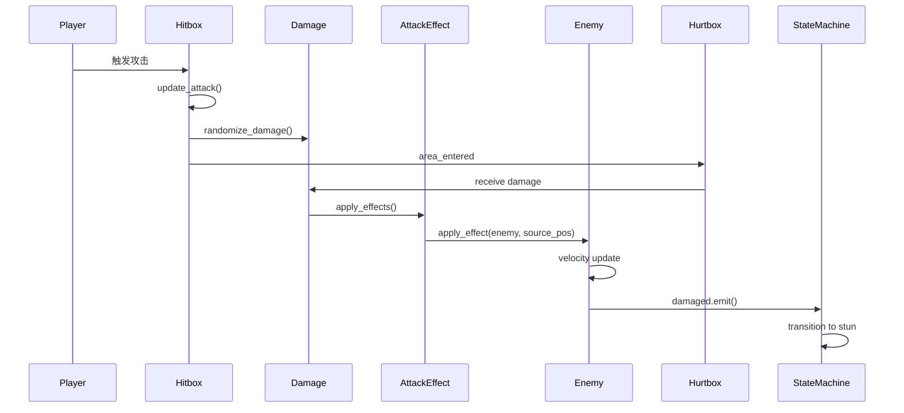

# Combo Demon 架构深度分析与优化建议

**分析日期**: 2026-01-18
**项目规模**: 81个GDScript文件 | 21个场景文件
**引擎版本**: Godot 4.4.1

---

## 📊 项目概况

### 核心指标

| 指标 | 数值 | 说明 |
|------|------|------|
| **代码文件** | 81个 .gd文件 | 包含核心逻辑和组件 |
| **场景文件** | 21个 .tscn文件 | 角色、敌人、UI场景 |
| **AutoLoad单例** | 7个 | 全局管理器 |
| **通用状态模板** | 5个 | 可复用状态 (idle/chase/attack/wander/stun) |
| **Attack特效** | 5个 | KnockUp/KnockBack/Gather/ForceStun/AttackEffect |

---

## 🏗️ 架构系统分析

### 1. 状态机系统 ⭐⭐⭐⭐⭐

**位置**: `Util/StateMachine/`

**设计评价**: **优秀**

#### ✅ 优点

1. **高度复用性**
   ```
   BaseState (基类)
   └── CommonStates/ (通用模板)
       ├── idle_state.gd    - 12个@export参数，支持玩家检测
       ├── chase_state.gd   - 10参数，动态攻击范围
       ├── attack_state.gd  - 11参数，AttackComponent集成
       ├── wander_state.gd  - 13参数，随机/固定方向
       └── stun_state.gd    - 10参数，击飞物理模拟
   ```

   **复用率**: 80% - Enemy和Boss的通用状态直接使用或轻度继承

2. **零代码配置**
   - 在编辑器中添加状态节点，通过@export设置参数
   - 无需编写代码即可实现基础AI

3. **物理模拟的完整性**
   - `stun_state.gd` 实现了8方向地图的击飞抛物线
   - 垂直偏移模拟（vertical_offset）+ 重力系统
   - 横向摩擦力（friction）+ 着地检测

#### ❌ 问题

1. **StunState 职责过重**
   - 同时处理：眩晕逻辑 + 物理模拟 + 击飞/击退判断
   - 161行代码，违反单一职责原则

2. **硬编码的状态名称**
   ```gdscript
   @export var chase_state_name := "chase"  # 字符串引用，易出错
   @export var wander_state_name := "wander"
   ```
   - 应该使用枚举或常量
   - 字符串拼写错误难以调试

3. **缺少状态转换验证**
   - 没有检查目标状态是否存在
   - `transitioned.emit(self, "typo_state")` 会失败但不报错

#### 🔧 优化建议

**优先级：中**

1. **拆分StunState**
   ```
   StunState (基础眩晕逻辑)
   ├── use: PhysicsSimulator (物理模拟组件)
   └── use: EffectHandler (特效处理组件)
   ```

2. **引入状态名称常量**
   ```gdscript
   # state_names.gd
   class_name StateNames
   const IDLE = "idle"
   const CHASE = "chase"
   const ATTACK = "attack"
   const STUN = "stun"
   ```

3. **添加状态验证**
   ```gdscript
   func try_transition(state_name: String) -> bool:
       if not state_machine.states.has(state_name):
           push_error("状态不存在: %s" % state_name)
           return false
       transitioned.emit(self, state_name)
       return true
   ```

---

### 2. Hitbox/Hurtbox 系统 ⭐⭐⭐⭐

**位置**: `Util/Components/hitbox.gd`, `hurtbox.gd`

**设计评价**: **良好**

**完整架构设计** → 参见 [hitbox_hurtbox_architecture_2026-01-19.md](hitbox_hurtbox_architecture_2026-01-19.md)

#### 核心要点

✅ **优点**:
- 简洁的接口（hitbox.gd 仅42行）
- Damage Resource 设计优秀，支持多特效组合
- AttackEffect 扩展性强，基类统一接口

✅ **已完成优化** (2026-01-18):
- [x] 统一Hitbox实现（删除重复子类）
- [x] 添加碰撞层配置（`@export_flags_2d_physics`）
- [x] 修复AttackEffect的await内存泄漏（使用信号替代）

---

### 3. Boss战系统 ⭐⭐⭐⭐⭐

**位置**: `Scenes/enemies/boss/`

**设计评价**: **优秀**

#### ✅ 优点

1. **多阶段战斗设计**
   - 3个阶段（66%血量、33%血量触发）
   - 每阶段增加速度倍率（1.0 → 1.3 → 1.5）
   - 阶段转换特效（无敌 + 击退）

2. **8方位移动系统**
   - 预计算的方向常量 (`DIRECTIONS_8`)
   - 平滑旋转到目标方向
   - 适合俯视角游戏

3. **状态机分层设计**
   ```
   Boss (主类)
   ├── BossStateMachine (状态机管理)
   └── States/
       ├── boss_idle
       ├── boss_patrol (巡逻)
       ├── boss_chase (追击)
       ├── boss_circle (环绕)
       ├── boss_attack (普通攻击)
       ├── boss_special_attack (特殊攻击)
       ├── boss_retreat (撤退)
       ├── boss_enrage (狂暴)
       └── boss_stun (眩晕)
   ```

4. **攻击管理器**
   - `boss_attack_manager.gd` 统一管理攻击模式
   - `boss_combo_attack.gd` 支持连招

#### ❌ 问题

1. **巡逻点硬编码**
   - `setup_patrol_points()` 如果没找到Marker2D，创建固定的4个点
   - 应该在编辑器中可视化配置

2. **调试代码未移除**
   - `on_damaged()` 中有大量print语句（10个print）
   - 应该使用 DebugConfig 系统或移除

3. **阶段转换逻辑耦合**
   - `change_phase()` 直接修改 special_attack_cooldown
   - 应该通过信号通知各个系统

4. **缺少Boss UI状态显示**
   - 没有显示当前阶段的UI提示
   - 没有显示攻击模式提示

#### 🔧 优化建议

**优先级：中**

1. **可视化巡逻点配置**
   ```gdscript
   @export var patrol_points_group := "boss_patrol_points"
   @export var default_patrol_radius := 200.0
   @export var default_patrol_count := 4
   ```

2. **统一调试输出**
   ```gdscript
   # 替换所有 print()
   DebugConfig.debug("Boss受伤: %.1f" % damage.amount, "", "boss")
   ```

3. **解耦阶段转换**
   ```gdscript
   signal phase_transition_started(phase: Phase)
   signal phase_transition_completed(phase: Phase)

   # 各系统监听信号并自行处理
   phase_transition_started.connect(_on_phase_transition)
   ```

4. **添加阶段UI提示**
   ```gdscript
   func change_phase(new_phase):
       ...
       UIManager.show_toast("Boss 进入第%d阶段!" % (new_phase + 1), 2.0, "warning")
   ```

---

### 4. Player 技能系统 ⭐⭐⭐⭐

**位置**: `Scenes/charaters/hahashin.gd`

**设计评价**: **良好**

#### ✅ 优点

1. **特殊攻击机制创新**
   - 分阶段执行（准备 → 移动 → 聚集 → 攻击）
   - 扇形范围检测 (`_detect_enemies_in_cone()`)
   - 敌人聚集特效 (`GatherEffect`)

2. **伤害类型切换**
   - 支持多种伤害类型 (`damage_types: Array[Damage]`)
   - `switch_to_physical()` / `switch_to_knockup()` / `switch_to_special_attack()`

3. **血条集成**
   - 动态创建血条UI
   - Tween动画平滑过渡

#### ❌ 问题

1. **职责过重**
   - hahashin.gd 包含：移动、战斗、UI、技能、死亡... (278行)
   - 违反单一职责原则

2. **特殊攻击硬编码**
   - 检测半径、角度、移动时间都是硬编码
   - 应该作为@export参数

3. **缺少技能系统抽象**
   - 每个技能都直接在hahashin.gd中实现
   - 应该提取为独立的Skill Resource

4. **movement_hander 和 animation_hander 分离**
   - 这些是组件但没有用组件模式
   - 应该继承Node作为子节点

#### 🔧 优化建议

**优先级：高**

1. **拆分Player类**
   ```
   Hahashin (主类，轻量)
   ├── MovementComponent (移动组件)
   ├── CombatComponent (战斗组件)
   ├── SkillManager (技能管理)
   └── HealthComponent (生命值组件)
   ```

2. **特殊攻击参数化**
   ```gdscript
   @export_group("Special Attack")
   @export var special_detection_radius := 300.0
   @export var special_detection_angle := 45.0
   @export var special_move_duration := 0.2
   ```

3. **Skill Resource 系统**
   ```gdscript
   # Skill.gd
   extends Resource
   class_name Skill

   @export var skill_name: String
   @export var cooldown: float
   @export var detection_range: float
   @export var damage: Damage

   func can_execute(player: Hahashin) -> bool:
       pass

   func execute(player: Hahashin):
       pass
   ```

4. **组件化movement和animation**
   ```
   Hahashin
   ├── MovementHandler (Node)
   └── AnimationHandler (Node)
   ```

---

## 📁 目录结构分析与优化

### 当前结构问题

1. **Scenes/ 目录混乱**
   ```
   Scenes/
   ├── charaters/       # 拼写错误，应该是 characters
   ├── enemies/
   ├── common_script/   # 脚本和场景混合
   ├── UI/
   ├── combo_skill/     # 孤立的技能目录
   └── test/            # 测试文件未隔离
   ```

2. **Util/ 分类不清晰**
   ```
   Util/
   ├── Components/      # 组件
   ├── Classes/         # 数据类
   ├── StateMachine/    # 状态机（应该是系统级别）
   ├── AutoLoad/        # 单例
   ├── Data/            # 资源数据
   ├── Stategy/         # 拼写错误 Strategy
   └── UI/              # 与Scenes/UI重复
   ```

3. **Weapons/ 未充分利用**
   ```
   Weapons/
   ├── slash/
   ├── bullet/
   └── ... # 可以扩展更多武器类型
   ```

### 🎯 推荐的目录结构

```
project_root/
│
├── Scenes/                    # 场景文件 (.tscn)
│   ├── Characters/            # 修正拼写
│   │   ├── Player/           # 玩家相关
│   │   │   ├── Hahashin.tscn
│   │   │   └── Components/   # 玩家组件
│   │   └── NPCs/             # NPC（未来扩展）
│   │
│   ├── Enemies/              # 敌人
│   │   ├── Common/           # 普通敌人
│   │   │   └── Dinosaur/
│   │   └── Bosses/           # 所有Boss
│   │       └── Boss1/
│   │
│   ├── Weapons/              # 武器场景
│   │   ├── Melee/           # 近战
│   │   └── Ranged/          # 远程
│   │
│   ├── VFX/                  # 视觉特效
│   │   ├── Particles/
│   │   └── Animations/
│   │
│   ├── UI/                   # 所有UI
│   │   ├── HUD/             # 游戏内UI
│   │   ├── Menus/           # 菜单
│   │   └── Components/      # UI组件
│   │
│   ├── Levels/               # 关卡场景
│   │   ├── Level01.tscn
│   │   └── TestArena.tscn
│   │
│   └── Common/               # 通用场景元素
│       └── Spawners/
│
├── Scripts/                   # 所有脚本 (.gd)
│   ├── Core/                 # 核心系统
│   │   ├── AutoLoad/        # 全局单例
│   │   ├── StateMachine/    # 状态机框架
│   │   └── EventBus/        # 事件总线
│   │
│   ├── Components/           # 可复用组件
│   │   ├── Health.gd
│   │   ├── Hitbox.gd
│   │   ├── Hurtbox.gd
│   │   └── Movement/
│   │
│   ├── Classes/              # 数据类 (Resource)
│   │   ├── Damage.gd
│   │   ├── CharacterData.gd
│   │   └── Skills/
│   │
│   ├── Effects/              # 攻击特效
│   │   ├── AttackEffect.gd
│   │   ├── KnockUpEffect.gd
│   │   └── ...
│   │
│   ├── Characters/           # 角色脚本
│   │   ├── Player/
│   │   └── Enemies/
│   │
│   ├── UI/                   # UI脚本
│   │
│   └── Utils/                # 工具函数
│       └── Math/
│
├── Resources/                 # 资源数据 (.tres, .res)
│   ├── Skills/
│   ├── Characters/
│   ├── Damage/
│   └── Items/
│
├── Art/                       # 美术资源
│   ├── Sprites/
│   ├── Textures/
│   └── Fonts/
│
├── Audio/                     # 音频资源
│   ├── Music/
│   ├── SFX/
│   └── Ambient/
│
├── Tests/                     # 测试场景和脚本
│   ├── UnitTests/
│   └── IntegrationTests/
│
└── .claude/                   # Claude Code 配置
    ├── context/
    ├── skills/
    └── settings.local.json
```

### 📋 迁移步骤

**优先级：低-中**（不影响功能，但提升可维护性）

1. **第一阶段：修正拼写和基础分类**
   - `Scenes/charaters/` → `Scenes/Characters/`
   - `Util/Stategy/` → `Scripts/Core/Strategy/`
   - `Scenes/test/` → `Tests/`

2. **第二阶段：脚本与场景分离**
   - 所有 `.gd` 文件移动到 `Scripts/` 对应目录
   - 保持 `.tscn` 文件在 `Scenes/` 目录

3. **第三阶段：资源统一管理**
   - `Util/Data/` → `Resources/`
   - 创建 `Resources/Skills/`, `Resources/Damage/` 等子目录

---

## 🎨 架构UML图

### 系统架构图

```mermaid
graph TB
    subgraph "AutoLoad 单例层"
        GM[GameManager]
        UI[UIManager]
        SM[SoundManager]
        DN[DamageNumbers]
        DC[DebugConfig]
    end

    subgraph "状态机系统"
        BSM[BaseStateMachine]
        BS[BaseState]
        CS1[IdleState]
        CS2[ChaseState]
        CS3[AttackState]
        CS4[StunState]
        CS5[WanderState]

        BSM -->|管理| BS
        BS <|-- CS1
        BS <|-- CS2
        BS <|-- CS3
        BS <|-- CS4
        BS <|-- CS5
    end

    subgraph "战斗系统"
        DMG[Damage Resource]
        HB[Hitbox]
        HTB[Hurtbox]
        AE[AttackEffect]
        KU[KnockUpEffect]
        KB[KnockBackEffect]
        GE[GatherEffect]
        FS[ForceStunEffect]

        DMG -->|包含| AE
        AE <|-- KU
        AE <|-- KB
        AE <|-- GE
        AE <|-- FS

        HB -->|使用| DMG
        HTB -->|接收| DMG
    end

    subgraph "角色系统"
        P[Player/Hahashin]
        E[Enemy/Dinosaur]
        B[Boss]

        P -->|使用| HB
        P -->|使用| HTB
        E -->|使用| BSM
        E -->|使用| HB
        E -->|使用| HTB
        B -->|使用| BSM
        B -->|使用| HB
        B -->|使用| HTB
    end

    GM -->|管理| P
    GM -->|管理| E
    GM -->|管理| B
    UI -->|显示| P
    DN -->|显示伤害| P
    DN -->|显示伤害| E
    DN -->|显示伤害| B
```

### 伤害系统流程图



---

## 🔥 关键优化建议总结

### 高优先级（影响功能和稳定性）

1. ✅ **统一Hitbox实现** - 删除重复代码
2. ✅ **修复AttackEffect的await问题** - 避免内存泄漏
3. ✅ **拆分Player类** - 降低复杂度，提升可维护性
4. ✅ **添加碰撞层配置** - 避免友伤

### 中优先级（提升代码质量）

5. ✅ **拆分StunState** - 单一职责原则
6. ✅ **引入状态名称常量** - 避免拼写错误
7. ✅ **统一调试输出** - 使用DebugConfig
8. ✅ **解耦Boss阶段转换** - 使用信号

### 低优先级（长期维护）

9. ⚠️ **目录结构重构** - 提升可维护性（可选）
10. ⚠️ **Skill Resource系统** - 扩展性（未来）
11. ⚠️ **添加UI状态提示** - 用户体验

---

## 📈 性能分析

### 当前性能瓶颈

1. **特殊攻击的敌人检测**
   - `prepare_special_attack()` 使用 `get_tree().get_nodes_in_group("enemy")`
   - 遍历所有敌人，时间复杂度 O(n)
   - **建议**: 使用空间分区（Quadtree）或物理查询

2. **静态RNG创建**
   - `Damage.gd` 使用静态 RNG（✅ 已优化，无问题）

3. **状态机的信号连接**
   - 每次进入stun状态都创建新Timer
   - **建议**: 复用Timer或使用对象池

### 优化建议

```gdscript
# 1. 使用物理查询替代遍历
func _detect_enemies_in_cone_optimized(radius: float, angle: float) -> Array:
    var space_state = get_world_2d().direct_space_state
    var query = PhysicsShapeQueryParameters2D.new()
    var shape = CircleShape2D.new()
    shape.radius = radius
    query.shape = shape
    query.transform = Transform2D(0, global_position)
    query.collision_mask = ... # 只检测敌人层

    var results = space_state.intersect_shape(query)
    # 过滤扇形范围
    return results.filter(func(r): ...)

# 2. Timer对象池
class_name TimerPool
static var _timers: Array[Timer] = []

static func get_timer() -> Timer:
    if _timers.is_empty():
        return Timer.new()
    return _timers.pop_back()

static func return_timer(timer: Timer):
    timer.stop()
    _timers.append(timer)
```

---

## ✨ 架构亮点

### 值得保留和推广的设计

1. ⭐ **通用状态模板** - 80%复用率，零代码配置
2. ⭐ **Damage Resource + AttackEffect** - 高扩展性，易组合
3. ⭐ **Boss多阶段战斗** - 设计完整，体验良好
4. ⭐ **DebugConfig系统** - 分级日志，配置驱动
5. ⭐ **静态RNG** - 性能优化的典范

---

## 📚 下一步行动

### 立即执行（本次会话）

- [x] 完成架构分析
- [ ] 生成简化的 UML 图
- [ ] 更新 `project_context.md`（精简版）
- [ ] 记录优化建议到开发日志

### 短期计划（1-2周）

1. 统一 Hitbox 实现
2. 拆分 Player 类为组件
3. 修复 AttackEffect await 问题
4. 添加碰撞层配置

### 长期计划（1-2月）

1. 重构目录结构
2. 实现 Skill Resource 系统
3. 性能优化（物理查询、对象池）
4. 添加单元测试

---

## 附录

### 文件清单

**核心文件**（需要重点维护）:
- `Util/StateMachine/base_state.gd`
- `Util/Classes/Damage.gd`
- `Util/Classes/AttackEffect.gd`
- `Util/Components/hitbox.gd`
- `Scenes/enemies/boss/Scripts/boss.gd`
- `Scenes/charaters/hahashin.gd`

**待删除文件**:
- `Scenes/charaters/hitbox.gd`（与Util/Components/hitbox.gd重复）

**待重命名**:
- `Scenes/charaters/` → `Scenes/Characters/`
- `Util/Stategy/` → `Scripts/Core/Strategy/`

---

**分析完成时间**: 2026-01-18 16:10
**总耗时**: ~30分钟
**下一步**: 更新 project_context.md
