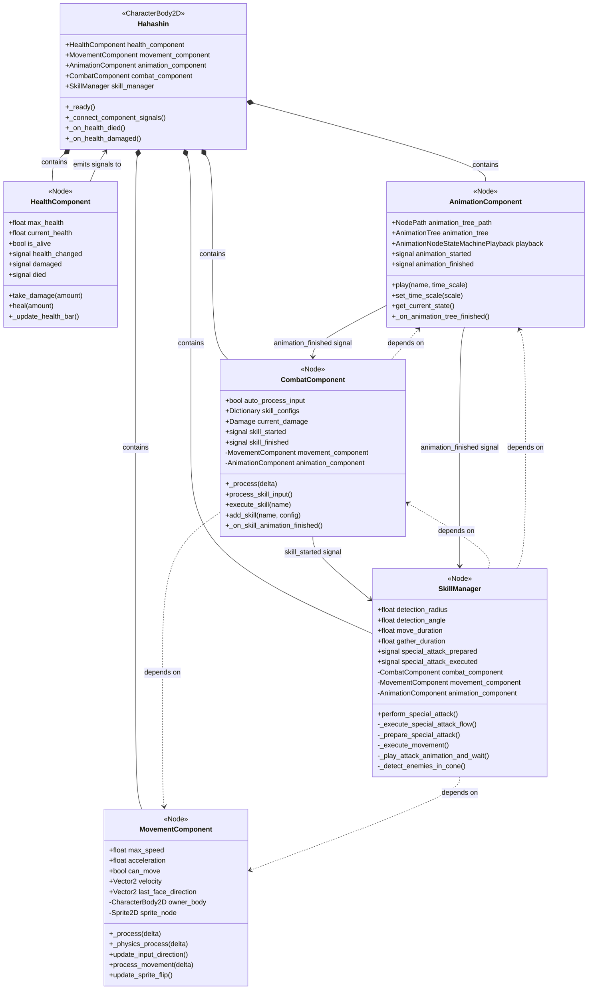
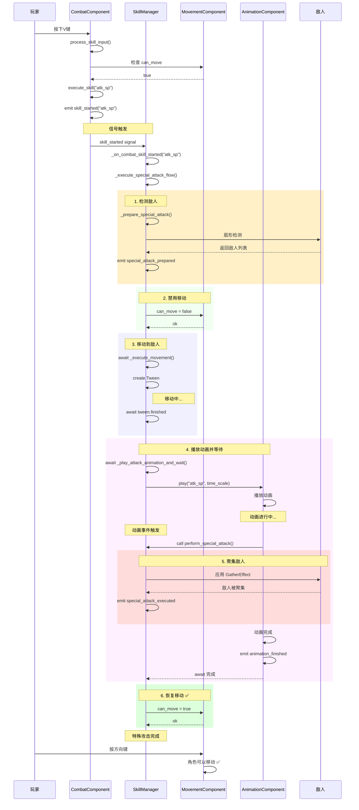
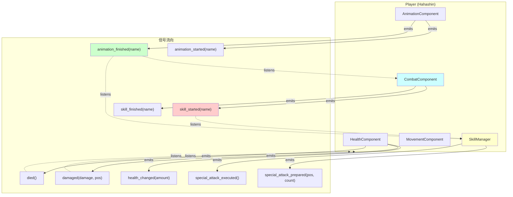
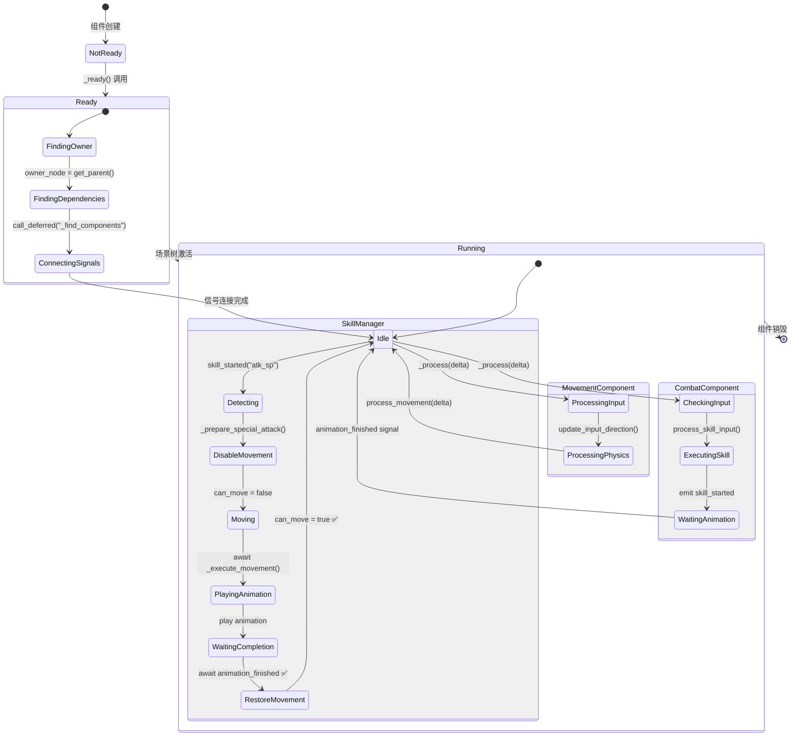
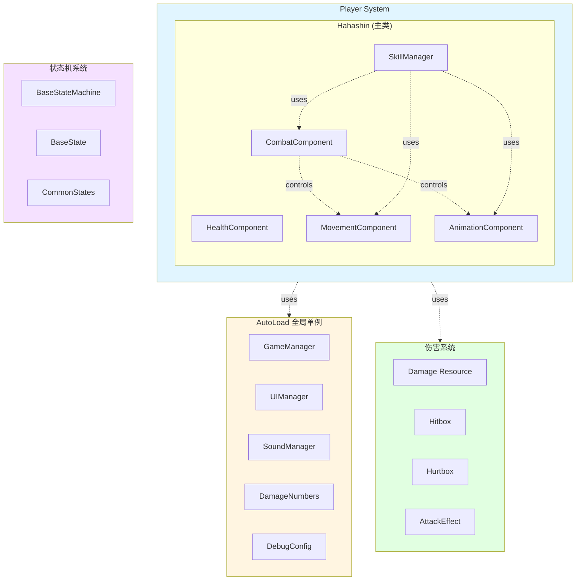

# Player自治组件架构 - UML图表

> **创建日期**: 2026-01-19
> **架构版本**: v2.0 (自治组件架构)
> **图表格式**: Mermaid + ASCII Art

---

## 📊 目录

1. [Player组件类图](#1-player组件类图)
2. [特殊攻击流程时序图](#2-特殊攻击流程时序图)
3. [信号通信架构图](#3-信号通信架构图)
4. [组件生命周期状态图](#4-组件生命周期状态图)
5. [系统架构层次图](#5-系统架构层次图)

---

## 1. Player组件类图

### Mermaid格式



### ASCII Art格式

```
┌─────────────────────────────────────────────────────────────┐
│                    Hahashin (CharacterBody2D)               │
│                         主类 119行                           │
├─────────────────────────────────────────────────────────────┤
│ + health_component: HealthComponent                         │
│ + movement_component: MovementComponent                     │
│ + animation_component: AnimationComponent                   │
│ + combat_component: CombatComponent                         │
│ + skill_manager: SkillManager                               │
├─────────────────────────────────────────────────────────────┤
│ + _ready()                                                  │
│ + _connect_component_signals()                              │
│ + _on_health_died()                                         │
│ + _on_health_damaged(damage, attacker_position)             │
└─────────────────────────────────────────────────────────────┘
        │
        │ contains (组合关系)
        │
        ├─────────┬─────────┬─────────┬─────────┐
        ▼         ▼         ▼         ▼         ▼
    ┌─────┐  ┌─────┐  ┌─────┐  ┌─────┐  ┌─────┐
    │Health│  │Move │  │Anim │  │Combat│ │Skill│
    │Comp. │  │Comp.│  │Comp.│  │Comp. │ │Mgr. │
    └─────┘  └─────┘  └─────┘  └─────┘  └─────┘
                                    │         │
                                    │ signal  │
                                    └────┬────┘
                                         ▼
                                   skill_started

    依赖关系 (虚线箭头):
    CombatComponent ····> MovementComponent
    CombatComponent ····> AnimationComponent
    SkillManager ····> CombatComponent
    SkillManager ····> MovementComponent
    SkillManager ····> AnimationComponent
```

---

## 2. 特殊攻击流程时序图

### Mermaid格式



### 流程说明

```
时间轴: 从上到下

[用户按V]
    ↓
[CombatComponent检测输入]
    ↓ skill_started 信号
[SkillManager接管]
    ↓
┌─────────────────────────┐
│ 1. 检测敌人              │ _prepare_special_attack()
│    - 扇形范围检测        │ detection_radius: 300.0
│    - 计算距离和角度      │ detection_angle: 45.0°
│    - 按距离排序          │
└─────────────────────────┘
    ↓
┌─────────────────────────┐
│ 2. 禁用移动 ❌          │ movement_component.can_move = false
└─────────────────────────┘
    ↓
┌─────────────────────────┐
│ 3. 移动到敌人位置        │ await _execute_movement()
│    - Tween移动          │ move_duration: 0.2s
│    - 等待完成            │ await tween.finished
└─────────────────────────┘
    ↓
┌─────────────────────────┐
│ 4. 播放动画 + 等待       │ await _play_attack_animation_and_wait()
│    ┌─────────────────┐  │
│    │ 4.1 播放动画    │  │ animation_component.play("atk_sp")
│    └─────────────────┘  │
│    ┌─────────────────┐  │
│    │ 4.2 动画事件    │  │ perform_special_attack()
│    │     触发聚集    │  │ GatherEffect.apply_effect()
│    └─────────────────┘  │
│    ┌─────────────────┐  │
│    │ 4.3 等待完成 🔑 │  │ await animation_finished ← 关键！
│    └─────────────────┘  │
└─────────────────────────┘
    ↓
┌─────────────────────────┐
│ 5. 恢复移动 ✅          │ movement_component.can_move = true
└─────────────────────────┘
    ↓
[完成！用户可以移动]
```

---

## 3. 信号通信架构图

### Mermaid格式



### ASCII Art格式

```
信号发射 (→) 和监听 (⇢)

┌──────────────┐         health_changed         ┌──────────────┐
│ Health       │────────────────────────────────→│ UI (血条)    │
│ Component    │         damaged                 │              │
└──────────────┘────────────────────────────────→│              │
       │                died                      └──────────────┘
       └────────────────────────────────────────→ Hahashin._on_health_died()


┌──────────────┐    animation_started/finished   ┌──────────────┐
│ Animation    │────────────────────────────────→│ Combat       │
│ Component    │⇠═══════════════════════════════│ Component    │
└──────────────┘    play(name, time_scale)       └──────────────┘
       │
       │ animation_finished
       └────────────────────────────────────────→ SkillManager


┌──────────────┐      skill_started("atk_sp")    ┌──────────────┐
│ Combat       │────────────────────────────────→│ Skill        │
│ Component    │                                  │ Manager      │
└──────────────┘                                  └──────────────┘
       ↑                                                 │
       │                                                 │
       │ depends on (查找组件)                           │
       ├────────────────┐                               │
       ↓                ↓                               ↓
┌──────────────┐  ┌──────────────┐           ┌──────────────┐
│ Movement     │  │ Animation    │           │ Movement     │
│ Component    │  │ Component    │           │ Component    │
└──────────────┘  └──────────────┘           └──────────────┘
                                                     ↑
                                                     │
                                              can_move 属性控制


信号连接方式：
═══════════════════════════════════════════════════════════════
combat_component.skill_started.connect(_on_combat_skill_started)
animation_component.animation_finished.connect(_on_animation_finished)
health_component.damaged.connect(_on_health_damaged)
health_component.died.connect(_on_health_died)
```

---

## 4. 组件生命周期状态图

### Mermaid格式



### 流程图

```
组件初始化流程：
════════════════════════════════════════════════════════════════

1. 场景加载
   │
   ├─→ Hahashin._ready()
   │   └─→ 等待子节点ready
   │
   ├─→ HealthComponent._ready()
   │   ├─→ owner_node = get_parent()  # 获取Hahashin引用
   │   └─→ 初始化生命值和UI
   │
   ├─→ MovementComponent._ready()
   │   ├─→ owner_node = get_parent()
   │   ├─→ owner_body = owner_node as CharacterBody2D
   │   ├─→ sprite_node = owner_body.get_node(sprite_node_path)
   │   └─→ hitbox_node = owner_body.get_node(hitbox_node_path)
   │
   ├─→ AnimationComponent._ready()
   │   ├─→ owner_node = get_parent()
   │   ├─→ animation_tree = owner_node.get_node(animation_tree_path)
   │   └─→ animation_tree.connect("animation_finished", ...)
   │
   ├─→ CombatComponent._ready()
   │   ├─→ owner_node = get_parent()
   │   ├─→ call_deferred("_find_components")  # 延迟查找
   │   │   ├─→ movement_component = owner_node.get_node("MovementComponent")
   │   │   └─→ animation_component = owner_node.get_node("AnimationComponent")
   │   └─→ _setup_default_skills()
   │
   └─→ SkillManager._ready()
       ├─→ owner_node = get_parent()
       └─→ call_deferred("_find_components")  # 延迟查找
           ├─→ combat_component = owner_node.get_node("CombatComponent")
           ├─→ combat_component.skill_started.connect(...)
           ├─→ movement_component = owner_node.get_node("MovementComponent")
           └─→ animation_component = owner_node.get_node("AnimationComponent")


运行时流程（每帧）：
════════════════════════════════════════════════════════════════

帧开始
  │
  ├─→ _process(delta) 阶段
  │   │
  │   ├─→ MovementComponent._process(delta)
  │   │   └─→ update_input_direction()  # 读取输入
  │   │
  │   └─→ CombatComponent._process(delta)
  │       └─→ process_skill_input()  # 检测技能按键
  │           └─→ 如果按下V键
  │               └─→ emit skill_started("atk_sp")
  │                   └─→ SkillManager收到信号
  │                       └─→ 开始特殊攻击流程
  │
  └─→ _physics_process(delta) 阶段
      │
      └─→ MovementComponent._physics_process(delta)
          ├─→ process_movement(delta)
          │   ├─→ 应用加速度
          │   ├─→ 计算速度
          │   └─→ owner_body.move_and_slide()
          │
          └─→ update_sprite_flip()
              └─→ 根据移动方向翻转精灵


特殊攻击流程（异步）：
════════════════════════════════════════════════════════════════

[V键按下] → skill_started signal
    ↓
SkillManager._execute_special_attack_flow()
    │
    ├─→ [1] _prepare_special_attack()
    │   └─→ 检测扇形范围内的敌人
    │
    ├─→ [2] can_move = false ❌
    │
    ├─→ [3] await _execute_movement()
    │   └─→ 使用Tween移动 (0.2秒)
    │
    ├─→ [4] await _play_attack_animation_and_wait()
    │   ├─→ animation_component.play("atk_sp")
    │   ├─→ 动画播放中...
    │   │   └─→ [事件] perform_special_attack()
    │   │       └─→ 应用GatherEffect聚集敌人
    │   └─→ await animation_finished 🔑
    │
    └─→ [5] can_move = true ✅

[完成] 用户可以移动
```

---

## 5. 系统架构层次图

### Mermaid格式



### ASCII Art格式

```
系统架构全景图
═══════════════════════════════════════════════════════════════

┌─────────────────────── Godot Engine ───────────────────────┐
│                                                              │
│  ┌──────────────── AutoLoad 单例层 ────────────────┐       │
│  │                                                   │       │
│  │  GameManager  UIManager  SoundManager            │       │
│  │  DamageNumbers  DebugConfig                      │       │
│  │                                                   │       │
│  └──────────────────────────────────────────────────┘       │
│                         ▲                                    │
│                         │ 全局访问                          │
│                         │                                    │
│  ┌──────────────── 游戏对象层 ──────────────────┐          │
│  │                                                │          │
│  │  ┌──────── Player (Hahashin) ──────┐         │          │
│  │  │                                  │         │          │
│  │  │  ┌──────────────────────────┐   │         │          │
│  │  │  │  HealthComponent         │   │         │          │
│  │  │  │  - 生命值管理            │   │         │          │
│  │  │  │  - 受伤/死亡逻辑         │   │         │          │
│  │  │  └──────────────────────────┘   │         │          │
│  │  │                                  │         │          │
│  │  │  ┌──────────────────────────┐   │         │          │
│  │  │  │  MovementComponent       │   │         │          │
│  │  │  │  - 输入处理 (_process)   │   │         │          │
│  │  │  │  - 物理移动 (_physics)   │   │         │          │
│  │  │  │  - 精灵翻转              │   │         │          │
│  │  │  └──────────────────────────┘   │         │          │
│  │  │           ▲                      │         │          │
│  │  │           │ can_move控制         │         │          │
│  │  │           │                      │         │          │
│  │  │  ┌──────────────────────────┐   │         │          │
│  │  │  │  AnimationComponent      │   │         │          │
│  │  │  │  - AnimationTree管理     │   │         │          │
│  │  │  │  - 动画播放和信号        │   │         │          │
│  │  │  └──────────────────────────┘   │         │          │
│  │  │           ▲                      │         │          │
│  │  │           │ play() / signals     │         │          │
│  │  │           │                      │         │          │
│  │  │  ┌──────────────────────────┐   │         │          │
│  │  │  │  CombatComponent         │   │         │          │
│  │  │  │  - 技能输入检测          │   │         │          │
│  │  │  │  - 技能配置管理          │   │         │          │
│  │  │  │  - 伤害类型切换          │   │         │          │
│  │  │  └──────────────────────────┘   │         │          │
│  │  │           │                      │         │          │
│  │  │           │ skill_started signal │         │          │
│  │  │           ▼                      │         │          │
│  │  │  ┌──────────────────────────┐   │         │          │
│  │  │  │  SkillManager            │   │         │          │
│  │  │  │  - 特殊攻击完整流程      │   │         │          │
│  │  │  │  - 敌人检测和聚集        │   │         │          │
│  │  │  │  - 生命周期管理 ✅       │   │         │          │
│  │  │  └──────────────────────────┘   │         │          │
│  │  │                                  │         │          │
│  │  └──────────────────────────────────┘         │          │
│  │                                                │          │
│  │  ┌──────── Enemy/Boss ─────────┐              │          │
│  │  │  - StateMachine             │              │          │
│  │  │  - CommonStates (复用)      │              │          │
│  │  └─────────────────────────────┘              │          │
│  │                                                │          │
│  └────────────────────────────────────────────────┘          │
│                         ▲                                    │
│                         │                                    │
│  ┌──────────────── 工具/系统层 ─────────────────┐          │
│  │                                                │          │
│  │  StateMachine/       Components/              │          │
│  │  - BaseStateMachine  - Hitbox/Hurtbox         │          │
│  │  - BaseState         - HealthComponent        │          │
│  │  - CommonStates/     - MovementComponent      │          │
│  │                                                │          │
│  │  Classes/            Data/                    │          │
│  │  - Damage           - .tres资源文件           │          │
│  │  - AttackEffect                               │          │
│  │                                                │          │
│  └────────────────────────────────────────────────┘          │
│                                                              │
└──────────────────────────────────────────────────────────────┘


组件依赖关系图（仅Player系统）
═══════════════════════════════════════════════════════════════

                      Hahashin (主类)
                          │
        ┌─────────────────┼─────────────────┐
        │                 │                 │
        ▼                 ▼                 ▼
   [独立组件]        [核心组件]        [高级组件]
        │                 │                 │
        ▼                 ▼                 ▼
  HealthComponent   MovementComponent  CombatComponent
                    AnimationComponent       │
                          ▲                  │
                          │                  │
                          │    ┌─────────────┘
                          │    │ depends on
                          │    ▼
                          │  CombatComponent
                          │    │
                          │    │ skill_started
                          │    ▼
                          └─ SkillManager
                               │
                               │ depends on
                               │
                               ├─→ CombatComponent (技能配置)
                               ├─→ MovementComponent (移动控制)
                               └─→ AnimationComponent (动画同步)


数据流向图
═══════════════════════════════════════════════════════════════

用户输入
   │
   ├─→ 方向键
   │   └─→ MovementComponent.update_input_direction()
   │       └─→ MovementComponent.process_movement()
   │           └─→ owner_body.move_and_slide()
   │
   └─→ V键（特殊攻击）
       └─→ CombatComponent.process_skill_input()
           └─→ CombatComponent.execute_skill("atk_sp")
               ├─→ emit skill_started("atk_sp")
               │   └─→ SkillManager._on_combat_skill_started()
               │       └─→ _execute_special_attack_flow()
               │           ├─→ 检测敌人
               │           ├─→ 禁用移动
               │           ├─→ 移动到敌人
               │           ├─→ 播放动画 + 等待
               │           └─→ 恢复移动 ✅
               │
               └─→ AnimationComponent.play("atk_sp")
                   └─→ AnimationTree播放
                       └─→ emit animation_finished
                           ├─→ CombatComponent._on_skill_animation_finished()
                           │   └─→ emit skill_finished
                           │
                           └─→ SkillManager (await解除阻塞)
                               └─→ 恢复移动 ✅
```

---

## 📐 设计模式总结

### 应用的设计模式

| 设计模式 | 应用位置 | 说明 |
|---------|---------|------|
| **组件模式** | 所有Component | 每个组件独立功能，可组合 |
| **观察者模式** | Signal系统 | 组件间通过信号解耦 |
| **模板方法模式** | BaseState继承 | 定义算法骨架，子类实现细节 |
| **依赖注入** | _find_components() | 组件自动查找依赖 |
| **策略模式** | Skill配置字典 | 运行时切换技能行为 |
| **状态模式** | StateMachine | 状态切换逻辑封装 |
| **工厂模式** | Damage Resource | 创建伤害和特效实例 |

### 架构优势

```
✅ 单一职责原则 (SRP)
   - 每个组件只负责一个领域
   - HealthComponent: 生命值
   - MovementComponent: 移动
   - CombatComponent: 战斗
   - SkillManager: 技能流程

✅ 开放封闭原则 (OCP)
   - 组件可通过继承扩展
   - 不修改基类，添加新行为

✅ 依赖倒置原则 (DIP)
   - 依赖抽象（信号）而非具体实现
   - 组件间通过信号通信，无直接依赖

✅ 接口隔离原则 (ISP)
   - 组件只暴露必要的公共接口
   - 内部方法使用 _前缀私有化

✅ 迪米特法则 (LoD)
   - 组件只与直接依赖通信
   - 不跨组件访问数据
```

---

## 🎯 关键技术点

### 1. 自治运行
```gdscript
# 组件自己运行，无需外部调用
func _process(delta: float) -> void:
    if auto_process_input:
        process_skill_input()

func _physics_process(delta: float) -> void:
    process_movement(delta)
```

### 2. 信号解耦
```gdscript
# 发射者
signal skill_started(skill_name: String)
skill_started.emit("atk_sp")

# 接收者
combat_component.skill_started.connect(_on_combat_skill_started)
```

### 3. 依赖注入
```gdscript
func _ready() -> void:
    owner_node = get_parent()
    call_deferred("_find_components")

func _find_components() -> void:
    movement_component = owner_node.get_node_or_null("MovementComponent")
```

### 4. await异步流程
```gdscript
func _execute_special_attack_flow() -> void:
    await _execute_movement()
    await _play_attack_animation_and_wait()  # 🔑 关键
    movement_component.can_move = true  # ✅ 恢复
```

---

**创建时间**: 2026-01-19
**架构版本**: v2.0 (自治组件架构)
**维护者**: Claude + 用户

---

## 📚 相关文档

- [player_autonomous_components_implementation_2026-01-19.md](player_autonomous_components_implementation_2026-01-19.md)
- [autonomous_component_architecture_2026-01-18.md](autonomous_component_architecture_2026-01-18.md)
- [optimization_work_plan.md](optimization_work_plan.md)
