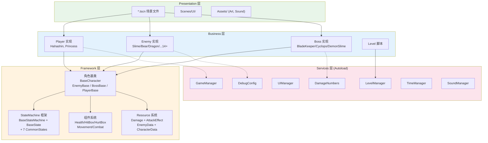
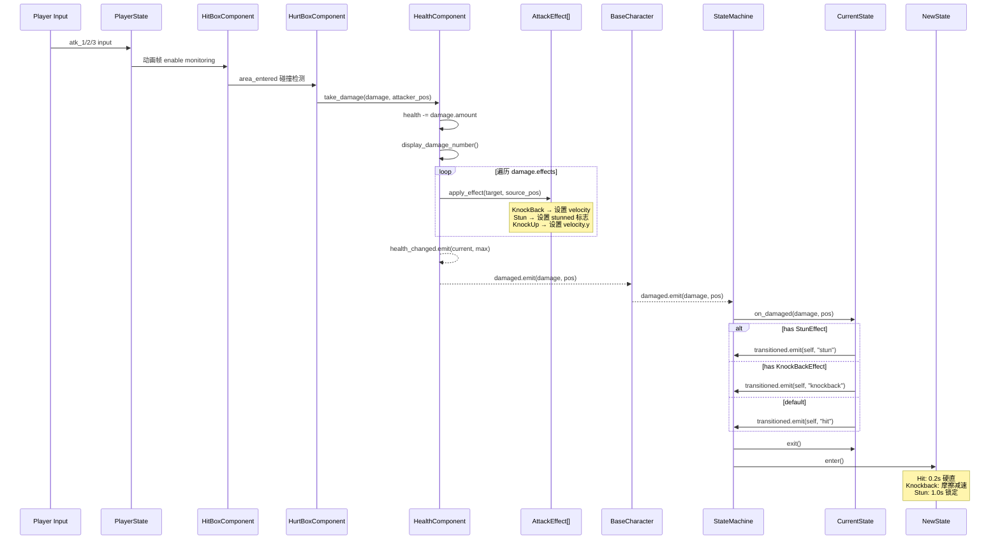
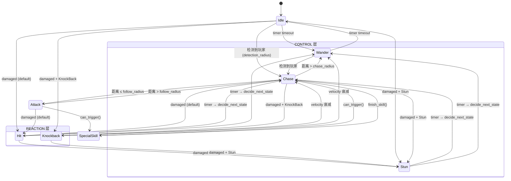
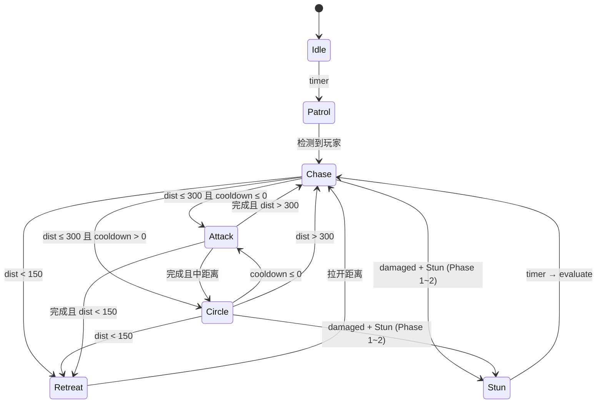
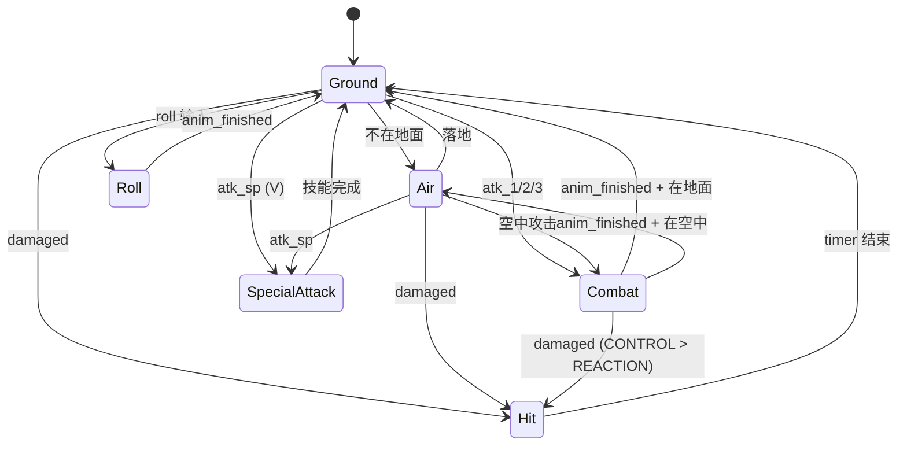
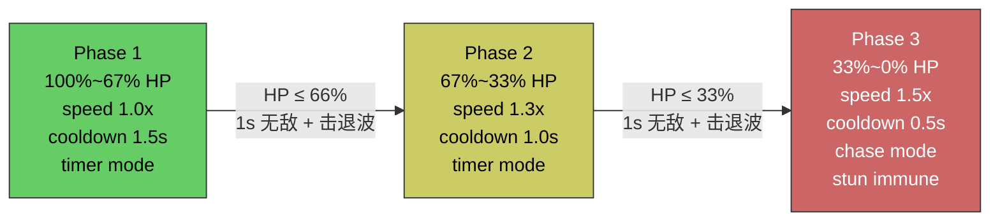
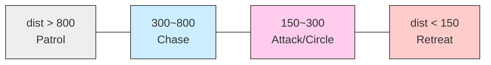
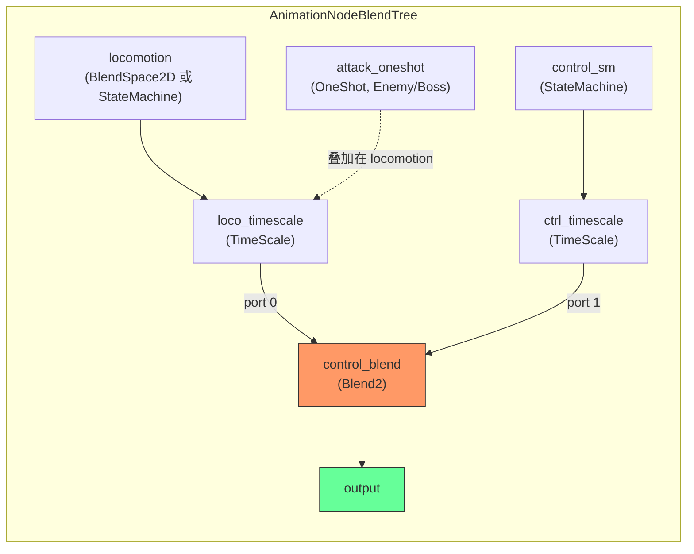
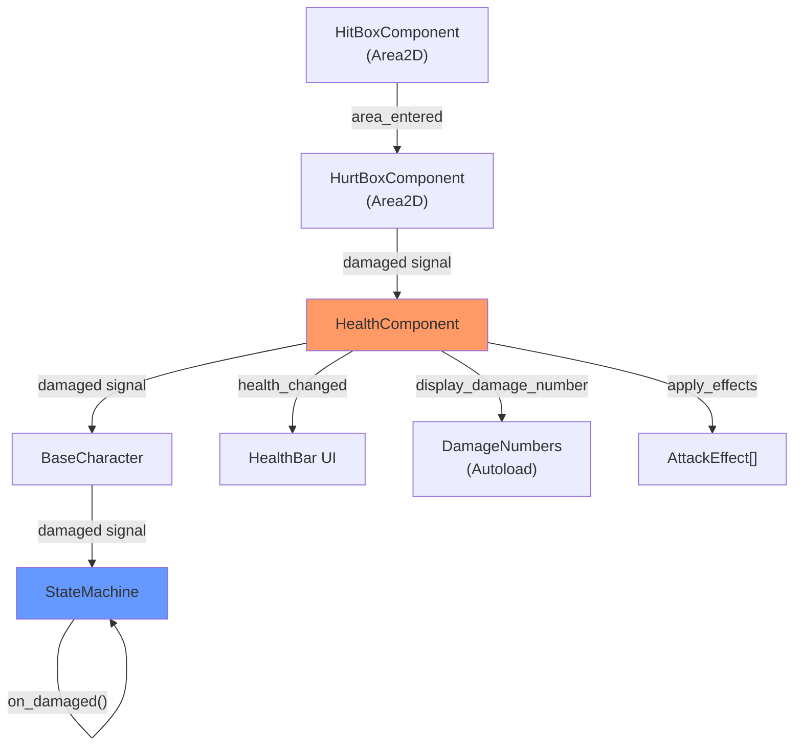

# 架构图 — Combo Demon

> 四层架构、数据流时序、状态机流转、Boss 阶段系统的可视化图。

---

## 1. 四层架构图

---

## 2. 伤害链路时序图

---

## 3. 状态机转换流程

### 3.1 Enemy 状态流转

### 3.2 Boss 战斗状态流转

### 3.3 Player 状态流转

---

## 4. Boss 三阶段系统

### Boss 距离判定区间

---

## 5. AnimationTree BlendTree 结构

**核心参数:**

| 参数 | 用途 |
|------|------|
| `parameters/control_blend/blend_amount` | **核心开关**: 0.0=locomotion, 1.0=control |
| `parameters/locomotion/blend_position` | Enemy/Boss: (方向x, 速度比y) |
| `parameters/control_sm/playback` | start("hit"/"stunned"/"death") |
| `parameters/attack_oneshot/request` | FIRE=触发, ABORT=中断 |

---

## 6. 组件通信信号图

