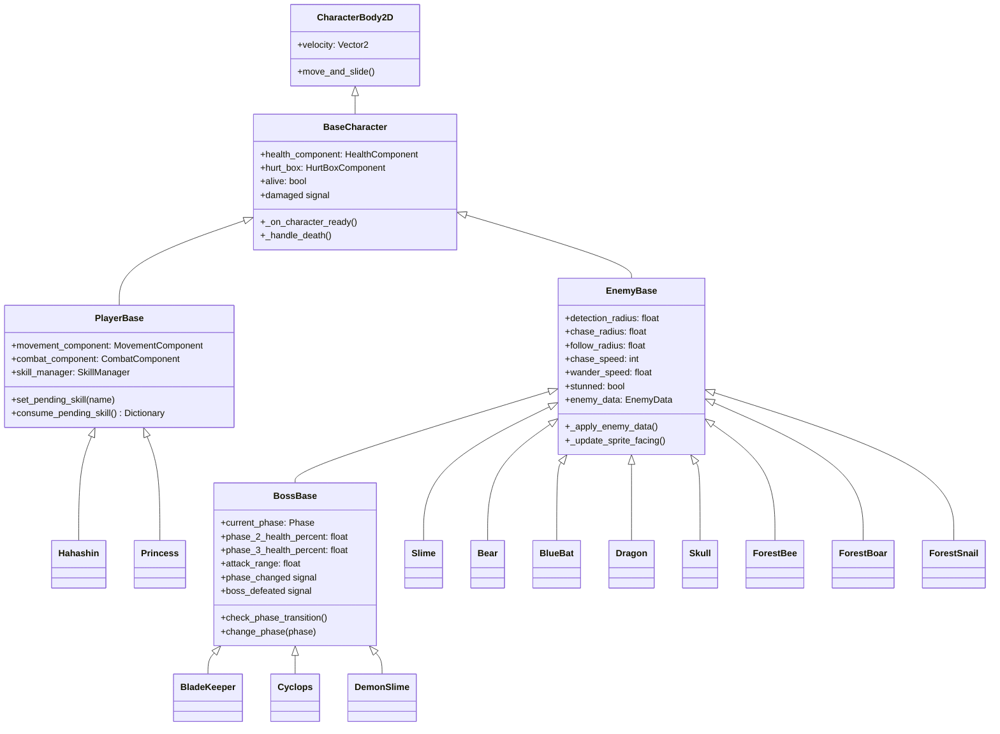
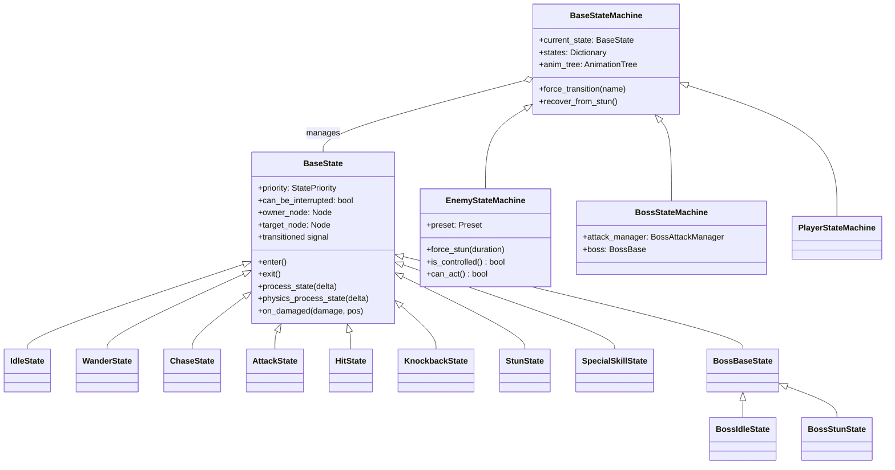
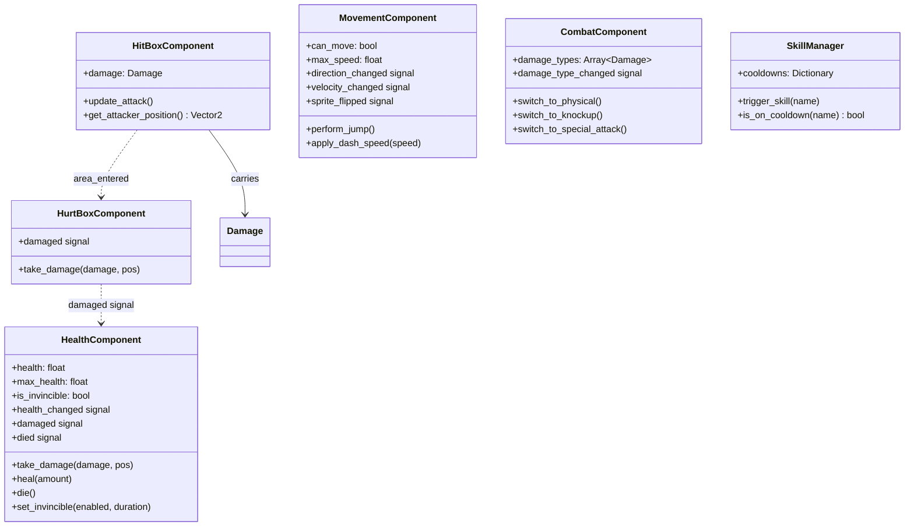
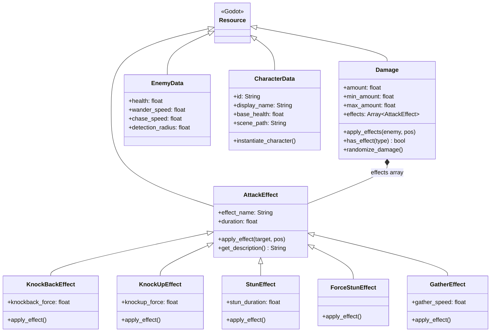
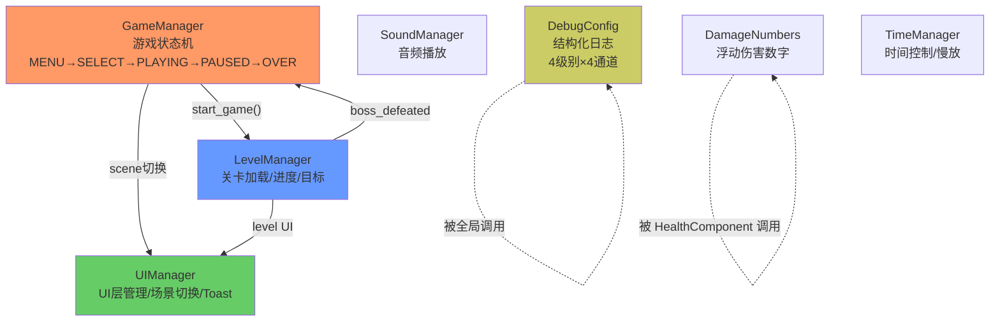

# 类图 — Combo Demon

> 所有图使用 mermaid 格式。详细 API → `project-architecture` skill 的 `references/module-registry.md`

---

## 1. 角色继承体系



---

## 2. 状态机继承体系



### 优先级层次

```
CONTROL  (2)  — StunState, FallDeath     (不可被打断)
REACTION (1)  — HitState, KnockbackState (可被 CONTROL 打断)
BEHAVIOR (0)  — Idle, Wander, Chase, Attack (可被任何高优先级打断)
```

---

## 3. 组件系统



---

## 4. 伤害与效果 Resource 体系



---

## 5. Autoload 服务依赖


