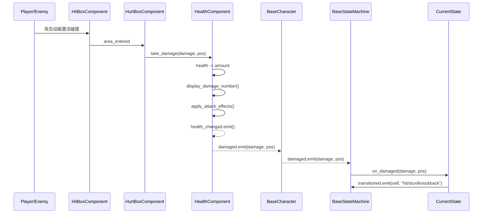

# Skill 体系实现计划

> **For agentic workers:** REQUIRED SUB-SKILL: Use superpowers:subagent-driven-development (recommended) or superpowers:executing-plans to implement this plan task-by-task. Steps use checkbox (`- [ ]`) syntax for tracking.

**Goal:** 为 Combo Demon 项目创建 5 个 Claude Code skills（project-architecture、feature-development、troubleshooting、testing、code-review），覆盖开发、排查、测试、审查的完整工作流。

**Architecture:** 分层引用型 — 每个 skill 包含 SKILL.md（入口，约 200-300 行）+ references/ 子文件（按需加载的详细指南）。元数据英文、正文中文。所有 skill 位于 `.claude/skills/` 目录下。

**Tech Stack:** Claude Code Skills（Markdown + YAML frontmatter），GUT 测试框架（Godot Unit Test），MCP Godot 工具

---

## 文件结构

```
.claude/skills/
├── project-architecture/
│   ├── SKILL.md                    # 创建: 架构总览入口
│   └── references/
│       ├── layer-map.md            # 创建: 四层架构详细说明
│       ├── data-flow.md            # 创建: 信号链路 + 控制流图
│       └── module-registry.md      # 创建: 核心类速查表
│
├── feature-development/
│   ├── SKILL.md                    # 创建: 通用开发流程入口
│   └── references/
│       ├── enemy-guide.md          # 创建: 敌人开发指南
│       ├── boss-guide.md           # 创建: Boss 开发指南
│       ├── effect-guide.md         # 创建: 攻击效果开发指南
│       ├── component-guide.md      # 创建: 组件开发指南
│       └── trap-guide.md           # 创建: 陷阱开发指南
│
├── troubleshooting/
│   ├── SKILL.md                    # 创建: 排查流程入口
│   └── references/
│       └── common-issues.md        # 创建: 常见问题速查表
│
├── testing/
│   ├── SKILL.md                    # 创建: 三层验证流程入口
│   └── references/
│       └── gut-patterns.md         # 创建: GUT 测试模式库
│
└── code-review/
    └── SKILL.md                    # 创建: 代码审查流程
```

**总计**: 15 个新文件

---

### Task 1: project-architecture SKILL.md

**Files:**
- Create: `.claude/skills/project-architecture/SKILL.md`

- [ ] **Step 1: 创建 SKILL.md**

```markdown
---
name: project-architecture
description: "Combo Demon project architecture overview. Use when understanding codebase structure, navigating layers, tracing data flow, or locating modules. Triggers on: architecture, layer, data flow, signal chain, module, navigate, locate, codebase."
---

# 项目架构总览

Combo Demon 2D 动作游戏的架构导航 skill。提供分层架构、数据流、模块速查，供开发和排查共用。

## 四层架构

| 层 | 职责 | 关键目录 | 入口文件 |
|---|---|---|---|
| **Framework** | 与业务无关的通用能力：状态机框架、组件基类、Resource 基类、Effect 系统 | `Core/StateMachine/`, `Core/Components/`, `Core/Resources/`, `Core/Effects/` | `BaseState.gd`, `BaseStateMachine.gd`, `HealthComponent.gd`, `Damage.gd` |
| **Services** | 跨场景的全局单例服务：游戏流程、UI管理、音频、调试日志、对象池 | `Core/Autoloads/` | `GameManager.gd`, `UIManager.gd`, `DebugConfig.gd`, `LevelManager.gd` |
| **Business** | 具体角色实现：敌人 AI、Boss 阶段逻辑、玩家技能、关卡目标脚本 | `Scenes/Characters/`, `Scenes/Levels/*.gd` | `EnemyBase.gd`, `BossBase.gd`, `PlayerBase.gd` |
| **Presentation** | 场景组合（.tscn）、UI 界面、美术/音频资源 | `Scenes/**/*.tscn`, `Scenes/UI/`, `Assets/` | 各 .tscn 文件 |

### 依赖方向

```
Presentation → Business → Framework
                 ↓
              Services（全局可访问，但不反向依赖 Business）
```

- **允许**：上层调用下层的公共 API，Services 被任意层通过 Autoload 访问
- **禁止**：Framework 引用 Business 代码，Services 直接操作特定角色逻辑

## 三条核心数据流

### 1. 伤害链路
```
玩家输入(atk_1/2/3)
  → PlayerState 触发攻击动画
  → HitBoxComponent.area_entered(enemy_hurtbox)
  → HurtBoxComponent.take_damage(damage, attacker_pos)
  → HealthComponent:
      ├─ health -= damage.amount
      ├─ display_damage_number()
      ├─ apply_attack_effects() → KnockBack/Stun/KnockUp
      ├─ health_changed.emit() → UI 血条更新
      └─ damaged.emit() → BaseCharacter.damaged.emit()
  → BaseStateMachine._on_owner_damaged()
  → current_state.on_damaged(damage, attacker_pos)
  → 状态切换: StunEffect→"stun", KnockBack→"knockback", else→"hit"
```

### 2. 状态机切换链路
```
触发源（timer/距离检测/伤害）
  → current_state.transitioned.emit(self, "new_state_name")
  → BaseStateMachine._on_state_transition(from_state, new_state_name)
      ├─ 验证 from_state == current_state（防止过期请求）
      ├─ states.get(new_state_name.to_lower())（查找目标状态）
      └─ current_state.can_transition_to(new_state)（优先级检查）
          ├─ 高优先级 > 低优先级 → 允许
          ├─ 同优先级 → 检查 can_be_interrupted
          └─ 当前状态主动转低优先级 → 允许（自愿结束）
  → _execute_transition: exit() → enter() → current_state = new_state
```

### 3. 关卡流程
```
Main.tscn 加载
  → GameManager: MENU → CHARACTER_SELECT → PLAYING
  → LevelManager.start_level(index)
      → 加载 LEVEL_SCENES[index]
      → level_started.emit(index)
  → Level 脚本:
      ├─ 注册目标（treasures/keys/boss）
      ├─ 监听完成条件
      └─ LevelManager.complete_level() → 加载下一关
```

## 分层定位法（排查用）

遇到问题时，先判断现象属于哪一层，然后从该层的入口文件开始排查：

| 现象类型 | 所属层 | 入口文件 | 日志通道 |
|---------|-------|---------|---------|
| 动画不播放/错误 | Framework + Presentation | `BaseState.gd` (AnimationTree helpers) | `animation` |
| 伤害不触发/数值错误 | Framework | `HealthComponent.gd`, `HitBoxComponent.gd` | `combat` |
| 状态卡死/切换异常 | Framework | `BaseStateMachine.gd`, `BaseState.gd` | `state_machine` |
| 敌人不追踪/不攻击 | Business | `EnemyBase.gd`, `ChaseState.gd`, `AttackState.gd` | `state_machine` |
| Boss 阶段不转换 | Business | `BossBase.gd`, 具体 Boss 脚本 | `combat` |
| UI 不更新/显示异常 | Services + Presentation | `UIManager.gd`, 具体 UI 脚本 | — |
| 关卡流程异常 | Services | `LevelManager.gd`, `GameManager.gd` | — |
| 物理碰撞问题 | Presentation（配置） | `project.godot` Layer/Mask 设置 | — |

## 按需加载详细资料

根据需要读取 references/ 下的详细文件：

| 需要了解 | 读取文件 |
|---------|---------|
| 四层架构的详细说明（文件清单、职责边界、通信规则） | `references/layer-map.md` |
| 完整信号链路图、时序图、Autoload 信号列表 | `references/data-flow.md` |
| 核心类速查（类名→路径→职责→API→依赖） | `references/module-registry.md` |
```

- [ ] **Step 2: 验证 SKILL.md 格式**

检查文件是否：
- 有正确的 YAML frontmatter（name, description）
- description 包含英文触发词
- 正文使用中文
- 表格格式正确

- [ ] **Step 3: Commit**

```bash
git add .claude/skills/project-architecture/SKILL.md
git commit -m "feat: add project-architecture skill entry point"
```

---

### Task 2: project-architecture references

**Files:**
- Create: `.claude/skills/project-architecture/references/layer-map.md`
- Create: `.claude/skills/project-architecture/references/data-flow.md`
- Create: `.claude/skills/project-architecture/references/module-registry.md`

- [ ] **Step 1: 创建 layer-map.md**

四层架构详细说明，包含：
- 每层包含的所有文件/目录清单
- 每层的职责边界定义
- 层间通信规则（允许/禁止的调用方向）
- 每层的扩展点（新增代码应放在哪里）

内容要点：

**Framework 层** — 文件清单：
- `Core/StateMachine/BaseStateMachine.gd` — 状态机框架（owner/target 注入、优先级转换）
- `Core/StateMachine/BaseState.gd` — 状态基类（生命周期、AnimationTree helper、Timer 管理）
- `Core/StateMachine/EnemyStateMachine.gd` — 敌人预设（BASIC/RANGED/BOSS 自动创建状态）
- `Core/StateMachine/CommonStates/` — 7 个通用状态 + SpecialSkillState 基类
- `Core/Components/HealthComponent.gd` — 生命值、伤害、无敌、死亡
- `Core/Components/HitBoxComponent.gd` — 攻击判定、damage 发射
- `Core/Components/HurtBoxComponent.gd` — 受击判定、damaged 信号
- `Core/Components/MovementComponent.gd` — 输入驱动移动、加减速、跳跃
- `Core/Components/CombatComponent.gd` — 伤害类型切换
- `Core/Components/SkillManager.gd` — 特殊技能管理
- `Core/Resources/Damage.gd` — 伤害 Resource（amount + effects 组合）
- `Core/Resources/AttackEffect.gd` — 效果基类
- `Core/Resources/KnockBackEffect.gd`, `KnockUpEffect.gd`, `StunEffect.gd`, `ForceStunEffect.gd`, `GatherEffect.gd`
- `Core/Characters/BaseCharacter.gd` — 角色基类（信号转发、HurtBox↔HealthComponent 自动连接）
- `Core/Characters/EnemyBase.gd` — 敌人基类（AI 参数、精灵管理、EnemyData 驱动）
- `Core/Characters/PlayerBase.gd` — 玩家基类（重力、组件引用、技能挂载）
- `Core/Characters/BossBase.gd` — Boss 基类（阶段系统、巡逻、冷却、相位转换特效）
- `Core/Effects/` — VFX（AfterImage、GhostExpand、Vortex、GatherTrail、EnemyHighlight）
- `Core/Data/` — .tres 资源文件（Characters/、SkillBook/）

**Services 层** — 文件清单：
- `Core/Autoloads/GameManager.gd` — 游戏状态（MENU/SELECT/PLAYING/OVER）、角色选择
- `Core/Autoloads/LevelManager.gd` — 关卡加载、目标追踪、进度管理
- `Core/Autoloads/UIManager.gd` — 6 层 UI 管理、场景切换
- `Core/Autoloads/SoundManager.gd` — 音频播放
- `Core/Autoloads/TimeManager.gd` — 子弹时间、时间缩放
- `Core/Autoloads/DamageNumbers.gd` — 浮动伤害数字
- `Core/Autoloads/DebugConfig.gd` — 结构化日志（级别/路径/分类过滤）
- `Core/Autoloads/BulletPool.gd` — 子弹对象池
- `Core/Autoloads/EnemySpawner.gd` — 敌人生成管理

**Business 层** — 目录结构：
- `Scenes/Characters/Enemies/` — 各敌人实现（Bear/, BlueBat/, Cyclope/, Dragon/, Flam/, Lizard/, Mouse/, SkullBlue/, Slime/, Spirit/, boss/）
- `Scenes/Characters/` — 玩家角色场景
- `Scenes/Levels/Level1_Adventure/`, `Level2_Maze/`, `Level3_Boss/` — 关卡脚本
- `Scenes/Levels/Components/Traps/` — 陷阱系统

**Presentation 层**：
- `Scenes/**/*.tscn` — 所有场景文件
- `Scenes/UI/` — UI 界面
- `Assets/Art/`, `Assets/Sound/` — 美术音频资源

通信规则：
- Presentation .tscn 引用 Business 脚本（节点挂载）
- Business 脚本继承/调用 Framework 基类
- 任意层通过全局名访问 Services（`GameManager`, `DebugConfig` 等）
- Framework 不 import 任何 Business/Presentation 代码
- Services 不直接操作具体角色（通过信号或 group 间接通信）

- [ ] **Step 2: 创建 data-flow.md**

完整信号链路和控制流，包含：

**伤害系统信号链（Mermaid 时序图）**：


**状态机优先级系统**：
```
CONTROL(2) → stun, frozen — 最高优先级，只能被同级中断（如果 can_be_interrupted=true）
REACTION(1) → hit, knockback — 中等优先级，被 CONTROL 中断
BEHAVIOR(0) → idle, wander, chase, attack — 最低优先级，被任何高级中断
```

**Autoload 信号清单**：
- `GameManager`: game_state_changed, character_selection_completed
- `LevelManager`: level_started, level_completed, item_collected, objective_updated, boss_defeated, game_completed
- `HealthComponent`: health_changed, damaged, died
- `BaseCharacter`: damaged
- `BossBase`: phase_changed, boss_defeated
- `BaseState`: transitioned

**特殊技能触发链路**：
```
ChaseState/AttackState.physics_process_state()
  → special_skill_state.can_trigger(distance)
      ├─ cooldown check
      ├─ recheck delay check
      ├─ _check_condition(distance)
      └─ probability roll
  → transitioned.emit(self, special_skill_name)
  → SpecialSkillState.enter() → execute_skill()
  → finish_skill() → cooldown reset → transition_to("chase")
```

- [ ] **Step 3: 创建 module-registry.md**

核心类速查表，格式统一：

```markdown
## 类名
- **路径**: `完整文件路径`
- **职责**: 一句话描述
- **继承**: 父类 → 当前类
- **关键 API**:
  - `method_name(params) -> return` — 说明
- **信号**: signal_name(params) — 说明
- **依赖**: 依赖的其他类
- **被依赖**: 谁依赖此类
```

覆盖以下核心类（约 25 个）：
- BaseCharacter, PlayerBase, EnemyBase, BossBase
- BaseStateMachine, EnemyStateMachine, BaseState
- IdleState, WanderState, ChaseState, AttackState, HitState, KnockbackState, StunState, SpecialSkillState
- HealthComponent, HitBoxComponent, HurtBoxComponent, MovementComponent, CombatComponent, SkillManager
- Damage, AttackEffect, KnockBackEffect, KnockUpEffect, StunEffect
- GameManager, LevelManager, DebugConfig

每个类的 API 列表从实际代码中提取（已读取的源文件），确保方法签名准确。

- [ ] **Step 4: Commit**

```bash
git add .claude/skills/project-architecture/references/
git commit -m "feat: add project-architecture reference files (layer-map, data-flow, module-registry)"
```

---

### Task 3: feature-development SKILL.md

**Files:**
- Create: `.claude/skills/feature-development/SKILL.md`

- [ ] **Step 1: 创建 SKILL.md**

```markdown
---
name: feature-development
description: "General-purpose development skill for Combo Demon. Use when implementing new features: enemies, bosses, attack effects, components, traps, or any gameplay system. Triggers on: new enemy, new boss, new effect, new component, new trap, new feature, implement, develop, create, add."
---

# 通用功能开发指南

接到开发需求时，按本 skill 流程执行：识别需求类型 → 加载对应指南 → 按模式实现 → 验证 → 更新上下文。

## 需求分类与指南映射

接到需求后，先判断类型，读取对应 reference：

| 需求类型 | 关键词 | 读取的 reference |
|---------|-------|-----------------|
| 新敌人/角色 | 敌人, enemy, 怪物, mob | `references/enemy-guide.md` |
| 新 Boss | Boss, 首领, 头目 | `references/boss-guide.md` |
| 新攻击效果/伤害类型 | 效果, effect, 击退, 眩晕, 伤害 | `references/effect-guide.md` |
| 新组件/系统 | 组件, component, 系统, system | `references/component-guide.md` |
| 新陷阱/机关 | 陷阱, trap, 机关, 障碍 | `references/trap-guide.md` |
| 新关卡 | 关卡, level, 地图 | 触发 `godot-level-design` skill |
| 其他 | — | 读取 `project-architecture` skill 定位涉及的架构层 |

> 如果需求跨多个类型（如"新敌人 + 新攻击效果"），依次加载相关 reference。

## 通用开发流程

**所有类型共用此流程**：

### Step 1: 架构定位
读取 `project-architecture` skill，确认：
- 需求涉及哪些架构层（Framework / Services / Business / Presentation）
- 新代码应放在哪个目录
- 需要继承/使用哪些基类

### Step 2: 加载开发指南
根据需求类型，读取对应 reference 文件，获取：
- 场景结构模板（节点树）
- 脚本代码骨架
- 需要连接的信号
- 需要创建的 Resource 文件

### Step 3: 实现
按 reference 中的模板实现，遵循以下规则：
- **继承优先**：使用已有基类（BaseState, EnemyBase, BossBase），只重写钩子方法
- **信号解耦**：组件间通过信号通信，不直接引用
- **编辑器配置**：Node 派生对象在编辑器创建，代码只控制参数
- **@export 配置化**：可调参数用 @export 暴露，不硬编码
- **懒缓存**：`get_tree()` 查询结果缓存，不在 _process 中重复查询

### Step 4: 验证
触发 `testing` skill，执行三层验证（日志 → GUT → MCP）。

### Step 5: 上下文更新
触发 `context-updater` skill，检查是否需要更新 `.claude/context/project_context.md`。

## 开发检查清单

完成实现后，逐项检查：

- [ ] 遵循 `godot-coding-standards` skill 规范
- [ ] 新文件放在正确的架构层目录
- [ ] 类名 PascalCase，变量/函数 snake_case，常量 UPPER_SNAKE
- [ ] 信号通信而非直接调用
- [ ] `@export` 配置化，避免硬编码魔法值
- [ ] 编辑器配置节点，代码不 `new()` Node 派生对象（动态生成除外）
- [ ] 动态生成通过 `preload().instantiate()`
- [ ] 类型注解完整（函数参数 + 返回值）
- [ ] 状态继承 BaseState，使用内置 helper（set_locomotion/enter_control_state）
- [ ] `animation_finished` 信号在 `exit()` 中断开连接
- [ ] `is_instance_valid()` 检查动态引用
- [ ] 懒缓存模式用于 `get_tree()` 查询
```

- [ ] **Step 2: Commit**

```bash
git add .claude/skills/feature-development/SKILL.md
git commit -m "feat: add feature-development skill entry point"
```

---

### Task 4: feature-development references (enemy + boss)

**Files:**
- Create: `.claude/skills/feature-development/references/enemy-guide.md`
- Create: `.claude/skills/feature-development/references/boss-guide.md`

- [ ] **Step 1: 创建 enemy-guide.md**

敌人开发完整指南，包含：

**1. 前置条件**
- 了解 `EnemyBase`（Core/Characters/EnemyBase.gd）— AI 参数、精灵管理、死亡动画
- 了解 `EnemyStateMachine`（Core/StateMachine/EnemyStateMachine.gd）— 预设类型
- 了解 `CommonStates`（Core/StateMachine/CommonStates/）— 7 个通用状态
- 了解 `BaseState` AnimationTree helper — `set_locomotion()`, `enter_control_state()`, `exit_control_state()`

**2. 场景结构模板**
```
EnemyName.tscn (继承或组合)
├── EnemyName (CharacterBody2D, script: EnemyName.gd extends EnemyBase)
│   ├── Sprite2D 或 AnimatedSprite2D
│   ├── CollisionShape2D (物理碰撞, Layer 4: Enemy)
│   ├── AnimationPlayer
│   ├── AnimationTree (BlendTree 结构)
│   ├── HealthComponent
│   ├── HurtBoxComponent (Area2D, Layer 4, Mask 2+3: Player+PlayerProjectile)
│   │   └── CollisionShape2D
│   ├── HitBoxComponent (Area2D, Layer 5: EnemyProjectile, Mask 2: Player)
│   │   └── CollisionShape2D
│   ├── DamageNumbersAnchor (Node2D, 头顶偏移)
│   ├── HealthBar (可选)
│   └── EnemyStateMachine (preset: BASIC 或 RANGED)
│       ├── Idle (IdleState)
│       ├── Wander (WanderState)
│       ├── Chase (ChaseState)
│       ├── Attack (AttackState)
│       ├── Hit (HitState)
│       ├── Knockback (KnockbackState)
│       ├── Stun (StunState)
│       └── SpecialSkill (可选, extends SpecialSkillState)
```

**3. 脚本模板**
```gdscript
extends EnemyBase
class_name EnemyName

## 敌人说明

# ============ 配置参数 ============
# 使用 EnemyBase 的 @export 参数:
# detection_radius, chase_radius, follow_radius
# chase_speed, wander_speed
# max_health, health

func _on_enemy_ready() -> void:
    # 敌人特定初始化
    pass
```

**4. AnimationTree BlendTree 配置**
```
AnimationNodeBlendTree (root)
├── locomotion (BlendSpace2D)
│   ├── idle 动画 at (0, 0)
│   └── run 动画 at (1, 1) 或 (-1, 1)
├── loco_timescale (TimeScale)
├── control_sm (StateMachine)
│   ├── hit 动画
│   ├── stun 动画 (可选)
│   └── death 动画
├── ctrl_timescale (TimeScale)
└── control_blend (Blend2) → output
    ├── input 0: loco_timescale
    └── input 1: ctrl_timescale
```

**5. 信号接线清单**
- `HurtBoxComponent.damaged → HealthComponent.take_damage`（BaseCharacter._setup_health_signals 自动连接）
- `HealthComponent.damaged → BaseCharacter._on_health_component_damaged`（自动连接）
- `HealthComponent.died → BaseCharacter._on_died`（自动连接）
- `BaseCharacter.damaged → BaseStateMachine._on_owner_damaged`（_setup_signals 自动连接）
- 以上信号全部由基类自动连接，**子类不需要手动连接**

**6. 添加特殊技能（可选）**
如果敌人需要特殊技能：
- Group A（扩展攻击）：继承 AttackState，重写 `on_custom_attack()`
- Group B（独立技能）：继承 SpecialSkillState，重写 `execute_skill()` 和 `_check_condition()`
- 在 EnemyStateMachine 中添加技能状态节点
- ChaseState/AttackState 会自动检查 `can_trigger(distance)` 来触发

**7. 物理层配置**
```
Layer 4 (Enemy): 敌人碰撞体
HurtBox: Layer 4, Mask 2(Player) + 3(PlayerProjectile)
HitBox: Layer 5(EnemyProjectile), Mask 2(Player)
```

**8. 验证要点**
- [ ] 敌人生成后能正常 idle/wander
- [ ] 玩家进入 detection_radius 后追击
- [ ] 进入 follow_radius 后攻击
- [ ] 受击后进入 hit 状态并闪烁
- [ ] 死亡后播放死亡动画并 queue_free
- [ ] 物理碰撞层正确（不与同类碰撞）

- [ ] **Step 2: 创建 boss-guide.md**

Boss 开发完整指南，包含：

**1. 前置条件**
- 了解 `BossBase`（Core/Characters/BossBase.gd）— 阶段系统、冷却、巡逻
- 了解 Boss 参考实现（Scenes/Characters/Enemies/boss/）

**2. 场景结构模板**
```
BossName.tscn
├── BossName (CharacterBody2D, script: BossName.gd extends BossBase)
│   ├── Sprite2D
│   ├── CollisionShape2D (Layer 4)
│   ├── AnimationPlayer
│   ├── AnimationTree
│   ├── HealthComponent
│   ├── HurtBoxComponent
│   ├── HitBoxComponent
│   ├── DamageNumbersAnchor
│   ├── HealthBar
│   ├── BossStateMachine (自定义状态机)
│   │   ├── Idle
│   │   ├── Chase
│   │   ├── Attack
│   │   ├── Stun
│   │   └── (Boss 特有状态: Retreat, Circle, SpecialAttack...)
│   └── BossAttackManager (可选, 管理攻击生成)
```

**3. 脚本模板**
```gdscript
extends BossBase
class_name BossName

## Boss 说明

@export_group("Movement")
@export var move_speed := 100.0

func _on_boss_ready() -> void:
    # Boss 特定初始化
    pass

func _on_phase_transition() -> void:
    # 阶段转换时的特殊行为
    match current_phase:
        Phase.PHASE_2:
            move_speed *= 1.3
        Phase.PHASE_3:
            move_speed *= 1.5

func _update_facing() -> void:
    # 更新朝向
    if sprite and velocity.x != 0:
        sprite.flip_h = velocity.x < 0
```

**4. BossPhaseConfig Resource**
```gdscript
extends Resource
class_name BossNamePhaseConfig

@export var attack_pool: Array[String] = []
@export var chase_speed_multiplier := 1.0
@export var attack_cooldown := 2.0
@export var behavior_mode: String = "aggressive"
```

**5. 阶段系统**
- Phase.PHASE_1 (100%-67%): 基础行为
- Phase.PHASE_2 (67%-33%): 加速，新攻击解锁
- Phase.PHASE_3 (33%-0%): 狂暴，全攻击池
- 阶段转换时：1s 无敌 + 击退波 + VFX（BossBase.activate_phase_transition_effect 自动处理）

**6. 验证要点**
- [ ] 三个阶段正确触发（检查 phase_changed 信号）
- [ ] 阶段转换时无敌 + 击退生效
- [ ] 各阶段攻击池正确
- [ ] Boss 死亡时 boss_defeated 信号发出
- [ ] 死亡动画正确播放

- [ ] **Step 3: Commit**

```bash
git add .claude/skills/feature-development/references/enemy-guide.md
git add .claude/skills/feature-development/references/boss-guide.md
git commit -m "feat: add enemy and boss development guides"
```

---

### Task 5: feature-development references (effect + component + trap)

**Files:**
- Create: `.claude/skills/feature-development/references/effect-guide.md`
- Create: `.claude/skills/feature-development/references/component-guide.md`
- Create: `.claude/skills/feature-development/references/trap-guide.md`

- [ ] **Step 1: 创建 effect-guide.md**

攻击效果开发指南，包含：

**1. 前置条件**
- `AttackEffect`（Core/Resources/AttackEffect.gd）— 效果基类
- `Damage`（Core/Resources/Damage.gd）— 伤害容器，持有 `effects: Array[AttackEffect]`
- 已有效果：KnockBackEffect, KnockUpEffect, StunEffect, ForceStunEffect, GatherEffect

**2. 新建效果步骤**
```
Step 1: 在 Core/Resources/ 创建 NewEffect.gd
Step 2: 继承 AttackEffect
Step 3: 实现 apply_effect(target, source_pos) 和 get_description()
Step 4: 创建 .tres 文件或在 Damage.tres 的 effects 数组中添加
```

**3. 脚本模板**
```gdscript
extends AttackEffect
class_name NewEffect

## 效果说明

@export var param: float = 1.0

func apply_effect(target: Node, source_position: Vector2) -> void:
    if not is_instance_valid(target):
        return
    # 效果逻辑
    DebugConfig.debug("[NewEffect] applied to %s" % target.name, "", "combat")

func get_description() -> String:
    return "效果描述"
```

**4. 集成方式**
- 方式 A: 创建 .tres 文件，在编辑器中配置到 Damage Resource 的 effects 数组
- 方式 B: 代码中动态创建：
```gdscript
var dmg = Damage.new()
dmg.amount = 20.0
var effect = NewEffect.new()
effect.param = 2.0
dmg.effects.append(effect)
```

**5. 状态机响应**
如果效果需要触发特定状态（如 Stun → "stun" 状态），需要在 `BaseState.on_damaged()` 中添加检查：
```gdscript
if damage.has_effect("NewEffect"):
    if state_machine.states.has("new_state"):
        transitioned.emit(self, "new_state")
        return
```

**6. 验证要点**
- [ ] apply_effect 正确应用到目标
- [ ] has_effect("NewEffect") 返回 true
- [ ] get_description() 返回可读文本
- [ ] 与其他效果组合不冲突

- [ ] **Step 2: 创建 component-guide.md**

组件开发指南，包含：

**1. 设计原则**
- 单一职责：一个组件只做一件事
- 信号通信：对外暴露信号，不直接调用父节点方法
- @export 配置：所有可调参数用 @export
- 独立性：可在不同场景中复用

**2. 组件模板**
```gdscript
extends Node
class_name NewComponent

## 组件说明
## 通过信号通知状态变化，不依赖特定父节点

# ============ 信号 ============
signal state_changed(new_state: String)

# ============ 配置 ============
@export var param: float = 1.0

# ============ 节点引用 ============
@onready var owner_body: CharacterBody2D = get_parent()

# ============ 公共方法 ============
func do_action() -> void:
    # 逻辑
    state_changed.emit("done")
```

**3. 挂载方式**
- 编辑器中添加为角色子节点
- 代码中通过 `@onready` 或 `$NodeName` 引用
- 通过信号与其他组件交互

**4. 与现有组件交互**
- 需要生命值 → 监听 HealthComponent.health_changed
- 需要伤害 → 连接 HurtBoxComponent.damaged
- 需要移动 → 调用 MovementComponent 方法
- 需要状态 → 监听 BaseStateMachine 的状态切换

- [ ] **Step 3: 创建 trap-guide.md**

陷阱开发指南，包含：

**1. 前置条件**
- 参考陷阱系统设计文档：`docs/superpowers/specs/2026-03-25-trap-system-design.md`
- 复用已有 Damage/AttackEffect 系统

**2. 场景结构模板**
```
TrapName.tscn
├── TrapName (Node2D, script: TrapName.gd)
│   ├── Sprite2D / AnimatedSprite2D
│   ├── AnimationPlayer
│   ├── DamageZone (Area2D, Layer 5: EnemyProjectile, Mask 2: Player)
│   │   └── CollisionShape2D
│   └── ActivationTimer (Timer, 控制激活/冷却循环)
```

**3. 脚本模板**
```gdscript
extends Node2D
class_name TrapName

@export var damage_amount := 10.0
@export var cooldown := 2.0
@export var activation_delay := 0.5

var _damage: Damage
var _active := false

func _ready() -> void:
    _damage = Damage.new()
    _damage.amount = damage_amount
    # 添加效果（如击退）
    var kb = KnockBackEffect.new()
    kb.knockback_force = 200.0
    _damage.effects.append(kb)

func activate() -> void:
    _active = true
    # 播放激活动画
    # 启动伤害检测

func deactivate() -> void:
    _active = false
    # 停止伤害
    # 进入冷却
```

**4. 验证要点**
- [ ] 激活/冷却循环正确
- [ ] 伤害正确应用到玩家
- [ ] 动画与伤害时机同步
- [ ] 物理层正确（只伤害玩家）

- [ ] **Step 4: Commit**

```bash
git add .claude/skills/feature-development/references/effect-guide.md
git add .claude/skills/feature-development/references/component-guide.md
git add .claude/skills/feature-development/references/trap-guide.md
git commit -m "feat: add effect, component, and trap development guides"
```

---

### Task 6: troubleshooting skill

**Files:**
- Create: `.claude/skills/troubleshooting/SKILL.md`
- Create: `.claude/skills/troubleshooting/references/common-issues.md`

- [ ] **Step 1: 创建 SKILL.md**

```markdown
---
name: troubleshooting
description: "Debug and troubleshoot Combo Demon issues. Use when encountering bugs, errors, unexpected behavior, state machine freezes, damage not triggering, animation glitches, or any runtime problem. Triggers on: bug, error, fix, debug, not working, broken, stuck, crash, freeze, issue, problem, troubleshoot."
---

# 问题排查指南

遇到 bug 或异常行为时，按本 skill 流程排查：分层定位 → 日志追踪 → 数据流验证。

## 分层定位法

**核心思路**：先判断现象属于哪个架构层，然后从该层的入口文件开始排查。

| 现象类型 | 所属层 | 首先检查的文件 | 日志通道 |
|---------|-------|--------------|---------|
| 动画不播放/错位/卡住 | Framework + Presentation | `BaseState.gd` (AnimationTree helper), .tscn 中 BlendTree 连接 | `animation` |
| 伤害不触发/数值错误 | Framework | `HealthComponent.gd:take_damage()`, `HitBoxComponent.gd`, `Damage.gd` | `combat` |
| 状态卡死/不切换 | Framework | `BaseStateMachine.gd:_on_state_transition()`, `BaseState.gd:can_transition_to()` | `state_machine` |
| 敌人不追踪/不攻击 | Business | `EnemyBase.gd`（detection_radius/follow_radius）, `ChaseState.gd`, `AttackState.gd` | `state_machine` |
| Boss 阶段不转换 | Business | `BossBase.gd:check_phase_transition()`, `HealthComponent.health_changed` 信号 | `combat` |
| 特殊技能不触发 | Business | `SpecialSkillState.gd:can_trigger()`, ChaseState/AttackState 中的检查代码 | `state_machine` |
| UI 不更新 | Services + Presentation | `UIManager.gd`, health_changed 信号连接 | — |
| 关卡流程异常 | Services | `LevelManager.gd`, `GameManager.gd` | — |
| 物理碰撞不触发 | Presentation（配置） | project.godot Layer/Mask, .tscn 中 Area2D 配置 | — |
| 节点找不到/空引用 | 任意层 | 检查 `is_instance_valid()`, group 归属, 节点路径 | — |

## 日志排查流程

### Step 1: 开启日志通道

确认 `Core/Autoloads/debug_config.json` 中对应通道已开启：

```json
{
  "category_configs": {
    "combat": { "enabled": true, "min_level": "DEBUG" },
    "state_machine": { "enabled": true, "min_level": "DEBUG" },
    "animation": { "enabled": true, "min_level": "DEBUG" },
    "movement": { "enabled": true, "min_level": "DEBUG" }
  }
}
```

### Step 2: 添加临时日志

在怀疑的代码路径添加 DebugConfig 日志：

```gdscript
DebugConfig.debug("变量值: %s" % some_var, "", "combat")
```

### Step 3: MCP 运行 + 获取日志

```
1. mcp__godot__run_project — 运行游戏
2. 触发问题场景
3. mcp__godot__get_debug_output — 获取日志
4. 分析日志链路
5. mcp__godot__stop_project — 停止
```

### Step 4: 数据流验证

沿数据流链路逐节点检查：

**伤害不触发？检查链路**：
1. HitBox 的碰撞层是否正确（Layer 5, Mask 2）
2. HurtBox 是否在正确的 Layer 上（Layer 4, Mask 2+3）
3. HitBox 是否 enabled / monitoring = true
4. Damage Resource 是否非空
5. HealthComponent.take_damage() 是否被调用
6. health_changed 信号是否发出

**状态卡死？检查链路**：
1. 当前状态的 priority 值
2. 目标状态的 priority 值
3. can_transition_to() 返回值
4. exit() 中是否遗漏了信号断开或 timer 停止
5. from_state == current_state 验证（是否是过期请求）

## 排查检查清单

- [ ] 物理层 Layer/Mask 配置正确
- [ ] 信号是否已连接（编辑器中检查，或 _ready() 中 `.connect()`）
- [ ] `is_instance_valid()` 检查动态引用
- [ ] group 归属正确（player/enemy）
- [ ] AnimationTree.active = true
- [ ] BlendTree 节点连接完整（locomotion → loco_timescale → control_blend）
- [ ] exit() 中断开 animation_finished 信号
- [ ] Timer 在 exit() 中停止
- [ ] await 后检查节点有效性

## 详细问题速查

需要具体问题的排查步骤，读取 `references/common-issues.md`。
```

- [ ] **Step 2: 创建 common-issues.md**

按模块分类的常见问题速查表，格式：`现象 → 原因 → 修复步骤`

覆盖以下高频问题：

**状态机问题**：
- 状态卡在 hit/stun 不恢复
- 状态切换被拒绝（优先级不足）
- 多个状态同时切换竞争

**伤害系统问题**：
- 伤害数字不显示
- 击退/眩晕效果不生效
- 无敌状态不结束
- 重复受伤（一次攻击多次触发）

**动画问题**：
- BlendTree 参数无效
- control_blend 不切回 locomotion
- 动画播放速度异常

**物理碰撞问题**：
- HitBox/HurtBox 不检测
- 穿墙
- 碰撞检测延迟

**Boss 问题**：
- 阶段不触发
- 攻击冷却异常
- 死亡后不消失

**特殊技能问题**：
- 技能不触发（冷却/概率/条件）
- 技能执行中断
- finish_skill() 未调用导致永远冷却

- [ ] **Step 3: Commit**

```bash
git add .claude/skills/troubleshooting/
git commit -m "feat: add troubleshooting skill with common issues reference"
```

---

### Task 7: testing skill

**Files:**
- Create: `.claude/skills/testing/SKILL.md`
- Create: `.claude/skills/testing/references/gut-patterns.md`

- [ ] **Step 1: 创建 SKILL.md**

```markdown
---
name: testing
description: "Functional testing and verification for Combo Demon. Use after feature development to validate with GUT unit tests, debug logs, and MCP runtime verification. Triggers on: test, verify, validate, check, unit test, GUT, testing, verification, 测试, 验证."
---

# 功能验证指南

功能开发完毕后，按三层验证流程确认功能正确性。

## 测试框架

**GUT (Godot Unit Test)** — 安装在 `addons/gut/`

运行命令：
```bash
godot --headless -s addons/gut/gut_cmdline.gd -gdir=res://test/unit -gexit
```

## 三层验证流程

**必须按顺序执行**，每层通过后才进入下一层：

### Layer 1: 日志断言验证

在关键代码路径添加 DebugConfig 日志，通过 MCP 运行验证日志输出：

```gdscript
# 在关键路径添加日志
DebugConfig.debug("[NewFeature] 初始化完成, param=%s" % param, "", "combat")
DebugConfig.debug("[NewFeature] 效果已应用到 %s" % target.name, "", "combat")
```

执行：
1. `mcp__godot__run_project` — 运行游戏
2. 触发功能场景
3. `mcp__godot__get_debug_output` — 获取日志
4. 检查日志中包含预期的关键路径输出
5. `mcp__godot__stop_project` — 停止

**通过标准**：日志中出现所有预期的关键路径日志，无 ERROR 级别输出。

### Layer 2: GUT 单元测试

根据变更类型生成测试用例：

| 变更类型 | 测试重点 |
|---------|---------|
| 新状态 | enter()/exit() 调用、优先级阻断、信号断开 |
| 新组件 | 信号发射、@export 默认值、边界值 |
| 新 Resource | 属性默认值、has_effect() 检查、效果组合 |
| 新敌人 | 状态机切换链路、伤害触发、死亡处理 |
| 新 Boss | 阶段转换、攻击池、无敌帧 |
| 新效果 | apply_effect() 行为、叠加/互斥 |

测试文件放在 `test/unit/` 目录，命名规则：`test_模块名.gd`

执行：
```bash
godot --headless -s addons/gut/gut_cmdline.gd -gdir=res://test/unit -gexit
```

**通过标准**：所有测试 PASS，无 FAIL。

### Layer 3: MCP 集成验证

运行完整游戏，验证功能在实际场景中表现正确：

1. `mcp__godot__run_project` — 运行游戏
2. 等待游戏加载完成
3. `mcp__godot__get_debug_output` — 获取运行日志
4. 检查：
   - 无 ERROR/WARNING 日志
   - 无 GDScript 运行时错误（null reference 等）
   - 功能相关日志正常输出
5. `mcp__godot__stop_project` — 停止

**通过标准**：无运行时错误，功能日志正常。

## 测试目录结构

```
test/
├── unit/                    # GUT 单元测试
│   ├── test_state_machine.gd
│   ├── test_damage_system.gd
│   ├── test_health_component.gd
│   ├── test_attack_effects.gd
│   └── ...（按模块添加）
├── integration/             # 集成测试（场景级，可选）
└── .gutconfig.json          # GUT 配置
```

## GUT 配置文件

`.gutconfig.json`:
```json
{
  "dirs": ["res://test/unit"],
  "should_exit": true,
  "log_level": 2
}
```

## 测试命名规范

```gdscript
# 文件名: test_模块名.gd
# 类名: 无需 class_name
# 测试方法: test_功能_场景_预期结果

func test_damage_apply_reduces_health():
    # ...

func test_stun_effect_triggers_stun_state():
    # ...

func test_phase_transition_at_66_percent():
    # ...
```

## 详细测试模式

需要具体的 GUT 测试代码模板，读取 `references/gut-patterns.md`。
```

- [ ] **Step 2: 创建 gut-patterns.md**

GUT 测试模式库，包含可直接复用的测试模板：

**1. 基础测试模板**
```gdscript
extends GutTest

# 被测对象
var _health_comp: HealthComponent

func before_each() -> void:
    _health_comp = HealthComponent.new()
    _health_comp.max_health = 100.0
    _health_comp.health = 100.0
    add_child_autofree(_health_comp)

func after_each() -> void:
    # autofree 自动清理
    pass

func test_take_damage_reduces_health() -> void:
    var dmg = Damage.new()
    dmg.amount = 30.0
    _health_comp.take_damage(dmg)
    assert_eq(_health_comp.health, 70.0, "Health should be reduced by damage amount")

func test_take_damage_emits_damaged_signal() -> void:
    watch_signals(_health_comp)
    var dmg = Damage.new()
    dmg.amount = 10.0
    _health_comp.take_damage(dmg)
    assert_signal_emitted(_health_comp, "damaged")

func test_die_when_health_reaches_zero() -> void:
    watch_signals(_health_comp)
    var dmg = Damage.new()
    dmg.amount = 100.0
    _health_comp.take_damage(dmg)
    assert_signal_emitted(_health_comp, "died")
    assert_false(_health_comp.is_alive)
```

**2. Resource 测试模板**
```gdscript
extends GutTest

func test_damage_has_effect() -> void:
    var dmg = Damage.new()
    var stun = StunEffect.new()
    dmg.effects.append(stun)
    assert_true(dmg.has_effect("StunEffect"))
    assert_false(dmg.has_effect("KnockBackEffect"))

func test_damage_randomize() -> void:
    var dmg = Damage.new()
    dmg.min_amount = 10.0
    dmg.max_amount = 20.0
    dmg.randomize_damage()
    assert_between(dmg.amount, 10.0, 20.0, "Randomized damage should be in range")
```

**3. 状态机测试模板**
```gdscript
extends GutTest

var _sm: BaseStateMachine
var _idle: IdleState
var _chase: ChaseState
var _stun: StunState

func before_each() -> void:
    _sm = BaseStateMachine.new()
    _idle = IdleState.new()
    _idle.name = "Idle"
    _chase = ChaseState.new()
    _chase.name = "Chase"
    _stun = StunState.new()
    _stun.name = "Stun"
    _sm.add_child(_idle)
    _sm.add_child(_chase)
    _sm.add_child(_stun)
    add_child_autofree(_sm)

func test_stun_interrupts_chase() -> void:
    # CONTROL(2) should interrupt BEHAVIOR(0)
    assert_true(_chase.can_transition_to(_stun))

func test_chase_cannot_interrupt_stun() -> void:
    # BEHAVIOR(0) cannot interrupt CONTROL(2)
    assert_false(_stun.can_transition_to(_chase))
```

**4. 信号测试模板**
```gdscript
extends GutTest

func test_boss_phase_changed_signal() -> void:
    var boss = BossBase.new()
    boss.max_health = 100
    boss.health = 100
    watch_signals(boss)
    add_child_autofree(boss)

    boss.change_phase(BossBase.Phase.PHASE_2)
    assert_signal_emitted(boss, "phase_changed")
    assert_signal_emitted_with_parameters(boss, "phase_changed", [BossBase.Phase.PHASE_2])
```

**5. 攻击效果测试模板**
```gdscript
extends GutTest

func test_knockback_effect_applies_velocity() -> void:
    # 需要在场景中测试，因为需要 CharacterBody2D
    var scene = preload("res://test/fixtures/test_enemy.tscn").instantiate()
    add_child_autofree(scene)

    var kb = KnockBackEffect.new()
    kb.knockback_force = 300.0
    var source_pos = scene.global_position + Vector2(-100, 0)  # 左侧攻击
    kb.apply_effect(scene, source_pos)

    assert_gt(scene.velocity.x, 0, "Should be knocked to the right")
```

**6. 测试 fixtures（共享测试资源）**
```
test/fixtures/
├── test_enemy.tscn     # 最小敌人场景（用于集成测试）
├── test_player.tscn    # 最小玩家场景
└── test_damage.tres    # 测试用 Damage Resource
```

- [ ] **Step 3: Commit**

```bash
git add .claude/skills/testing/
git commit -m "feat: add testing skill with GUT patterns reference"
```

---

### Task 8: code-review skill

**Files:**
- Create: `.claude/skills/code-review/SKILL.md`

- [ ] **Step 1: 创建 SKILL.md**

```markdown
---
name: code-review
description: "Code review for Combo Demon changes. Use after feature development and testing are complete, to review changed code for architecture compliance, coding standards, safety, and performance. Triggers on: code review, CR, review code, check code, 代码审查, 审查."
---

# 代码审查指南

功能开发 + 测试验证完毕后，对本次变更代码进行审查。

## 触发条件

- 功能开发完成 + `testing` skill 验证通过后
- 用户主动要求 CR

## 审查流程

### Step 1: 收集变更范围

```bash
git diff --name-only          # 获取所有变更文件
git diff --stat               # 变更统计
git diff                      # 完整 diff
```

将变更文件按架构分层归类：

| 层 | 审查优先级 | 原因 |
|---|----------|------|
| **Framework** | 🔴 最高 | 底层变更影响面最大 |
| **Services** | 🟡 高 | 全局服务影响所有场景 |
| **Business** | 🟢 中 | 业务逻辑影响特定功能 |
| **Presentation** | ⚪ 低 | 场景/资源变更影响最小 |

### Step 2: 逐层审查

按优先级从高到低审查，对每个变更文件检查以下维度：

#### 架构合规
- [ ] 文件放置在正确的架构层目录
- [ ] 没有跨层直接调用（Business 不直接操作 Framework 内部）
- [ ] 新增依赖方向正确（上层 → 下层，不反向）
- [ ] 没有在 Framework 层引入 Business 特定逻辑

#### 编码规范（对齐 godot-coding-standards）
- [ ] 类名 PascalCase，变量/函数 snake_case，常量 UPPER_SNAKE_CASE
- [ ] `@export` 配置化，无硬编码魔法值（数字/字符串直接写在逻辑中）
- [ ] 编辑器配置节点，代码不 `new()` Node 派生对象（`preload().instantiate()` 除外）
- [ ] 信号通信，无不必要的直接引用
- [ ] 类型注解完整（函数参数 + 返回值 `-> Type`）
- [ ] `@export_group()` 分组相关参数

#### 状态机规范
- [ ] 状态继承 BaseState，使用内置 helper（`set_locomotion`, `enter_control_state`, `exit_control_state`）
- [ ] 不直接操作 AnimationTree（通过 BaseState helper）
- [ ] `animation_finished` 信号在 `exit()` 中 disconnect
- [ ] 优先级设置正确（BEHAVIOR/REACTION/CONTROL）
- [ ] `transitioned.emit(self, ...)` 发出状态切换（不直接调用状态机方法）
- [ ] Timer 在 `exit()` 中停止

#### 安全性
- [ ] `is_instance_valid()` 检查动态引用（target_node、缓存的节点）
- [ ] 懒缓存模式用于 `get_tree()` 查询（不在 _process 中重复查询）
- [ ] `await` 后检查节点有效性（`if not is_instance_valid(self): return`）
- [ ] 物理层 Layer/Mask 配置正确
- [ ] group 归属正确（"player"/"enemy"）

#### 性能
- [ ] `_process` / `_physics_process` 中无重复查询（使用缓存变量）
- [ ] `preload` 替代 `load`（已知路径时）
- [ ] 对象池用于高频创建/销毁（子弹、特效）
- [ ] 避免在热路径中创建临时对象（Array、Dictionary）

### Step 3: 输出审查报告

```markdown
# Code Review Report

## 变更概述
- **变更文件**: N 个
- **涉及架构层**: Framework / Business / ...
- **影响范围**: 简述影响的功能模块

## 问题列表

| 级别 | 文件:行号 | 问题描述 | 建议修复 |
|------|----------|---------|---------|
| P0-必须修 | path/file.gd:42 | 描述 | 修复建议 |
| P1-建议改 | path/file.gd:78 | 描述 | 修复建议 |
| P2-可优化 | path/file.gd:123 | 描述 | 修复建议 |

## 通过项
- ✅ 架构合规: 文件放置正确，依赖方向正确
- ✅ 编码规范: 命名规范，类型注解完整
- ...
```

### 级别定义

| 级别 | 含义 | 处理方式 |
|------|------|---------|
| **P0-必须修** | 会导致 bug、安全问题、架构违规 | 修复后重新触发 `testing` skill 验证 |
| **P1-建议改** | 不符合规范但不影响功能 | 由用户决定是否修复 |
| **P2-可优化** | 可以改进但当前可接受 | 记录，后续优化 |

### Step 4: 修复验证

- P0 问题修复后，重新触发 `testing` skill 验证
- 验证通过后，更新审查报告状态
- P1/P2 由用户决定是否修复
```

- [ ] **Step 2: Commit**

```bash
git add .claude/skills/code-review/SKILL.md
git commit -m "feat: add code-review skill"
```

---

### Task 9: GUT 测试框架安装 + 基础测试

**Files:**
- Create: `test/unit/.gitkeep`
- Create: `test/integration/.gitkeep`
- Create: `.gutconfig.json`

- [ ] **Step 1: 创建测试目录结构**

```bash
mkdir -p test/unit test/integration test/fixtures
```

- [ ] **Step 2: 创建 .gutconfig.json**

```json
{
  "dirs": ["res://test/unit"],
  "should_exit": true,
  "should_exit_on_success": false,
  "log_level": 2,
  "include_subdirs": true
}
```

- [ ] **Step 3: 检查 GUT 是否已安装**

```bash
ls addons/gut/ 2>/dev/null || echo "GUT not installed - needs manual install via AssetLib or git"
```

如果 GUT 未安装，提醒用户安装：
1. Godot 编辑器 → AssetLib → 搜索 "GUT" → 安装
2. 或 `git clone https://github.com/bitwes/Gut.git` 到 `addons/gut/`

- [ ] **Step 4: 创建基础测试用例验证框架可用**

创建 `test/unit/test_damage_system.gd`:

```gdscript
extends GutTest

## Damage 系统基础测试

func test_damage_creation() -> void:
    var dmg = Damage.new()
    dmg.amount = 25.0
    assert_eq(dmg.amount, 25.0, "Damage amount should match")

func test_damage_has_effect_with_stun() -> void:
    var dmg = Damage.new()
    var stun = StunEffect.new()
    dmg.effects.append(stun)
    assert_true(dmg.has_effect("StunEffect"), "Should detect StunEffect")

func test_damage_has_effect_without_effect() -> void:
    var dmg = Damage.new()
    assert_false(dmg.has_effect("StunEffect"), "Should not detect missing effect")

func test_damage_randomize_in_range() -> void:
    var dmg = Damage.new()
    dmg.min_amount = 10.0
    dmg.max_amount = 20.0
    for i in range(10):
        dmg.randomize_damage()
        assert_between(dmg.amount, 10.0, 20.0, "Randomized damage should be in range")

func test_damage_effects_description() -> void:
    var dmg = Damage.new()
    assert_eq(dmg.get_effects_description(), "无特效")
```

- [ ] **Step 5: Commit**

```bash
git add test/ .gutconfig.json
git commit -m "feat: add GUT test infrastructure with basic damage system tests"
```

---

### Task 10: 注册新 skills 到 CLAUDE.md + 最终验证

**Files:**
- Modify: `CLAUDE.md`

- [ ] **Step 1: 更新 CLAUDE.md 的 Skills That Auto-Trigger 部分**

在 CLAUDE.md 末尾的 `## Skills That Auto-Trigger` 部分添加新 skills：

```markdown
- **`project-architecture`** — triggers on: architecture, layer, data flow, signal chain, module, navigate, locate keywords. Provides 4-layer architecture overview, data flow traces, module registry.
- **`feature-development`** — triggers on: new enemy, new boss, new effect, new component, new trap, new feature, implement keywords. Routes to type-specific development guides.
- **`troubleshooting`** — triggers on: bug, error, fix, debug, not working, broken, stuck keywords. Layer-based problem localization + log tracing.
- **`testing`** — triggers on: test, verify, validate, GUT keywords. Three-layer verification: log assertions → GUT unit tests → MCP runtime.
- **`code-review`** — triggers on: code review, CR, review code keywords. Architecture compliance + coding standards + safety + performance checks.
```

- [ ] **Step 2: 验证所有 skill 文件存在且格式正确**

```bash
# 检查所有 15 个文件
ls -la .claude/skills/project-architecture/SKILL.md
ls -la .claude/skills/project-architecture/references/layer-map.md
ls -la .claude/skills/project-architecture/references/data-flow.md
ls -la .claude/skills/project-architecture/references/module-registry.md
ls -la .claude/skills/feature-development/SKILL.md
ls -la .claude/skills/feature-development/references/enemy-guide.md
ls -la .claude/skills/feature-development/references/boss-guide.md
ls -la .claude/skills/feature-development/references/effect-guide.md
ls -la .claude/skills/feature-development/references/component-guide.md
ls -la .claude/skills/feature-development/references/trap-guide.md
ls -la .claude/skills/troubleshooting/SKILL.md
ls -la .claude/skills/troubleshooting/references/common-issues.md
ls -la .claude/skills/testing/SKILL.md
ls -la .claude/skills/testing/references/gut-patterns.md
ls -la .claude/skills/code-review/SKILL.md
```

- [ ] **Step 3: 验证 YAML frontmatter 格式**

每个 SKILL.md 必须包含：
- `name:` — 英文，与目录名一致
- `description:` — 英文，包含触发词

- [ ] **Step 4: Commit**

```bash
git add CLAUDE.md
git commit -m "feat: register 5 new skills in CLAUDE.md auto-trigger section"
```

---

## 执行顺序总结

| Task | 依赖 | 产出 |
|------|------|------|
| 1 | 无 | `project-architecture/SKILL.md` |
| 2 | Task 1 | `project-architecture/references/*` (3 files) |
| 3 | 无 | `feature-development/SKILL.md` |
| 4 | Task 3 | `enemy-guide.md`, `boss-guide.md` |
| 5 | Task 3 | `effect-guide.md`, `component-guide.md`, `trap-guide.md` |
| 6 | 无 | `troubleshooting/SKILL.md`, `common-issues.md` |
| 7 | 无 | `testing/SKILL.md`, `gut-patterns.md` |
| 8 | 无 | `code-review/SKILL.md` |
| 9 | Task 7 | `test/` 目录 + GUT 配置 + 基础测试 |
| 10 | All | CLAUDE.md 更新 + 最终验证 |

**可并行执行**：Task 1+3+6+7+8（无依赖关系）
**顺序执行**：Task 2 在 Task 1 后，Task 4+5 在 Task 3 后，Task 9 在 Task 7 后，Task 10 最后
